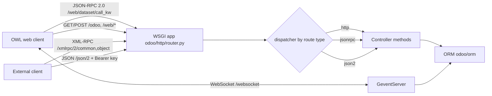

# APIs
Active contributors: Odoo SA (upstream)

## Purpose

Every client, the OWL web client, a browser tab, or an external script, reaches Odoo through the same WSGI application (`root` in `odoo/http/router.py`) and ends up in the same ORM. Four interfaces sit on top of it: the browser's JSON-RPC 2.0 calls, plain HTTP controllers that render pages and serve files, the programmatic endpoints under `/xmlrpc/2` and `/json/2`, and a WebSocket for live notifications. This page maps the four and links to the two pages that cover them in depth: [Web controllers](web-controllers.md) for the controller layer, and [External RPC](external-rpc.md) for the machine-to-machine endpoints.

## Directory layout

```text
odoo/http/                    # HTTP framework shared by all interfaces
├── router.py                 # WSGI Application, serve_db, dispatch_rpc()
├── routing_map.py            # Controller base class and @route decorator
├── dispatcher.py             # HttpDispatcher, JsonRPCDispatcher, Json2Dispatcher
└── session.py                # Session, SessionStore, authenticate()
odoo/service/
├── common.py                 # login / authenticate / version services
└── model.py                  # dispatch() and call_kw()
addons/rpc/controllers/       # external endpoints: /xmlrpc, /xmlrpc/2, /jsonrpc, /json/2
addons/web/controllers/       # browser endpoints: /web/*, plus /json and /json/1
addons/bus/controllers/       # /websocket and /websocket/peek_notifications
addons/crm/controllers/       # /lead/* email-link routes and the share-target manifest
```

## Key abstractions

| Name | File | Description |
| --- | --- | --- |
| `Controller` / `route()` | `odoo/http/routing_map.py` | Base class and decorator that bind a method to paths and routing options. |
| `Dispatcher` | `odoo/http/dispatcher.py` | Abstract request handler; subclasses register by `routing_type`. |
| `JsonRPCDispatcher` | `odoo/http/dispatcher.py` | JSON-RPC 2.0 envelope, what the web client speaks. |
| `Json2Dispatcher` | `odoo/http/dispatcher.py` | Plain JSON body, used by the `/json/2` model API. |
| `dispatch_rpc()` | `odoo/http/router.py` | Routes an XML-RPC or JSON-RPC service name to its implementation. |
| `call_kw()` | `odoo/service/model.py` | Invokes a public model method for `execute_kw` and `/web/dataset/call_kw`. |
| `Request` | `odoo/http/requestlib.py` | Per-request params, `env`, `session`, CSRF helpers. |
| `Session` / `SessionStore` | `odoo/http/session.py` | Cookie-backed session mapping and the file store behind it. |

## How it works

| Interface | Endpoints | `auth` | Consumed by |
| --- | --- | --- | --- |
| Browser JSON-RPC | `/web/dataset/call_kw[/<model>/<method>]`, `/web/session/*` | `user` | OWL web client, offline sync queue |
| HTTP controllers | `/odoo`, `/web/*`, `/web/manifest.webmanifest`, `/web/service-worker.js` | `public`, `user`, `none` | browsers, PWA service worker |
| External RPC | `/xmlrpc/<service>`, `/xmlrpc/2/<service>`, `/jsonrpc`, `/json/2/<model>/<method>`, `/json/1/<subpath>` | `none`, `bearer` | scripts, other systems |
| WebSocket bus | `/websocket`, `/websocket/peek_notifications` | `public` | web client notifications |

The routing map decides which controller handles a path, the dispatcher decides how the request body is parsed and how the result is serialized, and `ir.http._authenticate()` decides who the caller is. See [HTTP server](../systems/http-server.md) for that pipeline and [ORM](../systems/orm.md) for what happens after a controller calls the ORM.



## Integration points

- The fork consumes the controller layer, it does not extend the core: `addons/crm/controllers/webmanifest.py` subclasses web's `WebManifest` and flips `_has_share_target()` to `True`, which is what adds the PWA share target to the CRM manifest.
- `addons/crm/controllers/main.py` adds three `type='http'` routes under `/lead/` used by email links, each guarded by a token computed from `database.secret`.
- The offline sync queue replays records through `orm.silent.call`, which is the browser JSON-RPC interface, not the external one. See [sync queue](../features/offline-and-pwa/sync-queue.md).
- Session authentication is shared by all four interfaces: `/web/session/authenticate` for browsers, `common.login` for XML-RPC, `res.users.apikeys` plus a bearer header for the JSON routes.

## Entry points for modification

Adding an integration endpoint normally means a new `Controller` subclass in an addon's `controllers/` package, imported in that package's `__init__.py`. For this fork, keep new controllers in `addons/crm/`, and prefer extending an existing controller with `@route` overrides when the upstream path is already defined.

## Key source files

| File | Purpose |
| --- | --- |
| `odoo/http/router.py` | WSGI `Application`, db resolution, `dispatch_rpc()`. |
| `odoo/http/routing_map.py` | `Controller`, `route()`, rule generation and route merging. |
| `odoo/http/dispatcher.py` | The three dispatchers, CSRF check, error serialization. |
| `odoo/http/requestlib.py` | `Request`: params, JSON helpers, `csrf_token()`/`validate_csrf()`. |
| `odoo/http/response.py` | `Response.load()` and QWeb response support. |
| `odoo/http/session.py` | `Session`, `SessionStore`, `authenticate()`, rotation. |
| `odoo/service/model.py` | `dispatch()`, `call_kw()`, `execute_cr()`. |
| `odoo/service/common.py` | `login`, `authenticate`, `version` services. |
| `addons/rpc/controllers/__init__.py` | `RPC` controller: `/web/version`, deprecation notice. |
| `addons/rpc/controllers/xmlrpc.py` | `/xmlrpc/<service>` and `/xmlrpc/2/<service>`. |
| `addons/rpc/controllers/jsonrpc.py` | `/jsonrpc` JSON-RPC endpoint. |
| `addons/rpc/controllers/json2.py` | `/json/2/<model>/<method>`, the current external API. |
| `addons/web/controllers/dataset.py` | `/web/dataset/call_kw` and `/web/dataset/call_button`. |
| `addons/web/controllers/session.py` | `/web/session/*`, including `authenticate` and `logout`. |
| `addons/web/controllers/json.py` | `/json` and `/json/1/<subpath>` read-only view JSON. |
| `addons/web/controllers/webmanifest.py` | Manifest, service worker and offline page routes. |
| `addons/bus/controllers/websocket.py` | `/websocket`, `/websocket/health`, longpoll fallback. |
| `addons/crm/controllers/main.py` | `/lead/case_mark_won`, `/lead/case_mark_lost`, `/lead/convert`. |
| `addons/crm/controllers/webmanifest.py` | Enables the share target for CRM. |

## Related pages

- [Web controllers](web-controllers.md)
- [External RPC](external-rpc.md)
- [HTTP server](../systems/http-server.md)
- [Security](../security.md)
- [Deployment](../deployment.md)
- [Service worker and install](../features/offline-and-pwa/service-worker-and-install.md)
- [CRM app](../apps/crm/index.md)
