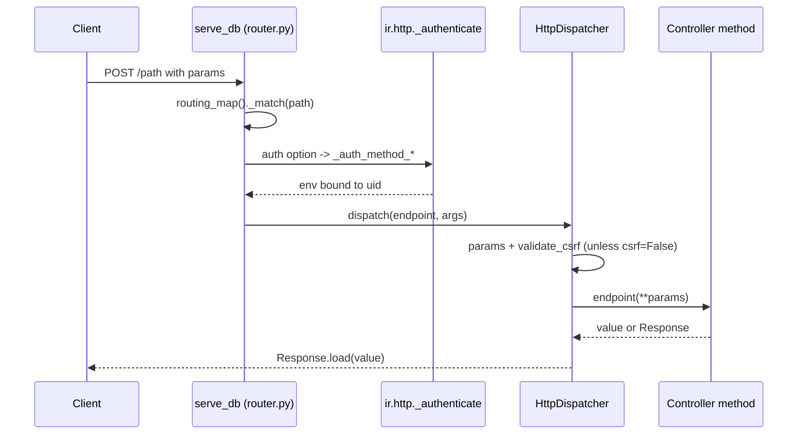

# Web controllers
Active contributors: Odoo SA (upstream)

## Purpose

A controller is a Python method bound to a URL by the `@route` decorator. It is the only supported way to add an endpoint: the routing map is rebuilt from installed modules, so a controller that is not decorated is never reachable. This page covers the decorator's options, how route declarations are merged across module inheritance, what happens between authentication and the method call (CSRF, read-only cursors, retries), and two worked examples from this repository.

## Directory layout

```text
odoo/http/
├── routing_map.py      # Controller, route(), _generate_routing_rules(), ROUTING_KEYS
├── dispatcher.py       # HttpDispatcher.dispatch(): params + CSRF; error handling
├── router.py           # serve_db(): RO cursor, readonly retry, _match()
├── requestlib.py       # Request.params, csrf_token(), validate_csrf()
└── response.py         # Response.load() for what a type='http' method may return
odoo/addons/base/models/ir_http.py   # _authenticate, _pre_dispatch, _dispatch
addons/web/controllers/              # web, session, dataset, json, webmanifest, ...
addons/crm/controllers/              # main.py (/lead/*), webmanifest.py (share target)
```

## Key abstractions

| Name | File | Description |
| --- | --- | --- |
| `Controller` | `odoo/http/routing_map.py` | Mixin whose subclasses are collected per module in `Controller.children_classes`. |
| `route()` | `odoo/http/routing_map.py` | Decorator storing `original_routing` and `original_endpoint` on the method. |
| `ROUTING_KEYS` | `odoo/http/routing_map.py` | Options forwarded verbatim to the werkzeug rule (`methods`, `host`, `websocket`, ...). |
| `Endpoint` | `odoo/http/routing_map.py` | The merged, per-URL callable with its final `routing` dict. |
| `_dispatchers` | `odoo/http/dispatcher.py` | Registry of route types; `route()` asserts `type` is one of its keys. |
| `ir.http._authenticate` | `odoo/addons/base/models/ir_http.py` | Turns `auth=` into `_auth_method_user/public/none/bearer`. |
| `Response.load()` | `odoo/http/response.py` | Coerces a `type='http'` return value into a `Response`. |

## How it works

`@route('/path', **options)` records the options on the function and returns a wrapper. The accepted options are declared in the `RoutingOpts` TypedDict in `odoo/http/routing_map.py`: `routes`, `methods`, `type`, `auth`, `cors`, `csrf`, `readonly`, `handle_params_access_error`, `captcha`, `save_session`, plus extension options such as `bearer_scope`, `check_identity` and `max_content_length`. `type` selects the dispatcher and must be `'http'`, `'jsonrpc'` or `'json2'`; `type='json'` is a deprecated alias for `'jsonrpc'` and raises a `DeprecationWarning`. `auth` defaults to `'user'` and accepts `'user'`, `'public'`, `'none'` and `'bearer'` (which requires `bearer_scope` and implies `save_session=False`). `csrf` defaults to enabled for `type='http'` and disabled for JSON routes.

Routes are resolved per database, not per process. `ir.http.routing_map()` is cached with `@api.ormcache('key', cache='routing')` and calls `_generate_routing_rules()` in `odoo/http/routing_map.py`, which rebuilds the controller inheritance tree from the installed modules, takes the leaf classes of each base controller, and merges the `@route` dictionaries from the top of the MRO down, so a subclass that re-declares `@route(auth='user')` keeps the parent's path and type and overrides only `auth`. An overriding method must be re-decorated; one that is not is decorated automatically with a warning, and a class member with no route at all is skipped with a warning. `_check_and_complete_route_definition()` refuses a type change and logs a warning when a child flips `readonly`, forcing the merge route to read/write in that case.

`readonly` decides which cursor the request uses. Its default is `auth == 'none'`, and it may also be a callable `(controller, rule, args) -> bool`, which is how `/web/dataset/call_kw` and `/json/2/...` decide from the target method's `_readonly` attribute. `serve_db()` in `odoo/http/router.py` opens `registry.cursor(readonly=True)` first; for a readonly route the call runs under that cursor, and a `ReadOnlySqlTransaction` error is caught, logged, and retried with a fresh read/write cursor. Read/write routes close the read-only cursor before dispatching.

CSRF is enforced by `HttpDispatcher.dispatch()` in `odoo/http/dispatcher.py` for every method outside `SAFE_HTTP_METHODS` (`GET`, `HEAD`, `OPTIONS`, `TRACE`) unless the route passes `csrf=False`. The token is popped from the merged params and checked with `request.validate_csrf()`, which recomputes an HMAC-SHA1 over the first 42 characters of the session id plus an expiry timestamp using the `database.secret` parameter; a missing token and an invalid token are logged differently, and both raise `BadRequest("Session expired (invalid CSRF token)")`. With no database resolved, the dispatcher redirects to `/web/database/selector` instead. A `type='http'` method may return a `Response`, a werkzeug response, `str`, `bytes` or `None`; anything else raises `TypeError` from `Response.load()`.

### Example: stateless routes in the web manifest controller

`addons/web/controllers/webmanifest.py` shows the minimal pattern. `/web/manifest.webmanifest`, `/web/service-worker.js` and `/odoo/offline` are declared `auth='public', methods=['GET'], readonly=True`, return raw bodies (`request.make_json_response()` with an explicit `application/manifest+json` content type, `request.make_response()` with a `Service-Worker-Allowed: /odoo` header, or `request.render('web.webclient_offline', ...)`), and touch no session state. `/scoped_app`, `/scoped_app_icon_png` and `/web/manifest.scoped_app_manifest` deliberately omit `readonly`, so they run on a read/write cursor. The class is also the extension point the fork uses: `addons/crm/controllers/webmanifest.py` subclasses `WebManifest` and returns `True` from `_has_share_target()`, which makes the manifest advertise the share target the CRM PWA handles.

### Example: token routes in the CRM controller

`addons/crm/controllers/main.py` declares three `type='http', auth='user', methods=['GET']` routes, `/lead/case_mark_won`, `/lead/case_mark_lost` and `/lead/convert`, each taking `res_id` and `token`. They delegate to `MailController._check_token_and_record_or_redirect()` in `addons/mail/controllers/mail.py`. `_check_token()` rebuilds the expected token with `mail.thread._encode_link()` (`addons/mail/models/mail_thread.py`): HMAC-SHA1 over `path?key=value` pairs, sorted, with the `token` parameter removed, keyed on the `database.secret` parameter. The comparison uses `odoo.tools.consteq()`. A failed comparison only logs a warning and redirects to a generic fallback, never to the record, and the record itself is browsed in the requesting user's environment, so `ir.access` still applies. Because these are GET routes, CSRF never runs here; the token is the whole protection, which is what makes the links usable from a mail client while remaining unguessable.



## Integration points

- The decorator interacts with `ir.http` hooks, not the other way round: `_pre_dispatch` applies `web.max_file_upload_size`, `_dispatch` verifies `captcha` routes, `_handle_error` delegates to the dispatcher. Modules override those hooks by inheriting `ir.http`.
- `addons/web/controllers/dataset.py` is the bridge to the ORM for the web client: it calls `odoo.service.model.call_kw()` and marks read-only methods through a `readonly` callable.
- Route option `check_identity=False` is used by the session routes in `addons/web/controllers/session.py` to let the user confirm their identity before it is enforced again.
- Every controller file must be imported from its package `__init__.py`; `addons/crm/controllers/__init__.py` imports `main` and `webmanifest`.

## Entry points for modification

Start from `addons/web/controllers/` to see the conventions the core uses, then `addons/crm/controllers/main.py` for the smallest complete example in this fork. When overriding an upstream route, subclass its controller and re-decorate the method with only the options that change; when adding a new endpoint, decide `auth`, `readonly` and `csrf` explicitly rather than relying on the defaults.

## Key source files

| File | Purpose |
| --- | --- |
| `odoo/http/routing_map.py` | `Controller`, `route()`, `RoutingOpts`, route merging, `readonly` resolution. |
| `odoo/http/dispatcher.py` | Param merging, CSRF enforcement, `SAFE_HTTP_METHODS`, error handling. |
| `odoo/http/router.py` | `serve_db()`, read-only cursor and `ReadOnlySqlTransaction` retry. |
| `odoo/http/requestlib.py` | `csrf_token()`, `validate_csrf()`, `make_response`, `make_json_response`. |
| `odoo/http/response.py` | `Response.load()`, QWeb lazy rendering. |
| `odoo/addons/base/models/ir_http.py` | `routing_map()`, `_authenticate*`, `_pre_dispatch`, `_dispatch`. |
| `addons/web/controllers/session.py` | `/web/session/authenticate`, `logout`, identity confirmation. |
| `addons/web/controllers/dataset.py` | `/web/dataset/call_kw`, `/web/dataset/call_button`. |
| `addons/web/controllers/webmanifest.py` | Manifest, service worker, offline page, scoped apps. |
| `addons/crm/controllers/main.py` | `/lead/*` token routes. |
| `addons/crm/controllers/webmanifest.py` | Share target enablement for CRM. |
| `addons/mail/controllers/mail.py` | `_check_token`, `_check_token_and_record_or_redirect`. |
| `addons/mail/models/mail_thread.py` | `_encode_link()`, the HMAC used by those tokens. |

## Related pages

- [APIs](index.md)
- [External RPC](external-rpc.md)
- [HTTP server](../systems/http-server.md)
- [Security](../security.md)
- [Service worker and install](../features/offline-and-pwa/service-worker-and-install.md)
- [CRM app](../apps/crm/index.md)
