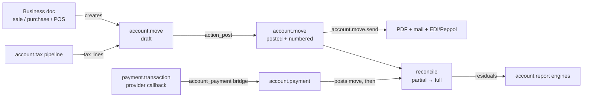

# Accounting

Active contributors: Odoo SA (upstream)

## Purpose

`addons/account` is the double-entry bookkeeping core: journals, journal entries (which double as customer invoices and vendor bills), payments, reconciliation, taxes and the report engine. Around it sit 15 satellite `account_*` modules and a 24-module `payment_*` family that turns online payment providers into posted bank entries. Nothing in this fork's offline CRM work touches it, but almost every other business app posts into it.

## Directory layout

```text
addons/account/                     # 38,058 lines across models/
├── models/
│   ├── account_move.py             # 8,339 L: largest Python file in the repo
│   ├── account_tax.py              # 5,205 L: tax computation engine
│   ├── account_move_line.py        # 4,078 L: journal items + reconciliation
│   ├── account_journal.py          # journals, journal_dashboard.py for the kanban
│   ├── account_payment.py          # account.payment
│   ├── account_report.py           # report / line / expression / column models
│   ├── chart_template.py           # account.chart.template loader
│   └── account_partial_reconcile.py, account_full_reconcile.py
├── wizard/                         # payment register, reversal, send, resequence, merge…
├── controllers/                    # portal.py, webmanifest.py, tests_shared_js_python.py
├── static/src/helpers/account_tax.js   # 2,674 L JS mirror of the tax engine
└── report/, security/, data/, views/, tests/, migrations/

addons/account_edi*, account_peppol, account_tax_python, account_check_printing, …  (15 satellites)
addons/payment/                     # provider-agnostic engine
addons/payment_<provider>/          # 23 integrations (stripe, adyen, paypal, mollie, …)
```

## Key abstractions

| Name | File | Description |
|---|---|---|
| `account.move` | `addons/account/models/account_move.py` | One journal entry. `move_type` picks the flavour: `entry`, `out_invoice`, `out_refund`, `in_invoice`, `in_refund`, `out_receipt`, `in_receipt`. |
| `account.move.line` | `addons/account/models/account_move_line.py` | Journal item (debit/credit leg). Carries `amount_residual`, `matching_number`, `full_reconcile_id`. |
| `account.journal` | `addons/account/models/account_journal.py` | Book of entries, typed `sale`, `purchase`, `cash`, `bank`, `credit` or `general`. Also drives entry numbering. |
| `account.tax` | `addons/account/models/account_tax.py` | Tax definition; `amount_type` is `group`, `fixed`, `percent` or `division`. Splits into `account.tax.repartition.line`. |
| `account.payment` | `addons/account/models/account_payment.py` | Money in/out, posted as a move and reconciled against invoices. |
| `account.partial.reconcile` | `addons/account/models/account_partial_reconcile.py` | One debit/credit match; also generates cash-basis tax moves. |
| `account.report` | `addons/account/models/account_report.py` | Declarative financial reports: lines with expressions evaluated by one of six engines. |
| `account.chart.template` | `addons/account/models/chart_template.py` | Abstract loader that installs a chart of accounts, taxes and fiscal positions into a company. |
| `account.move.send` | `addons/account/models/account_move_send.py` | Abstract orchestrator for sending invoices (PDF render, mail, EDI hooks). |
| `payment.provider` / `payment.transaction` | `addons/payment/models/payment_provider.py`, `.../payment_transaction.py` | The provider-agnostic payment engine every `payment_*` addon extends. |

## How it works

An invoice is a journal entry with a customer-facing face. Posting it (`action_post`, `addons/account/models/account_move.py:6810` → `_post`, line 6122) runs `_check_balanced` (line 2917), assigns a sequential number through `sequence.mixin` and freezes the lines. `button_draft` (line 6896) and `button_cancel` (line 7044) walk it back; `action_reverse` (line 6802) issues a credit note instead.

Tax amounts are not computed inline. `account.tax` exposes a staged pipeline, `_prepare_base_line_for_taxes_computation` (line 1571), `_add_tax_details_in_base_line` (line 1723) and `_round_base_lines_tax_details` (line 2204), so the same maths can run on unsaved data. That pipeline is mirrored line-for-line in JavaScript at `addons/account/static/src/helpers/account_tax.js`, and a harness (`addons/account/controllers/tests_shared_js_python.py`, `addons/account/views/tests_shared_js_python.xml`) runs both sides against the same fixtures to catch drift.

Reconciliation matches residual amounts across lines. `reconcile()` (`addons/account/models/account_move_line.py:3468`) plans matches via `_reconcile_plan` (line 3109), writes `account.partial.reconcile` rows, and collapses them into an `account.full.reconcile` when a set balances to zero.



Online payments enter through `addons/payment`. A `payment.transaction` moves through `_set_pending` / `_set_done` / `_set_canceled` / `_set_error` (`addons/payment/models/payment_transaction.py:1100-1170`); provider addons such as `addons/payment_stripe/models/payment_provider.py` override the request hooks (`_build_request_url`, `_build_request_headers`, `_build_request_auth`) rather than reimplementing the flow. The `addons/account_payment` bridge (auto-installed alongside `account`) is what turns a done transaction into a posted `account.payment`.

E-invoicing is layered: `addons/account_edi` adds `account.edi.document`/`account.edi.format`, `addons/account_edi_ubl_cii` (auto-installed) provides the UBL/CII formats, `addons/account_edi_proxy_client` registers the database with Odoo's proxy, and `addons/account_peppol` rides on both to send and receive over the Peppol network.

## Integration points

- Downstream apps post here. `addons/sale/models/account_move.py` and `account_move_line.py` extend invoices with order links; stock, purchase and point of sale do the same. See [Sales suite](sales-suite.md).
- Localizations plug into `account.chart.template.try_loading` (`addons/account/models/chart_template.py:151`), which is how the 229 `l10n_*` modules install country charts, taxes and EDI formats. See [Localizations and integrations](localizations-and-integrations.md).
- `account.move` inherits `portal.mixin`, `mail.thread.main.attachment`, `mail.activity.mixin`, `sequence.mixin`, `product.catalog.mixin` and `account.document.import.mixin`, so chatter, activities and portal sharing come from [Mail](mail.md).
- Multi-company behaviour runs through `company_id` on nearly every model plus `addons/account/models/company.py` (1,627 lines of fiscal-year, lock-date and hash-chain logic). See [Companies and multi-company](../primitives/companies-and-multi-company.md).
- `addons/account/controllers/webmanifest.py` subclasses web's `WebManifest` and flips `_has_share_target()` to `True`, the same PWA share-target hook that `addons/crm` uses.

## Entry points for modification

Do not start in `account_move.py`. Identify the layer first: a document flavour is usually a `move_type` branch plus a view, a tax rule belongs in the `account.tax` pipeline (and needs the JS mirror updated in lockstep), a new financial statement is data for `account.report` rather than code, and a new payment integration is a new `payment_*` addon that overrides the provider hooks. Per this fork's rules, all of that would have to be done from another addon by `_inherit`, not by editing `addons/account` in place; see [Patterns and conventions](../how-to-contribute/patterns-and-conventions.md).

## Key source files

| File | Purpose |
|---|---|
| `addons/account/__manifest__.py` | Module definition; depends on `base_setup`, `onboarding`, `product`, `analytic`, `portal`, `digest`; `post_init_hook` `_account_post_init`. |
| `addons/account/models/account_move.py` | Journal entries and invoices; post/draft/cancel/reverse workflow, balance checks, numbering. |
| `addons/account/models/account_move_line.py` | Journal items, residuals, `reconcile()` and `_reconcile_plan`. |
| `addons/account/models/account_tax.py` | Tax definitions, repartition lines and the staged computation pipeline. |
| `addons/account/static/src/helpers/account_tax.js` | JavaScript mirror of the tax pipeline for live totals in the client. |
| `addons/account/models/account_journal.py` | Journal types, sequences, bank/cash setup. |
| `addons/account/models/account_journal_dashboard.py` | Data behind the accounting dashboard kanban. |
| `addons/account/models/account_payment.py` | `account.payment` and the `account.move` extension that links payments to invoices. |
| `addons/account/models/account_partial_reconcile.py` | Partial matches and cash-basis tax move generation. |
| `addons/account/models/account_report.py` | `account.report`, `.line`, `.expression` (engines: domain, tax_tags, aggregation, account_codes, external, custom), `.column`. |
| `addons/account/models/chart_template.py` | Chart-of-accounts template loading used by every localization. |
| `addons/account/models/account_move_send.py` | Send pipeline with EDI hooks. |
| `addons/account/wizard/account_payment_register.py` | The "Register Payment" wizard, the usual path from invoice to payment. |
| `addons/account/controllers/webmanifest.py` | PWA share-target override. |
| `addons/payment/models/payment_provider.py` | Provider configuration and the request hooks providers override. |
| `addons/payment/models/payment_transaction.py` | Transaction lifecycle and state transitions. |
| `addons/account_payment/__manifest__.py` | Bridge between the payment engine and invoicing; auto-installed with `account`. |
| `addons/account_edi/models/account_edi_document.py` | EDI document queue and format dispatch. |
| `addons/account_peppol/models/account_move.py` | Peppol send/receive on top of UBL. |
| `addons/account_tax_python/__manifest__.py` | Taxes defined by two Python snippets (applicability and amount). |

## Related pages

- [Apps](index.md)
- [Sales suite](sales-suite.md)
- [Localizations and integrations](localizations-and-integrations.md)
- [Mail](mail.md)
- [Companies and multi-company](../primitives/companies-and-multi-company.md)
- [ORM](../systems/orm.md)
- [Patterns and conventions](../how-to-contribute/patterns-and-conventions.md)
