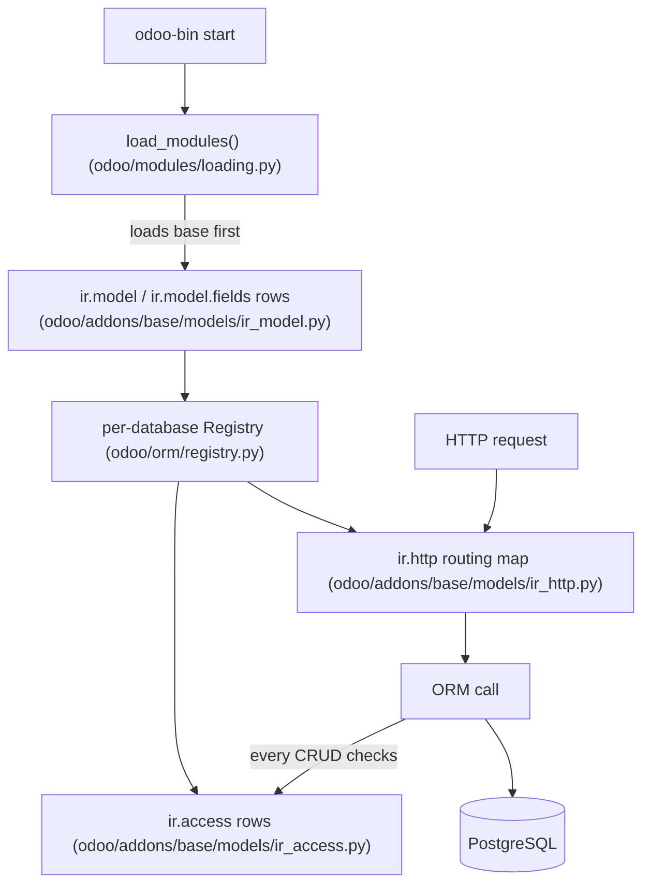

# Base module

Active contributors: Odoo SA (upstream)

## Purpose

`base` is the kernel module: the `ir.*` system models that make Odoo configurable at runtime, the `res.*` resource models every other module builds on, and the mixins (`image.mixin`, `avatar.mixin`, `format.address.mixin`) that business models reuse. It defines the vocabulary, models, groups, views, actions, sequences, crons, that every addon extends. It lives inside the core package at `odoo/addons/base/`, is `auto_install: True` in `odoo/addons/base/__manifest__.py`, and cannot be disabled: every database starts from it.

## Directory layout

```text
odoo/addons/base/
├── __manifest__.py     # name 'Base', category 'Hidden', auto_install True
├── models/             # ir.* and res.* system models
├── views/              # XML for the back-end settings screens
├── wizard/             # language install/import, module update/uninstall, partner merge
├── report/             # model-reference report, print layouts
├── security/           # base_groups.xml + ir.access.csv
├── data/               # countries, currencies, languages, crons (XML/CSV/SQL)
├── rng/                # RelaxNG schemas that validate view archs
├── populate/           # database population scripts
├── static/             # scss for res.users/res.partner, icons
├── i18n/               # .po translation files
└── tests/              # 36 test files
```

## Key abstractions

`ir.*` models:

| Model | File | What it does |
| --- | --- | --- |
| `ir.access` | `odoo/addons/base/models/ir_access.py` | One record per model, group, and CRUD subset; with a domain it restricts, without one it permits. Replaces `ir.model.access` and `ir.rule`; the ORM consults it on every call. |
| `ir.model`, `ir.model.fields` | `odoo/addons/base/models/ir_model.py` | Introspection rows for every model and field; `ir.model.data` stores external IDs (xmlids). |
| `ir.ui.view`, `ir.ui.menu` | `odoo/addons/base/models/ir_ui_view.py`, `odoo/addons/base/models/ir_ui_menu.py` | View archs (validated against `odoo/addons/base/rng/`) and the menu tree. |
| `ir.actions.*` | `odoo/addons/base/models/ir_actions.py`, `odoo/addons/base/models/ir_actions_report.py` | Window, URL, client, server, and report actions. |
| `ir.cron` + `ir.cron.trigger` | `odoo/addons/base/models/ir_cron.py` | Scheduled jobs; `_process_jobs` runs in the cron worker. |
| `ir.http` | `odoo/addons/base/models/ir_http.py` | Builds the routing map from all loaded controllers, handles auth (`user`, `public`, `none`, `bearer`) and dispatch. |
| `ir.attachment` + bundles | `odoo/addons/base/models/ir_attachment.py`, `odoo/addons/base/models/assetsbundle.py` | Binary storage in the filestore; `AssetsBundle` compiles JS/SCSS into the bundles served to the browser. |
| `ir.qweb` + `ir.qweb.field.*` | `odoo/addons/base/models/ir_qweb.py`, `odoo/addons/base/models/ir_qweb_fields.py` | The QWeb template engine and its field renderers. |
| `ir.config_parameter` | `odoo/addons/base/models/ir_config_parameter.py` | Key/value system parameters, e.g. `web.web_app_name`. |

`res.*` models:

| Model | File | What it does |
| --- | --- | --- |
| `res.partner` | `odoo/addons/base/models/res_partner.py` | Companies and contacts; inherits `format.address.mixin`, `format.vat.label.mixin`, `avatar.mixin`, `properties.base.definition.mixin`. |
| `res.company` | `odoo/addons/base/models/res_company.py` | Companies, the root of multi-company. |
| `res.users` | `odoo/addons/base/models/res_users.py` | Login users, preferences, API keys, sessions. |
| `res.groups` + `res.groups.privilege` | `odoo/addons/base/models/res_groups.py`, `odoo/addons/base/models/res_groups_privilege.py` | Access groups; 20.0 groups them under "privileges" (`odoo/addons/base/security/base_groups.xml`). |
| `res.lang`, `res.currency`, `res.country` | `odoo/addons/base/models/res_lang.py`, `odoo/addons/base/models/res_currency.py`, `odoo/addons/base/models/res_country.py` | Localization vocabulary loaded from `odoo/addons/base/data/`. |
| `res.config.settings` | `odoo/addons/base/models/res_config.py` | Transient settings model; apps add fields by `_inherit` bound to `config_parameter` keys or `related` company fields. |

## How it works

`base` loads before every other module; everything downstream assumes its tables exist.



The settings pattern every app copies: `_inherit` of `res.config.settings` adds a field, and its `config_parameter` or `related` binding writes through to `ir.config_parameter` or `res.company` on save (`execute` in `odoo/addons/base/models/res_config.py`). CRM's copy is `addons/crm/models/res_config_settings.py`.

Two things older Odoo documentation still mentions are gone in 20.0:

- `ir.rule` no longer exists; access rights and record rules are unified in `ir.access`, enforced through per-model access domains in the ORM.
- `ir.translation` no longer exists. Translated field values live as JSONB on the model's own table (`odoo/orm/fields.py:891`); code and UI terms load from each module's `i18n/*.po` files via `odoo/tools/translate.py`.

## Integration points

- The registry builds model classes from the loaded modules, and HTTP dispatch goes through `ir.http`.
- Every addon's security file is an `ir.access.csv` referencing `base.group_*` groups from `odoo/addons/base/security/base_groups.xml`.
- `addons/web` stores compiled asset bundles as `ir.attachment` rows and reads `ir.config_parameter` for `web.web_app_name`.
- Other modules extend base models from outside: `addons/mail/models/ir_access.py` (chatter tracking on `ir.access`), `addons/mail/models/ir_cron.py` (chatter and `_notify_admin`), `addons/crm/models/res_partner.py` (CRM partner fields).

## Entry points for modification

In this fork `odoo/addons/base/` is off-limits: `AGENTS.md` restricts changes to `addons/crm/` so the fork stays rebasable on upstream 20.0. Extend base behavior with `_inherit` inside `addons/crm/models/`, add settings through `res.config.settings`, and never add or change access rules or groups; the offline cache must not widen what a user can see.

## Key source files

| File | Purpose |
| --- | --- |
| `odoo/addons/base/models/ir_access.py` | The unified access model. |
| `odoo/addons/base/models/ir_model.py` | Model and field introspection, external IDs. |
| `odoo/addons/base/models/ir_ui_view.py` | View archs, inheritance, validation. |
| `odoo/addons/base/models/ir_ui_menu.py` | Menu tree and visibility filtering. |
| `odoo/addons/base/models/ir_actions.py` | Action primitives used by every app. |
| `odoo/addons/base/models/ir_cron.py` | Scheduled jobs and triggers. |
| `odoo/addons/base/models/ir_http.py` | Routing map, auth methods, dispatch. |
| `odoo/addons/base/models/ir_attachment.py` | Attachments and the filestore. |
| `odoo/addons/base/models/assetsbundle.py` | JS/CSS bundle compilation. |
| `odoo/addons/base/models/ir_qweb.py` | QWeb template engine. |
| `odoo/addons/base/models/res_partner.py` | Partners plus the address and VAT mixins. |
| `odoo/addons/base/models/res_users.py` | Users, groups, API keys, sessions. |
| `odoo/addons/base/models/res_config.py` | `res.config.settings`, the settings pattern. |
| `odoo/addons/base/security/base_groups.xml` | The `base.group_*` groups every access CSV references. |

## Related pages

- [Mail](mail.md), the chatter and activity layer built on these groups and users.
- [CRM](crm/index.md), the app consuming the settings and mixin patterns.
- [Web client](web/index.md), the asset bundles `ir.attachment` serves.
- [Module system](../systems/module-system.md), how `base` loads first.
- [ORM](../systems/orm.md), the access checks `ir.access` feeds.
- [Users, groups and access](../primitives/users-groups-and-access.md)
- [Actions, views and menus](../primitives/actions-views-menus.md)
- [Companies and multi-company](../primitives/companies-and-multi-company.md)
- [Cron and scheduled actions](../primitives/cron-and-scheduled-actions.md)
- [Translations](../primitives/translations.md)
