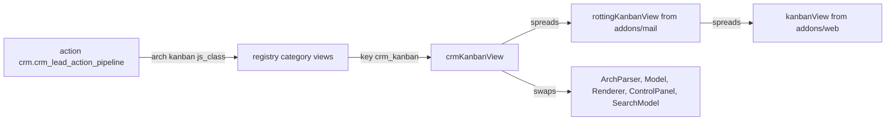
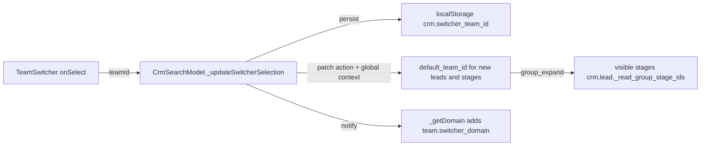

# CRM views

Active contributors: bobbyabbott421-glitch (fork), Odoo SA (upstream)

## Purpose

`addons/crm` ships a family of custom JS views selected by `js_class`, plus the shared control panel pieces every one of them reuses: CRM breadcrumbs with a team switcher and a lead generation dropdown. This page maps each `js_class` to the view object that implements it. The registry mechanics are covered in [views framework](../../apps/web/views-framework.md); the arch bindings all live in `addons/crm/views/crm_lead_views.xml`.

## Directory layout

One directory per component, files named after the directory:

```text
addons/crm/static/src/
├── views/
│   ├── crm_search_model.js            # CrmSearchModel: team switcher + offline restore
│   ├── forecast_search_model.js        # ForecastSearchModel: forecast filter domain
│   ├── crm_control_panel.js            # CrmControlPanel: swaps in CRM breadcrumbs
│   ├── check_rainbowman_message.js     # shared helper for the won effect
│   ├── fill_temporal_service.js        # period filling for the forecast views
│   ├── crm_kanban/                     # crm_kanban_view, _model, _renderer, _arch_parser, column_progress
│   ├── crm_form/                       # crm_form.js, crm_pls_tooltip_button.js/.xml/.scss
│   ├── crm_list/                       # crm_list_view.js/.xml
│   ├── crm_activity/                   # crm_activity_view.js   (lazy bundle)
│   ├── crm_calendar/                   # crm_calendar_view.js
│   ├── crm_graph/, crm_pivot/          # (lazy bundles)
│   └── forecast_kanban/, forecast_list/, forecast_graph/, forecast_pivot/
├── components/
│   ├── breadcrumbs/                    # CrmBreadcrumbs (js + xml)
│   ├── team_switcher/                   # TeamSwitcher dropdown
│   └── lead_generation_dropdown/       # LeadGenerationDropdown (js + xml + scss)
└── webclient/share_target/              # CrmShareTargetItem (see offline-and-mobile-crm)
```

## Key abstractions

| Name | File | Description |
| --- | --- | --- |
| `crm_search_model.js` | `addons/crm/static/src/views/crm_search_model.js` | `CrmSearchModel extends SearchModel`: team switcher state, domain and context, plus the two offline hooks. |
| `crm_kanban` | `addons/crm/static/src/views/crm_kanban/crm_kanban_view.js` | Pipeline kanban: spreads mail's `rottingKanbanView` and swaps five slots. |
| `crm_form` | `addons/crm/static/src/views/crm_form/crm_form.js` | Form view with a custom record save path (rainbowman, email and phone back-sync). |
| `CrmControlPanel` | `addons/crm/static/src/views/crm_control_panel.js` | `ControlPanel` with `CrmBreadcrumbs` swapped in. |
| `CrmBreadcrumbs` | `addons/crm/static/src/components/breadcrumbs/crm_breadcrumbs.js` | Breadcrumbs plus the `TeamSwitcher`. |
| `TeamSwitcher` | `addons/crm/static/src/components/team_switcher/team_switcher.js` | Team dropdown writing into the search model state. |
| `LeadGenerationDropdown` | `addons/crm/static/src/components/lead_generation_dropdown/lead_generation_dropdown.js` | "Generate leads" menu offering module installs, import and mail plugins. |
| `fillTemporalService` | `addons/crm/static/src/views/fill_temporal_service.js` | Service building and keeping forecast periods per model, field and granularity. |
| `ForecastSearchModel` | `addons/crm/static/src/views/forecast_search_model.js` | Extends `CrmSearchModel`, tracks `forecastStart` and the forecast filter domain. |

## How it works

### From action to view object

An action's arch carries a `js_class`; the client looks up that key in the `views` registry and uses the returned view object, which is usually a spread of a stock view with a few slots swapped:



### crm_kanban, the pipeline kanban

`crmKanbanView` in `addons/crm/static/src/views/crm_kanban/crm_kanban_view.js` spreads mail's `rottingKanbanView` (which itself spreads web's `kanbanView`) and swaps:

- `ArchParser`: `CrmKanbanArchParser` adds the `recurring_revenue_sum_field` progressbar attribute.
- `Model`: `CrmKanbanModel` adds the `effect` service, and its `DynamicGroupList.moveRecords()` override triggers the rainbowman when a record is dragged into a won stage while grouped by `stage_id`.
- `Renderer`: `CrmKanbanRenderer` uses `RottingKanbanRenderer` with a header that renders `CrmColumnProgress`, which shows the MRR sum next to the progressbar when the user is in `crm.group_use_recurring_revenues`.
- `Controller`: extends the rotting controller, registers `LeadGenerationDropdown` as a component and adds the recurring sum to `progressBarAggregateFields`; `buttonTemplate` is `crm.Kanban.Buttons`.
- `ControlPanel` and `SearchModel`: `CrmControlPanel` and `CrmSearchModel`, shared with every other CRM view.

Two archs bind `js_class="crm_kanban"`: the desktop pipeline `crm_case_kanban_view_leads` (`addons/crm/views/crm_lead_views.xml`, line ~504, with `sum_field="expected_revenue"` and `recurring_revenue_sum_field="recurring_revenue_monthly"` on the progressbar) and the small-screen `view_crm_lead_kanban` (line ~364), whose `class="o_kanban_mobile"` switches to the compact mobile card layout and drops the archive action. The mobile behavior is described in [mobile web](../../features/mobile-web.md).

### crm_form

`addons/crm/static/src/views/crm_form/crm_form.js` registers `crm_form` as `{...formView, Model: CrmFormModel}`. `CrmFormRecord._save()` adds two behaviors for `crm.lead` only, delegating to `super()` otherwise:

- After a stage change it calls `checkRainbowmanMessage()` from `addons/crm/static/src/views/check_rainbowman_message.js`, which asks `crm.lead` `get_rainbowman_message` and plays the `rainbow_man` effect.
- It force-saves `email_from` and `phone` when `partner_email_update` or `partner_phone_update` is set, so the lead's values reach the partner through the model's inverse methods even if the user did not touch them. The `crm_email_and_phone_propagation_edit_save` tour in `addons/crm/static/tests/tours/crm_email_and_phone_propagation.js` covers this.

The PLS tooltip is the `pls_tooltip_button` widget (`addons/crm/static/src/views/crm_form/crm_pls_tooltip_button.js`, registered in `view_widgets`): it saves pending changes, calls `crm.lead` `prepare_pls_tooltip_data`, reloads the record and opens `CrmPlsTooltip` as a popover, or as a bottom sheet on small screens (`usePopover(CrmPlsTooltip, { useBottomSheet: this.ui.isSmall })`). The form arch shows it next to the probability field only when `is_automated_probability` is true.

### crm_list, crm_activity, crm_calendar

`crm_list` (`addons/crm/static/src/views/crm_list/crm_list_view.js`) spreads `listView`, swaps `CrmControlPanel` and `CrmSearchModel`, and adds `LeadGenerationDropdown` with `buttonTemplate` `crm.List.Buttons`. `crm_activity` (`addons/crm/static/src/views/crm_activity/crm_activity_view.js`) spreads mail's `activityView` and swaps only `CrmControlPanel` and `CrmSearchModel`. `crm_calendar` (`addons/crm/static/src/views/crm_calendar/crm_calendar_view.js`) spreads web's `calendarView` with only the control panel and search model swapped; its arch displays `activity_date_deadline`, not the lead's own dates.

### crm_graph and crm_pivot, lazy bundles

`crm_graph` and `crm_pivot` (`addons/crm/static/src/views/crm_graph/crm_graph_view.js`, `addons/crm/static/src/views/crm_pivot/crm_pivot_view.js`) are plain spreads of `graphView` and `pivotView` with `CrmControlPanel` and `CrmSearchModel`. They ship in `web.assets_backend_lazy` instead of `web.assets_backend`: the manifest removes `crm/static/src/views/crm_activity/**`, `crm_graph/**`, `crm_pivot/**`, `forecast_graph/**` and `forecast_pivot/**` from the main bundle and re-adds them lazily, the only reason to touch the asset list.

### The forecast family

Four `js_class` values share the forecast machinery: `forecast_kanban`, `forecast_list`, `forecast_graph`, `forecast_pivot`, bound in the `crm_lead_action_forecast` action with `'forecast_field': 'date_deadline'` and a default `date_deadline` group by.

- `ForecastSearchModel` (`addons/crm/static/src/views/forecast_search_model.js`) extends `CrmSearchModel`. For any search item carrying `forecast_filter` in its context it adds `'|', (forecastField, '=', False), (forecastField, '>=', forecastStart)`: records without a closing date and records dated at or after the start of the current period (month by default, day when grouped by something else). `forecastStart` rides along in the exported state, so graph, pivot and list agree with the kanban.
- `ForecastKanbanModel` (`addons/crm/static/src/views/forecast_kanban/forecast_kanban_model.js`) extends `CrmKanbanModel` with the `fillTemporalService`. When grouped by the forecast field it fills the read group with empty future periods, so the kanban shows empty months ahead of the data, and remembers where the data ends.
- `ForecastKanbanRenderer` (`addons/crm/static/src/views/forecast_kanban/forecast_kanban_renderer.js`) allows creating the next period column through `ForecastKanbanColumnQuickCreate` and lets records be moved across `date_deadline` columns; the forecast kanban arch (`addons/crm/views/crm_lead_views.xml`, line ~574) swaps the revenue fields for their prorated twins.
- `ForecastKanbanController` only widens quick create to accept `date_deadline`.
- `forecast_list`, `forecast_graph` and `forecast_pivot` spread the stock views with `ForecastSearchModel`.

`fillTemporalService` (`addons/crm/static/src/views/fill_temporal_service.js`) is the shared period builder: it caches one `FillTemporalPeriod` per model, field and granularity, extends it as new columns are created, and serializes the domain leaves so repeated read groups do not accumulate them.

### The search model and the team switcher

`CrmSearchModel` is the heart of the shared behavior. `load()` calls `_initSwitcher()`, which asks `crm.team` `get_team_switcher_data` (cached on disk) whether at least two teams use opportunities, and restores the selected team from localStorage under `crm.switcher_team_id`. Everything else follows from the selected team:



The switcher only appears on actions that pass `'show_team_switcher': True` in their context (the Pipeline and Forecast actions in `addons/crm/views/crm_lead_views.xml`), and `CrmBreadcrumbs` renders it through `env.searchModel.isTeamSwitcherEnabled`. The domain comes from the server, not the client: each team's `switcher_domain` (built in `CrmTeam.get_team_switcher_data()` in `addons/crm/models/crm_team.py`) matches leads assigned to the team plus unassigned leads sitting in stages visible to that team. Exported search state carries `teamSwitcherState`, so switching views in one action keeps the selection.

The offline half of `CrmSearchModel` is covered in [offline and mobile CRM](offline-and-mobile-crm.md).

## Integration points

- Imports stock views from `@web/views/*`, mail's rotting kanban from `@mail/js/rotting_mixin/*`, and search pieces from `@web/search/*`. The only service crm registers itself is `fillTemporalService` in `addons/crm/static/src/views/fill_temporal_service.js`.
- Registers view objects under `crm_kanban`, `crm_form`, `crm_list`, `crm_activity`, `crm_calendar`, `crm_graph`, `crm_pivot`, `forecast_kanban`, `forecast_list`, `forecast_graph`, `forecast_pivot`, and the widget `pls_tooltip_button`.
- `LeadGenerationDropdown` can trigger module installs (`ir.module.module` `button_immediate_install`), access requests via `base.module.install.request`, the import action and the mail plugins dialog; it reaches the controllers through `orm` and `action` services only.

## Entry points for modification

To change what a pipeline view shows or how it behaves, find the binding in `addons/crm/views/crm_lead_views.xml` first, then the view object it selects. A new view slot means spreading an existing CRM view object and registering a new key, then binding it with a `js_class` on the arch, otherwise the code is unreachable. New components live in their own directory with files named after it, which the manifest glob `crm/static/src/**` already ships.

## Key source files

| File | Purpose |
| --- | --- |
| `addons/crm/views/crm_lead_views.xml` | Every lead arch, `js_class` binding, and the Pipeline and Forecast actions. |
| `addons/crm/static/src/views/crm_kanban/crm_kanban_view.js` | The `crm_kanban` view object and its swaps. |
| `addons/crm/static/src/views/crm_kanban/crm_kanban_model.js` | Rainbowman on drag to a won stage. |
| `addons/crm/static/src/views/crm_kanban/crm_kanban_arch_parser.js` | The `recurring_revenue_sum_field` progressbar attribute. |
| `addons/crm/static/src/views/crm_kanban/crm_kanban_renderer.js` | Rotting header with `CrmColumnProgress`. |
| `addons/crm/static/src/views/crm_kanban/crm_column_progress.js` | Progressbar with the MRR sum, group-gated. |
| `addons/crm/static/src/views/crm_form/crm_form.js` | `crm_form` with the record save override. |
| `addons/crm/static/src/views/crm_form/crm_pls_tooltip_button.js` | The PLS tooltip widget, popover or bottom sheet. |
| `addons/crm/static/src/views/crm_search_model.js` | Team switcher state, domain, context and offline restore. |
| `addons/crm/static/src/views/forecast_search_model.js` | Forecast filter domain and period start. |
| `addons/crm/static/src/views/fill_temporal_service.js` | The forecast period service. |
| `addons/crm/static/src/views/forecast_kanban/forecast_kanban_model.js` | Read group period filling. |
| `addons/crm/static/src/views/forecast_kanban/forecast_kanban_renderer.js` | Forecast column quick create and moves. |
| `addons/crm/static/src/views/crm_list/crm_list_view.js` | `crm_list`, with the lead generation dropdown. |
| `addons/crm/static/src/views/crm_activity/crm_activity_view.js` | `crm_activity` over mail's activity view. |
| `addons/crm/static/src/views/crm_calendar/crm_calendar_view.js` | `crm_calendar` over web's calendar view. |
| `addons/crm/static/src/views/crm_control_panel.js` | Control panel with CRM breadcrumbs. |
| `addons/crm/static/src/components/breadcrumbs/crm_breadcrumbs.js` | Breadcrumbs hosting the team switcher. |
| `addons/crm/static/src/components/team_switcher/team_switcher.js` | The team dropdown. |
| `addons/crm/static/src/components/lead_generation_dropdown/lead_generation_dropdown.js` | Lead acquisition menu. |
| `addons/crm/static/src/views/check_rainbowman_message.js` | Won-effect helper shared by form and kanban. |
| `addons/crm/static/tests/crm_team_switcher.test.js` | Team switcher unit tests. |
| `addons/crm/static/tests/forecast_kanban.test.js` | Forecast period and quick create tests. |

## Related pages

- [CRM](index.md): the models these views display.
- [Offline and mobile CRM](offline-and-mobile-crm.md): what these views do without a network.
- [views framework](../../apps/web/views-framework.md): the view registry, arch parsing and `js_class`.
- [relational model](../../apps/web/relational-model.md): the JS model layer behind every view.
- [mobile web](../../features/mobile-web.md): the small-screen signal and the mobile kanban layout.
- [patterns and conventions](../../how-to-contribute/patterns-and-conventions.md): the directory-per-component and patching rules.
