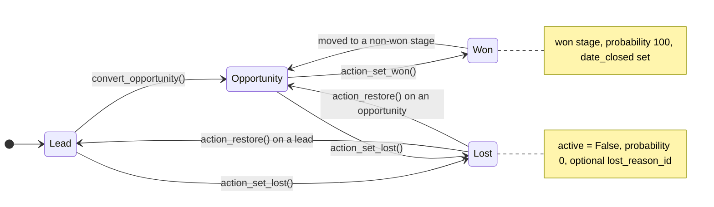
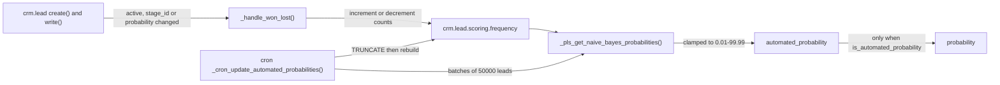

# CRM

Active contributors: bobbyabbott421-glitch (fork), Odoo SA (upstream)

## Purpose

`addons/crm` is the sales pipeline. Everything hangs off one model, `crm.lead`, which is either a raw lead or a qualified opportunity moving through `crm.stage` records until it is won or lost. Around it the addon adds predictive lead scoring (a naive Bayes model trained on won and lost history), a rule-based assignment engine on `crm.team`, recurring revenue and MRR, duplicate detection and merge, and the JS views described in [CRM views](crm-views.md).

## Directory layout

```text
addons/crm/
├── __manifest__.py                      # depends, data load order, asset bundles
├── controllers/
│   ├── main.py                          # token-authenticated email links (won / lost / convert)
│   └── webmanifest.py                   # enables the PWA share target (see offline-and-mobile-crm)
├── data/                                # stages, recurring plans, lost reasons, crons, subtypes, PLS params
├── models/
│   ├── crm_lead.py                      # the pipeline model, 2,871 lines
│   ├── crm_team.py                      # team settings + lead assignment engine
│   ├── crm_team_member.py               # per-member quotas and assignment domains
│   ├── crm_stage.py                     # stages: is_won, fold, rotting_threshold_days
│   ├── crm_lead_scoring_frequency.py    # PLS frequency table + selectable scoring fields
│   ├── crm_lost_reason.py, crm_recurring_plan.py
│   └── small _inherit files             # mail_activity, res_partner, calendar, utm, digest, res_users, ...
├── report/crm_activity_report.py         # SQL view over lead activities
├── security/                            # crm_security.xml (groups), ir.access.csv (access)
├── views/                               # archs; crm_lead_views.xml binds every js_class
├── wizard/                              # lost, merge, mass convert, PLS update
└── static/, tests/
```

## Key abstractions

| Name | File | Description |
| --- | --- | --- |
| `crm.lead` | `addons/crm/models/crm_lead.py` | The pipeline record: type, stage, probability, revenue, contact data. |
| `type` | `addons/crm/models/crm_lead.py` | `lead` or `opportunity`. The lead flavor defaults in only for members of `crm.group_use_lead`. |
| `won_status` | `addons/crm/models/crm_lead.py` | Computed `won` / `lost` / `pending`: won means a won stage, lost means inactive with probability 0. |
| `probability` | `addons/crm/models/crm_lead.py` | Manual 0-100 probability, constrained against the stage by `_check_won_validity`. |
| `automated_probability` | `addons/crm/models/crm_lead.py` | PLS output. `is_automated_probability` records whether the manual value is aligned with it. |
| `_stage_find()` | `addons/crm/models/crm_lead.py` | Stage resolution: global stages (`team_ids` empty) plus the lead's team stages. |
| `crm.lead.scoring.frequency` | `addons/crm/models/crm_lead_scoring_frequency.py` | Won and lost counts per variable, value and team. The naive Bayes training data. |
| `_allocate_leads()` | `addons/crm/models/crm_team.py` | Team-level assignment: weighted random pick by team capacity, merging duplicates on the way. |
| `assignment_max` | `addons/crm/models/crm_team_member.py` | Monthly lead capacity per member. The daily quota is capacity divided by 30. |
| `recurring_plan` | `addons/crm/models/crm_recurring_plan.py` | Billing interval in months; turns `recurring_revenue` into the MRR fields. |
| `merge_opportunity()` | `addons/crm/models/crm_lead.py` | Merges a recordset into the most confident lead and unlinks the rest. |
| `crm.group_use_lead` | `addons/crm/security/crm_security.xml` | "Show Lead Menu" group: gates the lead type, menu and team alias defaults. |
| `crm.group_use_recurring_revenues` | `addons/crm/security/crm_security.xml` | "Show Recurring Revenues Menu" group: gates the MRR fields in views and copies. |

## How it works

### Lead vs opportunity

`crm.lead` is a single table with a `type` selection, `lead` or `opportunity`. The column carries its own index plus a composite `(user_id, team_id, type)` index declared next to the model (`_user_id_team_id_type_index`). A lead is the pre-qualification state; `convert_opportunity(partner, user_ids, team_id)` flips it to an opportunity, sets `date_conversion`, and creates or links the customer. The lead flavor is gated on `crm.group_use_lead`: `type` defaults from the current user's groups, and the settings page propagates the flag to every team's alias (`addons/crm/models/res_config_settings.py`). Sorting is `_order = "priority desc, id desc"`, backed by a partial index on active records; priorities come from `AVAILABLE_PRIORITIES` in `addons/crm/models/crm_stage.py`.

Won and lost are property-based, not state-based, so any view or write path can trigger them:



`action_set_lost()` archives the record and writes probability 0. `action_set_won()` unarchives, finds the first won stage with a higher sequence (falling back to the last won stage at or below the current one, so mixed pipelines work), and writes probability 100. `action_restore()` unarchives and realigns `probability` with `automated_probability`. `write()` keeps `date_last_stage_update`, `date_open` and `date_closed` consistent, and `crm.stage.write()` forces probability 100 on every lead when a stage is flagged `is_won` (`addons/crm/models/crm_stage.py`).

### Probability and PLS

Predictive lead scoring is a per-team naive Bayes classifier. The training data is `crm.lead.scoring.frequency`: one row per variable, value and team, holding `won_count` and `lost_count` as floats (0.1 is added to every bucket to avoid the zero-frequency problem). Two paths feed it:

1. Live increment. `crm.lead.create()` and `write()` call `_handle_won_lost()` whenever `active`, `stage_id` or `probability` change, and it increments or decrements the won/lost counts for the lead's values through `_pls_increment_frequencies()`.
2. One-shot rebuild. The cron `crm.website_crm_score_cron` (`addons/crm/data/crm_lead_prediction_data.xml`, daily, inactive by default) runs `_cron_update_automated_probabilities()`: truncate the table, rebuild it from every closed lead, then recompute `automated_probability` for all pending leads in batches of 50,000 with SQL updates committed every 5,000 leads.



The scored fields come from the `crm.pls_fields` parameter, defaulting to `phone_state,email_state,state_id,country_id,source_id,lang_id,tag_ids`; `stage_id` and `team_id` are always included. `_pls_get_safe_fields()` filters the list to fields that exist, and changing the parameter forces a model re-setup (`addons/crm/models/ir_config_parameter.py`). Leads created before `crm.pls_start_date` (seeded 8 days before install) are ignored, tag frequencies are dropped below 50 combined outcomes, and a lead whose team has no rows falls back to the team-less bucket. The cron aligns `probability` with the automated value only when `is_automated_probability` was true. The form's AI button calls `prepare_pls_tooltip_data()`, which recomputes and returns the top and bottom three scoring criteria for the tooltip widget.

### Team assignment

Assignment is rule-based and off by default. It is gated by the `crm.lead.auto.assignment` parameter (`_is_rule_based_assignment_activated()` in `addons/crm/models/crm_lead.py`) and driven by the `crm.ir_cron_crm_lead_assign` cron, daily and inactive until the settings page activates it (`addons/crm/data/ir_cron_data.xml`). `CrmTeam._cron_assign_leads()` calls `_action_assign_leads()` (managers or admins only) on every team that uses leads or opportunities and is not opted out, in two phases:

1. `_allocate_leads()` assigns unassigned leads (no team, no salesperson, not won, created in the last `creation_delta_days`, older than the `crm.assignment.delay` hours, matching the team's `assignment_domain`) to teams. Teams are picked with a weighted random choice by `assignment_max`, the summed monthly capacity of their members. Each pick merges the candidate with its duplicates (`_merge_opportunity(max_length=0)`) before the team write, and the process auto-commits every `crm.assignment.commit.bundle` leads, 100 by default.
2. `_assign_and_convert_leads()` distributes each team's leads over its members. A member's daily quota is `assignment_max / 30` rounded half-up, minus the leads assigned in the last 24 hours. Members are sorted by remaining quota with a random tiebreak and walked round-robin, preferring each member's `assignment_domain_preferred` leads, converting every assigned lead with `convert_opportunity(lead.partner_id, user_ids=[member.user_id.id])`.

`CrmTeam.action_assign_leads()` is the manual variant (`force_quota=True`, no creation window) and returns a notification built by `_action_assign_leads_logs()`. Leads arriving through the mail gateway without a salesperson go to their team's leader instead when rule-based assignment is off (`_assign_userless_lead_in_team()`).

### Recurring revenue, MRR and forecast

`recurring_revenue` plus a `crm.recurring.plan` (seeded Monthly, Yearly, Over 3 years, Over 5 years in `addons/crm/data/crm_recurring_plan_data.xml`) produce `recurring_revenue_monthly = recurring_revenue / number_of_months`. Every revenue field has a prorated twin multiplied by `probability / 100`: `prorated_revenue`, `recurring_revenue_prorated`, `recurring_revenue_monthly_prorated`. The whole block is gated on `crm.group_use_recurring_revenues`; users without the group get recurring fields zeroed on copy (`copy_data`). The forecast views use the prorated fields; see [CRM views](crm-views.md).

### Duplicates and merge

Two detectors serve different callers. `_compute_potential_lead_duplicates()` powers the form's "Similar Leads" button with three criteria: exact email-domain match (`email_domain_criterion`), same commercial partner, and exact sanitized phone. It searches with `active_test=False`, skips criteria returning 21 or more matches, and runs `compute_sudo` so the count can signal a manager escalation. `_get_lead_duplicates(partner, email, include_lost)` is the wizard and assignment path. `merge_opportunity()` sorts the recordset by `_sort_by_confidence_level()` (active first, opportunity over lead, higher stage, higher probability, newer id) and merges into the head lead with `_merge_data()`: descriptions concatenated, tags unioned, addresses taken whole from the lead with the most address fields, first non-empty otherwise. `_merge_dependences()` moves messages, activities, attachments and meetings, `_merge_followers()` carries over only followers who posted in the last 30 days, `_merge_log_summary()` logs the `crm.crm_lead_merge_summary` template, and the tail is unlinked with sudo. Merging is capped at 5 records outside the assignment engine.

### Mail, activities, meetings

`crm.lead` inherits `mail.thread.subject.suggested`, `mail.thread.blacklist`, `mail.thread.phone`, `mail.activity.mixin`, `utm.mixin`, `format.address.mixin` and `mail.tracking.duration.mixin`; the chatter backbone is described in [mail](../../apps/mail.md). Incoming mail creates leads with no default salesperson (`message_new`), then the team leader rule above applies. Reply-to addresses come from the team alias (`_notify_get_reply_to`), and the lead subtypes (`mt_lead_create`, `mt_lead_stage`, `mt_lead_won`, `mt_lead_lost`, `mt_lead_restored`, plus team-level parents) are defined in `addons/crm/data/mail_message_subtype_data.xml`. `addons/crm/controllers/main.py` serves token-authenticated `/lead/case_mark_won`, `/lead/case_mark_lost` and `/lead/convert` links from emails. `addons/crm/models/mail_activity.py` amends `action_create_calendar_event` for activities tied to a lead's meeting, and `calendar.event` gains `opportunity_id` with `log_meeting()` in `addons/crm/models/calendar.py`.

### Security

`addons/crm/security/crm_security.xml` defines the two user groups and hands the contacts configuration menu to sales managers. `addons/crm/security/ir.access.csv` layers access: `sales_team.group_sale_salesman` gets create, read and update on leads matching `['|', ('user_id', '=', user.id), ('user_id', '=', False)]` (own or unassigned), `group_sale_salesman_all_leads` sees everything, and managers have full `crud`. A group-less multi-company rule restricts `crm.lead` and `crm.activity.report` to `company_id in company_ids + [False]`. The scoring frequency tables are read-only for salesmen and system users, and the wizards are `cru` for salesmen.

### Wizards

The wizards tie the loose ends: `crm.lead.lost` (`addons/crm/wizard/crm_lead_lost.py`) logs a closing note then calls `action_set_lost()` with the reason, `crm.merge.opportunity` filters won leads out of the selection, `crm.lead2opportunity.partner.mass` (`addons/crm/wizard/crm_lead_to_opportunity_mass.py`) converts or converts-and-merges a batch while round-robining salesmen, and `crm.lead.pls.update` (`addons/crm/wizard/crm_lead_pls_update.py`) is the admin path to rewrite the PLS parameters and rerun the cron.

## Integration points

- Extends other addons' models from inside `addons/crm`: `crm.team` (from sales_team) plus `mail.alias.mixin`, `crm.team.member`, `mail.activity`, `res.partner`, `utm.campaign`, `calendar.event`, `digest.digest`, `res.users`, `discuss.channel`, `ir.config_parameter`, `res.groups`, `res.config.settings`.
- Consumes the mail gateway, phone validation (`phone_validation`, for `phone_state` and `phone_sanitized`) and IAP enriching helpers (`iap_tools`, only for the email domain criterion).
- The JS layer consumes the view registry; every arch binds a `js_class`, see [views framework](../../apps/web/views-framework.md) and [CRM views](crm-views.md).
- Consumed downstream by sale, website_crm and the crm_iap_* modules.

## Entry points for modification

Start in `addons/crm/models/crm_lead.py` for any lifecycle, PLS or merge behavior; the won/lost semantics live in `action_set_won()`, `action_set_lost()` and `_handle_won_lost()`, so a change there usually needs the frequency table and the tests in `addons/crm/tests/test_crm_pls.py` checked too. Team capacity and rotation rules live in `addons/crm/models/crm_team.py` and `addons/crm/models/crm_team_member.py`. Remember the fork's constraint: no new fields on `crm.lead`, `crm.stage` or `crm.team`, and no new access rules.

## Key source files

| File | Purpose |
| --- | --- |
| `addons/crm/models/crm_lead.py` | The pipeline model: lifecycle, PLS (`_cron_update_automated_probabilities`), duplicates, merge, mail hooks. |
| `addons/crm/models/crm_team.py` | Team settings, aliases, the assignment engine, `get_team_switcher_data()`. |
| `addons/crm/models/crm_team_member.py` | Member quotas, assignment domains, `MEMBER_MAX_LEAD_ASSIGNMENT_QUOTA`. |
| `addons/crm/models/crm_stage.py` | Stages, `AVAILABLE_PRIORITIES`, `is_won` write behavior. |
| `addons/crm/models/crm_lead_scoring_frequency.py` | PLS frequency table and the selectable scoring fields. |
| `addons/crm/models/crm_lost_reason.py` | Lost reasons and the lost-leads action. |
| `addons/crm/models/crm_recurring_plan.py` | Recurring plans with the months constraint. |
| `addons/crm/models/res_config_settings.py` | Settings: lead group, assignment cron, PLS fields and start date. |
| `addons/crm/models/ir_config_parameter.py` | Re-setups `crm.lead` when `crm.pls_fields` changes. |
| `addons/crm/models/mail_activity.py` | Lead meeting defaults for activity-scheduled events. |
| `addons/crm/controllers/main.py` | Token-authenticated won, lost and convert links. |
| `addons/crm/report/crm_activity_report.py` | SQL view of activities joined on leads. |
| `addons/crm/wizard/crm_lead_lost.py` | Lost wizard: reason plus closing note, then `action_set_lost()`. |
| `addons/crm/wizard/crm_merge_opportunities.py` | Merge wizard, filters out won leads. |
| `addons/crm/wizard/crm_lead_to_opportunity_mass.py` | Mass convert and merge with duplicate handling. |
| `addons/crm/wizard/crm_lead_pls_update.py` | Admin wizard to reconfigure and rerun PLS. |
| `addons/crm/security/crm_security.xml` | The two `crm.group_use_*` groups. |
| `addons/crm/security/ir.access.csv` | Access per sales group, multi-company rules. |
| `addons/crm/data/crm_lead_prediction_data.xml` | PLS field list, start date and the scoring cron. |
| `addons/crm/data/mail_message_subtype_data.xml` | Lead and team chatter subtypes. |
| `addons/crm/views/crm_lead_views.xml` | Every lead arch and its `js_class` binding. |

## Related pages

- [CRM views](crm-views.md): every `js_class` view and the shared control panel components.
- [Offline and mobile CRM](offline-and-mobile-crm.md): the share target, offline search and mobile kanban.
- [mail](../../apps/mail.md): the chatter and activity backbone crm inherits.
- [views framework](../../apps/web/views-framework.md): how `js_class` reaches the view registry.
- [cron and scheduled actions](../../primitives/cron-and-scheduled-actions.md): the assignment and PLS crons as examples.
- [patterns and conventions](../../how-to-contribute/patterns-and-conventions.md): the `_inherit` and patching rules used throughout this addon.
- [testing](../../how-to-contribute/testing.md): how these models are tested.
