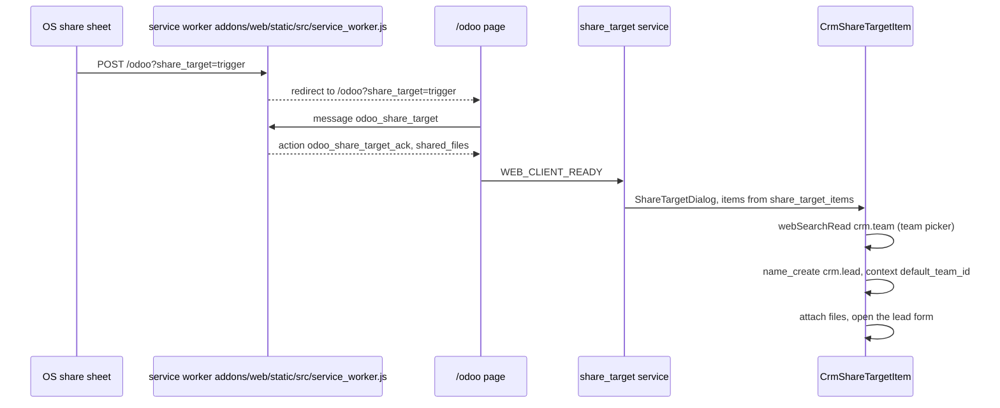

# Offline and mobile CRM

Active contributors: bobbyabbott421-glitch (fork), Odoo SA (upstream)

## Purpose

CRM is a pure consumer of the offline and PWA framework in `addons/web`. It never re-implements storage, queuing, or connectivity detection: a search across `addons/crm/` finds the word "offline" in exactly one file of its own, `addons/crm/static/src/views/crm_search_model.js`. What CRM adds is three deliberate extensions: the PWA share target that creates leads from the OS share sheet, the offline behavior of the team switcher inside `CrmSearchModel`, and the small-screen kanban arch. Everything else, queued saves, disabled buttons, remembered searches, the offline systray, arrives for free because CRM's views are spreads of the stock web views.

## Directory layout

```text
addons/crm/
├── controllers/webmanifest.py            # subclasses WebManifest, flips _has_share_target()
├── static/src/webclient/share_target/     # CrmShareTargetItem.js + .xml (team picker)
├── static/src/views/crm_search_model.js   # offline applySearch / getCurrentSearch
├── views/crm_lead_views.xml               # mobile kanban arch (o_kanban_mobile)
└── static/tests/                          # JS tests + tours, run under both presets
```

## Key abstractions

| Name | File | Description |
| --- | --- | --- |
| `WebManifest._has_share_target()` | `addons/crm/controllers/webmanifest.py` | Returns `True`, the only override, which puts a `share_target` section in the web manifest. |
| `CrmShareTargetItem` | `addons/crm/static/src/webclient/share_target/crm_share_target_item.js` | Extends web's `ShareTargetItem`: model `crm.lead`, team picker, `default_team_id` context. |
| `CrmSearchModel.applySearch()` | `addons/crm/static/src/views/crm_search_model.js` | Restores the selected team when an offline search is re-applied. |
| `CrmSearchModel.getCurrentSearch()` | `addons/crm/static/src/views/crm_search_model.js` | Exports the team as a read-only facet plus `teamId` while offline. |
| `view_crm_lead_kanban` | `addons/crm/views/crm_lead_views.xml` | The mobile kanban arch: `o_kanban_mobile` class with `js_class="crm_kanban"`. |
| `pls_tooltip_button` | `addons/crm/static/src/views/crm_form/crm_pls_tooltip_button.js` | Opens the PLS tooltip as a bottom sheet on small screens. |

## How it works

### The share target

Web's manifest controller adds a `share_target` section (action `/odoo?share_target=trigger`, POST, multipart) only when `_has_share_target()` is true (`addons/web/controllers/webmanifest.py`). Web returns `False`; CRM's subclass in `addons/crm/controllers/webmanifest.py` returns `True`, and that is the entire server-side diff. The client half is the `crm` entry in the `share_target_items` registry:



`CrmShareTargetItem` (`addons/crm/static/src/webclient/share_target/crm_share_target_item.js`) declares `name` "Lead", sequence 4, `modelName` `crm.lead`, and fetches the teams of the current company so the user can pick one before saving. The template (`.../crm_share_target_item.xml`) inherits `web.ShareTargetItem` and adds the "In sales team" picker, shown when more than one team is available. The heavy lifting is the base class `addons/web/static/src/webclient/share_target/share_target_item.js`: company activation, file upload through `/web/binary/upload_attachment`, `name_create` with a form-dialog fallback, attachment re-parenting, and opening the created record. The share target is online-only by nature: it is an entry point into the app, not an offline write path.

### Offline search and the team switcher

The framework remembers every search used on a visited view: `addons/web/static/src/model/relational_model/relational_model.js` stores the current search, obtained from `getCurrentSearch()`, in the `visited-ui-items` table through `setAvailableOffline()`. Web's `getCurrentSearch()` (`addons/web/static/src/search/search_model.js`) hashes the raw domain and group-bys into a `key`. Because `CrmSearchModel._getDomain()` folds the team's `switcher_domain` into that domain, every team the user worked in is remembered as a distinct offline search.

While offline, list and kanban controllers swap `SearchBar` for `OfflineSearchBar` (`addons/web/static/src/views/kanban/kanban_controller.xml`), which lists those remembered searches and re-applies one through `applySearch()`. CRM has to handle two problems there, both solved in `addons/crm/static/src/views/crm_search_model.js`:

1. The offline search bar shows facets, but the team switcher dropdown itself is out of play offline. So `getCurrentSearch()` appends the selected team as a facet, `{ type: "field", icon: "filter_alt", title: "Team", values: [team.name], isTeamFacet: true }`, and adds `teamId` to the search object. The team stays visible and selectable through the remembered-searches list instead of the dropdown.
2. `applySearch()` receives that same object when a remembered search is picked. The override first applies the facets with the team facet filtered out (with notifications blocked), then restores the team through `_updateSwitcherSelection(search.teamId)`, which updates the domain, the `default_team_id` context, and localStorage. Selecting the "All Teams" variant works the same way with `teamId` undefined.

Switching views inside the action while offline keeps the selection because `exportState()` includes `teamSwitcherState` and `_importState()` restores it.

### Inherited form and kanban behavior

CRM's views are spreads of the stock views, so every framework producer applies unchanged. The mechanics live in the pages about the [queue engine](../../features/offline-and-pwa/sync-queue.md) and [what stays usable offline](../../features/offline-and-pwa/offline-ui.md); the CRM-specific consequences are:

- Saving a lead offline queues one `web_save` per record, keyed by the caller id so repeated saves overwrite one entry. Moving a lead to a won stage in the form is just a `web_save` with `stage_id`, so it survives the queue; `write()` on the server sets probability 100 and `date_closed` on replay.
- Delete and archive are separate queue entries: `web_unlink` for delete, `action_archive` and `action_unarchive` for the toggle, produced by `addons/web/static/src/model/relational_model/record.js`.
- The follow-up rainbowman RPC in `CrmFormRecord._save()` (`addons/crm/static/src/views/crm_form/crm_form.js`) fails with `ConnectionLostError` while offline. The global `lostConnectionHandler` in `addons/web/static/src/core/offline/offline_error.js` swallows it and flips the app offline, so the effect simply does not play; the queued save is untouched.
- Wizard flows cannot be queued, because the queue replays `model, method, args, kwargs` verbatim and transient models cannot be replayed. Lost reason (`crm.lead.lost`), mass conversion and merge are transient wizards, and the form header buttons for Won, Convert, Restore and Lost (`addons/crm/views/crm_lead_views.xml`, lines 9-21) carry no offline availability tag, so the framework's disable pass turns them off while offline. Buttons that should stay usable must carry `data-available-offline` on the button element itself; CRM adds none of its own, the New and quick-create buttons that stay active come from web's templates.
- Partner fields keep working offline through web's many2x cache in `addons/web/static/src/views/fields/relational_utils.js`, which falls back to a substring match over cached display names. CRM does not extend that layer.
- Views never visited online render the `OfflineActionHelper` (`addons/web/static/src/views/offline_action_helper.js`) with the remembered searches, which is also what makes the team-facet handling above necessary.

The offline cache only ever reflects what the user already had access to: `addons/crm/security/ir.access.csv` is unchanged by the fork, and the queue replays writes through the same access checks on the server.

### Mobile

The mobile pipeline is the `view_crm_lead_kanban` arch in `addons/crm/views/crm_lead_views.xml` (line ~364): `<kanban class="o_kanban_mobile" archivable="false" js_class="crm_kanban" sample="1">` with a compact card template. The `o_kanban_mobile` class picks the small-screen card layout from web (`addons/web/static/src/views/kanban/kanban_controller.scss`), and the same `crm_kanban` view object renders it, so everything the desktop kanban does, including offline behavior, applies. The only small-screen branch CRM writes itself is the PLS tooltip, which opens as a bottom sheet through `usePopover(CrmPlsTooltip, { useBottomSheet: this.ui.isSmall })` in `addons/crm/static/src/views/crm_form/crm_pls_tooltip_button.js`. The signal and the bottom-sheet option are framework features, see [mobile web](../../features/mobile-web.md). "Native mobile" here means the installed PWA; there is no native app project anywhere in this fork.

### Tests

- Python UI tours in `addons/crm/tests/test_crm_ui.py` (`HttpCase`, `post_install`): `crm_tour` onboarding (steps in `addons/crm/static/src/js/tours/crm.js`, enabled by the `crm_tour` record in `addons/crm/data/crm_tour.xml`), `crm_rainbowman`, `crm_forecast` and the email and phone propagation tour. Test tours live in `addons/crm/static/tests/tours/`.
- JS unit tests in `addons/crm/static/tests/`: the rainbowman suite has a `test.tags("mobile")` variant of every statusbar case, plus the MRR progressbar, team switcher and forecast suites. Every JS test must pass under both presets, `./scripts/dev/test-js.sh desktop` and `./scripts/dev/test-js.sh mobile` (375x667, touch), per [testing](../../how-to-contribute/testing.md).
- No `TestCrmOffline` class exists. The name appears in `scripts/dev/README.md` and `AGENTS.md` only as the example class-name argument for `./scripts/dev/test-py.sh`; a repository-wide search finds no such class. CRM has no offline-specific Python test, its offline code paths are two search-model overrides and a client component, and the framework they lean on is tested in `addons/web/static/tests/core/offline/offline_plugin.test.js` and `addons/web/static/tests/webclient/offline_systray.test.js`. Manual validation of offline behavior in a real browser (secure context, going offline, confirming queued writes arrive) is the offline QA procedure described in [testing](../../how-to-contribute/testing.md).

## Integration points

- `addons/crm/controllers/webmanifest.py` subclasses web's `WebManifest` and is imported in `addons/crm/controllers/__init__.py`; the manifest route is `/web/manifest.webmanifest`.
- `CrmShareTargetItem` depends on web's `ShareTargetItem`, `ShareTargetDialog`, the `share_target` service and the service worker's POST interception.
- `CrmSearchModel` extends web's `SearchModel` and is consumed by web's `OfflineSearchBar` through the `getCurrentSearch()` and `applySearch()` contract.
- The mobile kanban depends on web's `o_kanban_mobile` styling and on the small-screen signal for the tooltip sheet.

## Entry points for modification

The two files where offline and mobile behavior are actually decided are `addons/crm/static/src/views/crm_search_model.js` and `addons/crm/static/src/webclient/share_target/crm_share_target_item.js`. Before adding anything new, check whether the framework already provides it; a second queue, store or connectivity check is forbidden by the project rules and would only diverge from the encrypted, multi-tab-safe implementation in `addons/web/static/src/core/offline/offline_plugin.js`. If a control must stay usable offline, the tag `data-available-offline` goes on the interactive element itself, and a tour under both presets is the way to prove it.

## Key source files

| File | Purpose |
| --- | --- |
| `addons/crm/controllers/webmanifest.py` | The `_has_share_target()` override that enables the share target. |
| `addons/crm/controllers/__init__.py` | Imports the controller; forgetting it disables the whole feature. |
| `addons/crm/static/src/webclient/share_target/crm_share_target_item.js` | Share target item: lead model, team picker, context. |
| `addons/crm/static/src/webclient/share_target/crm_share_target_item.xml` | Template inheritance adding the team picker. |
| `addons/crm/static/src/views/crm_search_model.js` | Team switcher plus the offline facet and restore overrides. |
| `addons/crm/static/src/views/crm_form/crm_pls_tooltip_button.js` | The one small-screen branch CRM owns. |
| `addons/crm/views/crm_lead_views.xml` | Mobile kanban arch and the form header buttons disabled offline. |
| `addons/crm/tests/test_crm_ui.py` | The four browser tours. |
| `addons/crm/static/tests/crm_rainbowman.test.js` | Desktop and mobile tagged statusbar tests. |
| `addons/web/controllers/webmanifest.py` | The base manifest and `share_target` section (cross-read). |
| `addons/web/static/src/webclient/share_target/share_target_item.js` | The base item doing upload, create and open (cross-read). |
| `addons/web/static/src/service_worker.js` | POST interception and file relay (cross-read). |
| `addons/web/static/src/search/search_bar/offline_search_bar.js` | The offline search UI CRM plugs into (cross-read). |
| `addons/web/static/src/model/relational_model/record.js` | The queue producer behind every CRM form save (cross-read). |

## Related pages

- [CRM](index.md) and [CRM views](crm-views.md): the domain and views this sits on.
- [sync queue](../../features/offline-and-pwa/sync-queue.md): the queue engine every offline CRM write goes through.
- [what stays usable offline](../../features/offline-and-pwa/offline-ui.md): the disable pass, the systray and the offline action helper.
- [offline and PWA](../../features/offline-and-pwa/index.md): the stack at a glance and the secure-context requirement.
- [mobile web](../../features/mobile-web.md): the small-screen signal, bottom sheets and the mobile kanban layout.
- [views framework](../../apps/web/views-framework.md): what `js_class` spreads, the reason CRM inherits all of this.
- [testing](../../how-to-contribute/testing.md): both-preset rule, tours, and the offline QA procedure.
