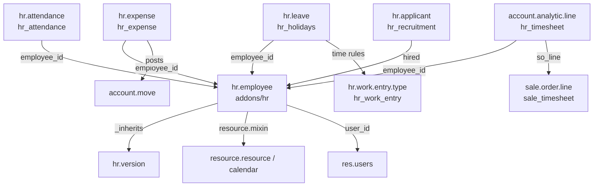

# Human resources

Active contributors: Odoo SA (upstream)

## Purpose

The HR family is 24 addons under `addons/` whose names start with `hr`. They all build on `addons/hr`, which owns the employee registry: departments, jobs, work locations, and the `hr.employee` record that links a person to a `res.users` login, a `res.partner` address, and a `resource.resource` working calendar. Everything else in the family (time off, expenses, recruitment, attendance, timesheets, skills) adds records that point back at an employee.

## Directory layout

```text
addons/
├── hr/                        # Employees: hr.employee, hr.version, hr.department, hr.job
│   ├── models/hr_employee.py  # 2,577 lines, the central model
│   ├── models/hr_version.py   # time-versioned employee record (783 lines)
│   └── models/hr_payroll_structure_type.py   # payroll hook only, see below
├── hr_work_entry/             # work entry types + time rules (no payroll engine)
├── hr_holidays/               # Time Off: hr.leave, allocations, accrual plans
├── hr_expense/                # Expenses -> account.move
├── hr_recruitment/            # applicants, stages, talent pools
│   ├── hr_recruitment_skills/ hr_recruitment_survey/ hr_recruitment_sms/
├── hr_attendance/             # check in/out, kiosk, badges
├── hr_timesheet/              # timesheets on account.analytic.line
├── hr_skills/                 # skills, levels, resume lines, CV report
│   ├── hr_skills_event/ hr_skills_slides/ hr_skills_survey/
├── hr_presence/               # presence heuristics from logs/IP/attendance
├── hr_calendar/ hr_calendar_google/ hr_address_extended/
├── hr_fleet/ hr_gamification/ hr_livechat/ hr_maintenance/
└── hr_holidays_attendance/ hr_timesheet_attendance/   # auto-installed bridges
```

## Key abstractions

| Name | File | Description |
|---|---|---|
| `hr.employee` | `addons/hr/models/hr_employee.py` | The employee record; `_inherits` `hr.version`, mixes in `resource.mixin`, `avatar.mixin`, mail thread/activity |
| `hr.version` | `addons/hr/models/hr_version.py` | A dated snapshot of employment data (job, schedule, salary structure); `current_version_id` points at the live one |
| `hr.employee.public` | `addons/hr/models/hr_employee_public.py` | Read-only projection of the non-confidential fields, for users outside `hr.group_hr_user` |
| `hr.leave` / `hr.leave.allocation` | `addons/hr_holidays/models/hr_leave.py` | Time off requests and the balances they draw from |
| `hr.expense` | `addons/hr_expense/models/hr_expense.py` | An expense line with its own state machine, posted into accounting |
| `hr.applicant` | `addons/hr_recruitment/models/hr_applicant.py` | Recruitment pipeline record, one stage set per `hr.job` |
| `hr.attendance` | `addons/hr_attendance/models/hr_attendance.py` | A check-in/check-out pair |
| `hr.work.entry.type` / `hr.time.rule` | `addons/hr_work_entry/models/hr_work_entry_type.py`, `addons/hr_work_entry/models/hr_time_rule.py` | Classification of worked and non-worked time, consumed by payroll |

## How it works

`hr.employee` is unusual among Odoo models because it delegates to a second table. It declares `_inherits = {'hr.version': 'version_id'}` with `_check_inherits_access = False`, and `version_id` is a computed, non-stored many2one resolved through `compute_sql`. Reading `employee.job_title` therefore reads it off whichever `hr.version` is current, and every dated change to employment terms creates a new version row instead of overwriting history.

Field-level confidentiality is enforced by group, not by a separate model: the class docstring in `addons/hr/models/hr_employee.py` requires every field that exists only on `hr.employee` (and not on `hr.employee.public`) to carry `groups="hr.group_hr_user"`, so the ORM prefetch never loads private data for users who only have the two groups defined in `addons/hr/security/hr_security.xml`, `group_hr_user` and `group_hr_manager`.



Time off (`addons/hr_holidays`) is the largest member after `hr` itself, at 7,742 model lines. It validates requests against the employee's `resource.calendar`, draws days from `hr.leave.allocation`, grows balances through accrual plans (`hr_leave_accrual_plan_level.py`), and maps approved leave onto work entry types so downstream payroll can classify the absence.

Expenses in 20.0 have no separate expense-report model: `hr.expense` alone carries a computed `state` (`draft`, `submitted`, `approved`, `posted`, `in_payment`, `paid`, `refused`) plus an `approval_state`, and posting produces `account.move` records through `addons/hr_expense/models/account_move.py`. `sale_expense` re-invoices an expense onto a sales order.

Timesheets do not add a model at all. `addons/hr_timesheet` extends `account.analytic.line` with employee, task, and project fields, which is why timesheet reporting is analytic reporting; `sale_timesheet` turns those lines into billable quantities on sales orders.

Attendance ships a second front end: `addons/hr_attendance/static/src/public_kiosk/public_kiosk_app.js` is a standalone OWL app served through public routes in `addons/hr_attendance/controllers/main.py` (`/hr_attendance/<token>`, badge scanning, manual selection), so a shared tablet can check people in without a logged-in session.

## Payroll is not in this repository

There is no `hr_payroll` addon here. What exists are hook points: the `hr.payroll.structure.type` model in `addons/hr/models/hr_payroll_structure_type.py` (name, country, default working hours), the salary-structure field on `hr.version`, a method at `addons/hr/models/hr_version.py:495` documented as "overridden in `hr_payroll`", and a test that resolves `hr_payroll.group_hr_payroll_user` with `raise_if_not_found=False`. Likewise `hr_work_entry` defines work entry *types* and time rules but no stored work entry records, because the generator lives in the payroll modules. Country payroll packs (`l10n_be_hr_payroll*`, `l10n_au_hr_payroll_api`, referenced from comments in `addons/fleet/models/fleet_vehicle.py` and `addons/account_edi_proxy_client/tests/test_neutralize.py`) are not part of this codebase either. The localization modules that *are* present only tune time off, for example `addons/l10n_fr_hr_holidays` (part-time workers in France) and `addons/l10n_in_hr_holidays`.

## Integration points

- `addons/hr` depends on `auth_signup`, `base_setup`, `digest`, `phone_validation`, `resource_mail`, and `web_hierarchy`. Fifteen manifests list `hr` as a direct dependency, thirteen of them in the HR family plus `mail_bot_hr` and `pos_hr`.
- Accounting: `hr_expense` requires `account` and posts moves; see [accounting](./accounting.md).
- Sales and services: `sale_expense`, `sale_timesheet`, `sale_timesheet_margin`, `project_timesheet_holidays`, `project_hr_expense` bridge into [sales](./sales-suite.md) and [project](./project-and-services.md).
- Auto-installed bridges (`hr_holidays_attendance`, `hr_recruitment_skills`, `l10n_fr_hr_holidays`) activate themselves as soon as both sides are installed.
- Mail: every major HR model inherits `mail.thread` and `mail.activity.mixin`; recruitment and expenses also use mail aliases for inbound email.

## Entry points for modification

Start at `addons/hr/models/hr_employee.py` and `hr_version.py`: the `_inherits` delegation there decides whether a new field belongs on the employee (stable identity) or the version (dated employment terms), and the `groups="hr.group_hr_user"` rule in the class docstring decides whether it is visible to colleagues. To add behavior to an existing HR flow, extend the owning model with `_inherit` from your own addon rather than editing these files, following [patterns and conventions](../how-to-contribute/patterns-and-conventions.md). For a new HR-adjacent app, copy the shape of `addons/hr_timesheet`: depend on `hr`, extend an existing record type, and add a bridge module for each other app you need to glue to.

## Key source files

| File | Purpose |
|---|---|
| `addons/hr/__manifest__.py` | Employees app manifest, dependency and data-file order |
| `addons/hr/models/hr_employee.py` | `hr.employee`, the central model (2,577 lines) |
| `addons/hr/models/hr_version.py` | Dated employment record delegated to by `hr.employee` |
| `addons/hr/models/hr_employee_public.py` | Public projection of employee data |
| `addons/hr/models/hr_payroll_structure_type.py` | Salary structure type, the payroll hook that stays in community |
| `addons/hr/security/hr_security.xml` | `group_hr_user`, `group_hr_manager` |
| `addons/hr_holidays/models/hr_leave.py` | Time off requests and validation (2,726 lines) |
| `addons/hr_holidays/models/hr_leave_allocation.py` | Balances and allocation requests |
| `addons/hr_holidays/models/hr_leave_accrual_plan_level.py` | Accrual rules that grow allocations |
| `addons/hr_expense/models/hr_expense.py` | Expense state machine and duplicate detection (2,309 lines) |
| `addons/hr_expense/models/account_move.py` | Posting expenses into accounting |
| `addons/hr_recruitment/models/hr_applicant.py` | Recruitment pipeline record |
| `addons/hr_attendance/controllers/main.py` | Public kiosk and badge routes |
| `addons/hr_attendance/static/src/public_kiosk/public_kiosk_app.js` | Standalone kiosk OWL app |
| `addons/hr_timesheet/models/account_analytic_line.py` | Timesheet fields on analytic lines |
| `addons/sale_timesheet/__manifest__.py` | Billing timesheets on sales orders |
| `addons/hr_skills/models/hr_employee_skill.py` | Employee skills and levels |
| `addons/hr_work_entry/models/hr_work_entry_type.py` | Work entry classification consumed by payroll |
| `addons/hr_presence/models/hr_employee.py` | Presence heuristics from logs and attendance |

## Related pages

- [Addon anatomy and inventory](./index.md)
- [Accounting](./accounting.md)
- [Sales suite](./sales-suite.md)
- [Project and services](./project-and-services.md)
- [Point of sale](./point-of-sale.md)
- [Localizations and integrations](./localizations-and-integrations.md)
- [Patterns and conventions](../how-to-contribute/patterns-and-conventions.md)
