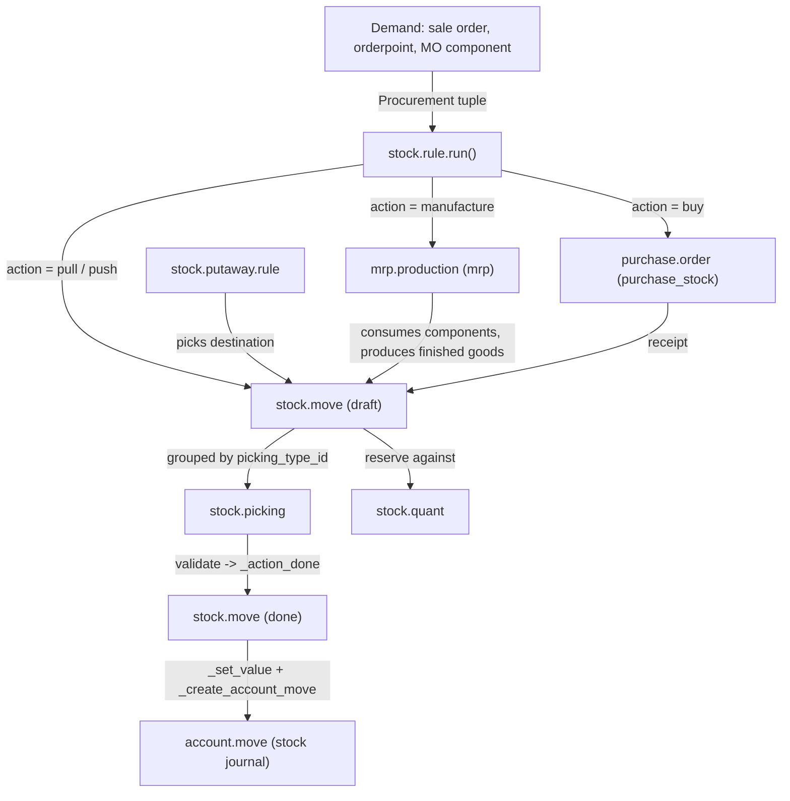

# Inventory and manufacturing

Active contributors: Odoo SA (upstream)

## Purpose

The supply-chain addons move physical goods and turn those movements into accounting entries. `addons/stock` owns the warehouse model (locations, quants, moves, transfers, lots, routes), `addons/mrp` builds products from bills of material, `addons/purchase` buys them, `addons/delivery` ships them, and `addons/stock_account` posts the resulting valuation journal entries. Together with their glue modules this family is 35 addons in `addons/` whose directory names start with `stock`, `mrp`, `purchase`, `delivery`, `barcodes` or `repair`.

## Directory layout

```text
addons/
  stock/                        # Inventory app (depends: product, barcodes_gs1_nomenclature, digest)
    models/stock_move.py        # 3,005 lines: the central movement record
    models/stock_picking.py     # 2,096 lines: transfers grouping moves
    models/stock_quant.py       # 1,602 lines: on-hand quantity per location
    models/stock_rule.py        # pull/push procurement rules
    models/product_strategy.py  # stock.putaway.rule, product.removal
    models/stock_warehouse.py   # warehouse + generated routes/operation types
    models/stock_orderpoint.py  # reordering rules and the replenishment scheduler
  stock_account/               # auto_install bridge: stock <-> account valuation
  mrp/                         # Manufacturing (depends: product, stock, resource)
    models/mrp_production.py    # 3,375 lines: manufacturing order
    models/mrp_bom.py           # bills of material and kits
    models/mrp_workorder.py     # operations executed on workcenters
  purchase/                    # Purchase (depends: account)
  purchase_stock/  purchase_requisition/  purchase_mrp/
  mrp_subcontracting/  mrp_account/  mrp_repair/
  delivery/                    # carriers and shipping cost lines
  barcodes/  barcodes_gs1_nomenclature/
  repair/  stock_dropshipping/  stock_landed_costs/  stock_delivery/
```

## Key abstractions

| Name | File | Description |
| --- | --- | --- |
| `stock.move` | `addons/stock/models/stock_move.py` | One product quantity travelling from a source to a destination location; states `draft`, `waiting`, `confirmed`, `partially_available`, `assigned`, `done`, `cancel` |
| `stock.move.line` | `addons/stock/models/stock_move_line.py` | The detail actually handled (lot, package, quantity done) |
| `stock.quant` | `addons/stock/models/stock_quant.py` | Reconciled on-hand quantity per product/location/lot/package |
| `stock.picking` | `addons/stock/models/stock_picking.py` | A transfer document; its state is computed from its moves |
| `stock.picking.type` | `addons/stock/models/stock_picking_type.py` | Operation type with `code` in `incoming`, `outgoing`, `internal` |
| `stock.location` / `stock.route` | `addons/stock/models/stock_location.py` | Hierarchical locations (`_parent_name = "location_id"`) and the routes attached to them |
| `stock.rule` | `addons/stock/models/stock_rule.py` | `action` in `pull`, `push`, `pull_push`; `procure_method` in `make_to_stock`, `make_to_order`, `mts_else_mto` |
| `stock.warehouse.orderpoint` | `addons/stock/models/stock_orderpoint.py` | Reordering rule; `_procure_orderpoint_confirm` is the scheduler entry point |
| `mrp.bom` | `addons/mrp/models/mrp_bom.py` | Bill of material, `type` either `normal` or `phantom` (kit) |
| `mrp.production` | `addons/mrp/models/mrp_production.py` | Manufacturing order, states `draft`, `confirmed`, `progress`, `to_close`, `done`, `cancel` |
| `mrp.workorder` / `mrp.workcenter` | `addons/mrp/models/mrp_workorder.py` | Operations and the capacity they consume |
| `purchase.order` | `addons/purchase/models/purchase_order.py` | RFQ to order, states `draft`, `sent`, `to approve`, `purchase`, `cancel` |
| `delivery.carrier` | `addons/delivery/models/delivery_carrier.py` | Shipping provider with a `rate_shipment` pricing API; base `delivery_type` is `fixed` or `base_on_rule` |
| `barcode.nomenclature` | `addons/barcodes/models/barcode_nomenclature.py` | Ordered `barcode.rule` set; `parse_barcode` classifies a scan |

## How it works

Demand is expressed as a procurement, routes turn it into moves, moves reserve quants, and completing a move posts value.



`stock.rule.run(procurements)` (`addons/stock/models/stock_rule.py`) dispatches each procurement to `_run_pull` or `_run_push`. Other addons widen the `action` selection rather than replacing the engine: `addons/mrp/models/stock_rule.py` adds `manufacture`, `addons/purchase_stock/models/stock_rule.py` adds `buy`. `stock.warehouse` generates the routes and operation types for a site from `reception_steps` (`one_step`, `two_steps`, `three_steps`) and `delivery_steps` (`ship_only`, `pick_ship`, `pick_pack_ship`) using its `Routing` namedtuple helpers.

Valuation lives in the `auto_install` bridge `addons/stock_account`. `_action_done` in `addons/stock_account/models/stock_move.py` computes move value (`cost_method` is `standard`, `average` or the `fifo` value added by `stock_account` to `product.category.property_cost_method`), then `_create_account_move` builds one `account.move` per batch of valued moves on `company.account_stock_journal_id` and posts it. `_should_create_account_move` gates this on a storable product, a valuation account on either location, a non-zero quantity, and `product.valuation == 'real_time'`. Manual cost corrections are journalled as `product.value` records (`addons/stock_account/models/product_value.py`). See [accounting](accounting.md) for the journal-entry side and for how purchase and sale orders become bills and invoices.

Barcode support is generic: `addons/barcodes` contributes a client-side scan plugin (`addons/barcodes/static/src/barcode_plugin.js`, `addons/barcodes/static/src/js/barcode_parser.js`) plus nomenclature rules, and `addons/stock/models/barcode.py` extends `barcode.rule.type` with `weight`, `location`, `lot` and `package`. `addons/barcodes_gs1_nomenclature` adds the GS1 application-identifier nomenclature (`is_gs1_nomenclature`, `gs1_separator_fnc1`, GS1 date parsing) and is a hard dependency of `stock`.

## Integration points

- `stock` depends on `product`, `barcodes_gs1_nomenclature` and `digest`; `mrp` on `product`, `stock`, `resource`; `purchase` on `account` only, with warehouse behaviour added by `purchase_stock`.
- Cross-app glue follows the pairwise-module convention: `purchase_mrp`, `purchase_requisition_stock`, `mrp_subcontracting_purchase`, `stock_delivery`, `stock_dropshipping` (depends on `sale_purchase_stock`), `stock_landed_costs`, `mrp_account`.
- `mrp_subcontracting` adds `subcontractor_ids` to `mrp.bom` and a `subcontract` BoM type, so an outsourced operation is still a manufacturing order.
- `repair` (`repair.order`, `addons/repair/models/repair.py`) depends on `sale_stock` and `sale_management` and reuses stock moves for parts consumption.
- `delivery` depends on `sale` and `payment_custom`; it adds a delivery line to the order and exposes `rate_shipment` (with `fixed_rate_shipment` and `base_on_rule_rate_shipment` implementations) for carrier addons to override. Label printing and tracking arrive with `stock_delivery`, which adds `send_shipping`, `get_tracking_link` and `cancel_shipment` in `addons/stock_delivery/models/delivery_carrier.py`.
- Front-end pieces are ordinary backend web-client extensions: `addons/stock/static/src/` contributes client actions (traceability report, multi-print), a forecast widget and dashboard graph fields. There is no offline-specific code here; only `addons/crm` consumes the offline framework.

## Entry points for modification

To change how goods flow, start at `stock.rule.run` in `addons/stock/models/stock_rule.py` and follow `_run_pull` into `stock.move._action_confirm` / `_action_assign` / `_action_done` in `addons/stock/models/stock_move.py`. To change what a validated move posts, override `_get_account_move_line_vals` or `_should_create_account_move` in `addons/stock_account/models/stock_move.py`. New manufacturing behaviour normally hooks `mrp.production._compute_state` or the `mrp.bom` explosion in `addons/mrp/models/mrp_bom.py`. Follow the `_inherit` and glue-module conventions described in [patterns and conventions](../how-to-contribute/patterns-and-conventions.md) rather than editing these addons in place, since this fork must stay rebasable onto upstream 20.0.

## Key source files

| File | Purpose |
| --- | --- |
| `addons/stock/__manifest__.py` | Inventory manifest: dependencies, 73 data files in load order, 6 demo files |
| `addons/stock/models/stock_move.py` | Move lifecycle, reservation, `_action_confirm/_assign/_done` |
| `addons/stock/models/stock_move_line.py` | Lot/package/quantity detail lines |
| `addons/stock/models/stock_picking.py` | Transfer document, computed state, backorders |
| `addons/stock/models/stock_quant.py` | On-hand quantities, inventory adjustments |
| `addons/stock/models/stock_rule.py` | Procurement rules, `run()`, `run_scheduler()` |
| `addons/stock/models/stock_location.py` | Locations and `stock.route` |
| `addons/stock/models/product_strategy.py` | `stock.putaway.rule` and `product.removal` strategies |
| `addons/stock/models/stock_warehouse.py` | Warehouse setup, reception/delivery step routes |
| `addons/stock/models/stock_orderpoint.py` | Reordering rules and replenishment scheduler |
| `addons/stock/models/stock_lot.py` | Lot and serial tracking |
| `addons/stock/models/barcode.py` | Stock-specific barcode rule types |
| `addons/stock_account/models/stock_move.py` | Move valuation and journal-entry creation |
| `addons/stock_account/models/product.py` | `cost_method`, FIFO/AVCO recomputation, category overrides |
| `addons/stock_account/models/product_value.py` | Audit trail of manual value/cost changes |
| `addons/mrp/models/mrp_production.py` | Manufacturing order state machine and component moves |
| `addons/mrp/models/mrp_bom.py` | Bills of material, kits, operations link |
| `addons/mrp/models/mrp_workorder.py` | Work orders and time tracking |
| `addons/mrp/models/mrp_workcenter.py` | Workcenters, capacity, productivity losses |
| `addons/purchase/models/purchase_order.py` | RFQ/PO workflow and bill creation |
| `addons/purchase_requisition/models/purchase_requisition.py` | Purchase agreements: `requisition_type` is `blanket_order` or `purchase_template` |
| `addons/delivery/models/delivery_carrier.py` | Carrier rating and shipping API |
| `addons/barcodes/models/barcode_nomenclature.py` | `parse_barcode` and rule matching |
| `addons/barcodes/static/src/barcode_plugin.js` | Client-side scanner capture |
| `addons/repair/models/repair.py` | `repair.order` and repair-to-stock integration |

## Related pages

- [Addons overview](index.md)
- [Accounting](accounting.md)
- [Sales suite](sales-suite.md)
- [Web client](web/index.md)
- [Patterns and conventions](../how-to-contribute/patterns-and-conventions.md)
