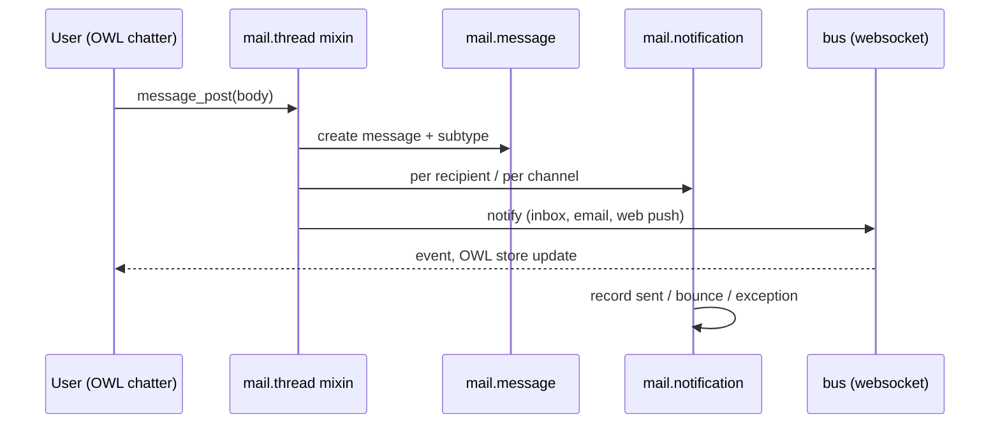

# Mail

Active contributors: Odoo SA (upstream)

## Purpose

`addons/mail` (display name "Discuss") is the messaging backbone: the `mail.thread` mixins that put a chatter on every business document, the `mail.activity` scheduling system, discuss channels, the email gateway, and templates. Most business apps depend on it; `crm.lead` is one of its heaviest consumers. Realtime delivery rides on `addons/bus`, the websocket event bus.

## Directory layout

```text
addons/mail/
├── models/         # mail_thread.py (the mixin, 5,446 lines), the thread-variant mixins,
│                   # mail_activity*.py, messages, followers, notifications, templates,
│                   # aliases, fetchmail.py, discuss/, and _inherit files for base models
├── controllers/    # /mail/..., /discuss/..., /websocket endpoints
├── wizard/         # compose message, schedule activity, followers edit
├── static/src/     # OWL chatter, discuss app, store, model layer
└── tools/          # discuss.py Store, alias errors, push, parser
```

## Key abstractions

| Name | File | What it does |
| --- | --- | --- |
| `mail.thread` | `addons/mail/models/mail_thread.py` | AbstractModel mixin: message posting, followers, tracking, inbound routing; tuned by class options (`_mail_post_access`, `_primary_email`). |
| `mail.thread.subject.suggested`, `mail.thread.blacklist`, `mail.thread.main.attachment` | `addons/mail/models/mail_thread_subject_suggested.py`, `addons/mail/models/mail_thread_blacklist.py`, `addons/mail/models/mail_thread_main_attachment.py` | Thin `mail.thread` variants: suggested composer subjects, mass-mailing opt-out from `mail.blacklist` (`addons/mail/models/mail_blacklist.py`), main-attachment picking. |
| `mail.activity` + `mail.activity.mixin` | `addons/mail/models/mail_activity.py`, `addons/mail/models/mail_activity_mixin.py` | Scheduled to-dos (`activity_ids`, `activity_state`, `my_activity_date_deadline`) with types and deadlines. |
| `mail.activity.plan` | `addons/mail/models/mail_activity_plan.py` | Reusable activity sequences per model. |
| `mail.message` | `addons/mail/models/mail_message.py` | Every chatter, log, and notification row. |
| `mail.followers` | `addons/mail/models/mail_followers.py` | Subscriptions with per-subtype filtering. |
| `mail.notification` | `addons/mail/models/mail_notification.py` | Per-recipient delivery state: inbox or email, sent/bounce/exception, failure reason. |
| `discuss.channel` | `addons/mail/models/discuss/discuss_channel.py` | Group channels, chats, livechat, alias-created channels; inherits `mail.thread` and `bus.sync.mixin`; WebRTC calls. |
| `mail.template` + `mail.render.mixin` | `addons/mail/models/mail_template.py`, `addons/mail/models/mail_render_mixin.py` | Templates rendering placeholders against a record. |
| `mail.alias` | `addons/mail/models/mail_alias.py` | Inbound addresses that spawn records on a target model. |
| `bus` | `addons/bus/models/bus.py`, `addons/bus/controllers/websocket.py` | Publish/subscribe event bus over `/websocket`; `auto_install`, depends on `base` and `web`. |

## How it works

A chatter post travels through the mixin, then fans out per recipient:



- **Chatter.** A model inheriting `mail.thread` gets `message_ids`, `message_follower_ids`, and the `message_*` computed fields. Form views render the panel with the `<chatter/>` tag, e.g. `addons/crm/views/crm_lead_views.xml:300`; the OWL implementation is `addons/mail/static/src/chatter/`.
- **Activities.** `mail.activity` rows point at `(res_model, res_id)` with a type, user, and deadline; plans bundle sequences; `action_create_calendar_event` schedules a meeting.
- **Followers and notifications.** Subscriptions filter on `mail.message.subtype`; `_notify_thread` in `addons/mail/models/mail_thread.py` splits delivery into inbox, email, and web-push paths, writing one `mail.notification` per recipient.
- **Gateway.** Aliases route inbound mail to a model via `message_route` in `addons/mail/models/mail_thread.py`; `addons/mail/models/fetchmail.py` polls POP/IMAP.
- **Discuss.** Channels add members, guests, polls, reactions, scheduled messages, and RTC sessions; the client keeps state in sync through the Store (`addons/mail/tools/discuss.py`) over the bus websocket.

History note: the fork's `20.0` branch is a single squashed commit whose message is "[FIX] mail: duplicate notifications", authored by Maryam Kia, with an `X-original-commit` trailer pointing at the upstream Odoo commit. The fix is real upstream work, but per-file history is unknowable from git alone.

## Integration points

- Depends on `base`, `base_setup`, `bus`, `web_tour`, `html_editor` (`addons/mail/__manifest__.py`).
- Extends base models from outside: `addons/mail/models/ir_access.py` (chatter tracking on `ir.access`), `addons/mail/models/ir_cron.py` (chatter and `_notify_admin`), `addons/mail/models/res_partner.py` (blacklist and activity mixins on `res.partner`).
- Business apps consume the mixins. `crm.lead` declares (`addons/crm/models/crm_lead.py:89`):

```python
_inherit = [
    'mail.thread.subject.suggested',
    'mail.thread.blacklist',
    'mail.thread.phone',             # defined in addons/phone_validation/models/mail_thread_phone.py
    'mail.activity.mixin',
    'utm.mixin',
    'format.address.mixin',
    'mail.tracking.duration.mixin',
]
```

- CRM's only Python extension of mail is `addons/crm/models/mail_activity.py`, which amends `action_create_calendar_event` so a meeting scheduled on a lead pre-fills the lead's partner as attendee.

## Entry points for modification

Fork rules apply: change only `addons/crm/`, and extend mail from there. To alter chatter or activity behavior for leads, override the mixin method with `_inherit` and keep a `super()` fallback, following `addons/crm/models/mail_activity.py`.

## Key source files

| File | Purpose |
| --- | --- |
| `addons/mail/models/mail_thread.py` | The thread mixin: posting, routing, notifications, tracking. |
| `addons/mail/models/mail_activity.py` | The activity model and its scheduling API. |
| `addons/mail/models/mail_message.py` | Message records. |
| `addons/mail/models/mail_followers.py` | Follower subscriptions and subtypes. |
| `addons/mail/models/mail_notification.py` | Delivery states and failure types. |
| `addons/mail/models/discuss/discuss_channel.py` | Discuss channels and their thread behavior. |
| `addons/mail/models/fetchmail.py` | Inbound POP/IMAP polling. |
| `addons/mail/tools/discuss.py` | The Store payload builder the client consumes. |
| `addons/bus/controllers/websocket.py` | The `/websocket` endpoint every client subscribes to. |
| `addons/crm/models/crm_lead.py` | The mixin `_inherit` list of `crm.lead`. |
| `addons/crm/models/mail_activity.py` | Reference `_inherit` extension from inside `addons/crm/`. |

## Related pages

- [CRM](crm/index.md) for how the pipeline consumes threads and activities.
- [Base module](base.md) for the groups, partners, and `ir.*` models mail extends.
- [Web client](web/index.md) for the OWL side of chatter and discuss.
- [Apps](index.md) for the addon inventory and composition rules.
- [Onboarding tours](../features/onboarding-tours.md), mail ships a tour in its data (`data/web_tour_tour.xml`).
- [Users, groups and access](../primitives/users-groups-and-access.md)
- [Patterns and conventions](../how-to-contribute/patterns-and-conventions.md)
