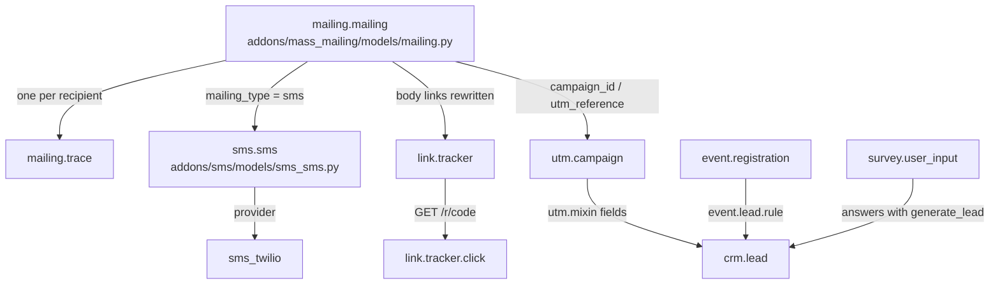

# Marketing

Active contributors: Odoo SA (upstream)

## Purpose

The marketing addons cover outbound communication and audience tracking: email and SMS campaigns, physical mail, events, surveys, short-link click tracking, periodic KPI digests, and gamified challenges. They matter to this fork because several of them feed `crm.lead` records into the pipeline, and because `addons/crm` inherits the UTM tracking fields they define.

## Directory layout

```text
addons/
  mass_mailing/            Email Marketing: mailing.mailing, lists, contacts, traces
  mass_mailing_sms/        SMS mailings (mailing_type = 'sms')
  mass_mailing_themes/     Email design themes
  mass_mailing_crm/        Bridge: lead counts per mailing
  mass_mailing_{event,event_track,sale,slides}[_sms]/   recipient-model bridges
  sms/                     SMS gateway (sms.sms, sms.template, trackers)
  sms_twilio/              Twilio provider for the gateway
  snailmail/               Printed-letter delivery via IAP
  event/                   Events, registrations, ticketing, mail schedulers
  event_booth/             Booth reservation
  event_crm/               Registration -> lead rules (auto_install)
  event_{product,sale,crm_sale,sms,booth_sale}/         commercial bridges
  website_event*/          Public event pages, tracks, exhibitors (12 modules)
  survey/                  Surveys, questions, user inputs, live sessions
  survey_crm/              Answers that generate leads (auto_install)
  gamification/            Challenges, goals, badges, karma
  gamification_sale_crm/   Sample CRM goal definitions (auto_install)
  utm/                     utm.mixin + campaign/source/medium/tag/stage
  link_tracker/            Short URLs and click statistics
  digest/                  Periodic KPI email + tips
  marketing_card/          Shareable generated cards
  marketing_card_event/    Card campaigns for events
```

There is no `marketing_automation` module in this repository; the automation app is not part of the open-source tree. Twelve modules carry the `mass_mailing` prefix.

## Key abstractions

| Name | File | Description |
| --- | --- | --- |
| `utm.mixin` | `addons/utm/models/utm_mixin.py` | Abstract mixin adding `campaign_id`, `source_id`, `medium_id` and the `utm_reference` Reference field; `default_get` reads values back from tracking cookies. |
| `mailing.mailing` | `addons/mass_mailing/models/mailing.py` | One campaign send: recipient model + domain or mailing lists, HTML body, A/B testing settings, aggregated statistics. |
| `mailing.trace` | `addons/mass_mailing/models/mailing_trace.py` | Per-recipient delivery record with `trace_status` and `failure_type`, the source of every mailing statistic. |
| `mailing.subscription` | `addons/mass_mailing/models/mailing_subscription.py` | Contact-to-list membership carrying `opt_out`, `opt_out_reason_id`, `opt_out_datetime`. |
| `sms.sms` | `addons/sms/models/sms_sms.py` | Outgoing SMS with provider state mapping (`IAP_TO_SMS_STATE_SUCCESS`) and `_send`/`_send_with_api`. |
| `snailmail.letter` | `addons/snailmail/models/snailmail_letter.py` | A report rendered to PDF and posted to the IAP print endpoint `/iap/snailmail/1/print`. |
| `event.event` | `addons/event/models/event_event.py` | Event with stage, `kanban_state`, seat counters (`seats_max`/`seats_reserved`/`seats_available`) and slots. |
| `event.mail` | `addons/event/models/event_mail.py` | Scheduler row: `interval_nbr`/`interval_unit`/`interval_type` relative to registration or event dates. |
| `event.lead.rule` | `addons/event_crm/models/event_lead_rule.py` | Rule that turns registrations into leads, per attendee or per order, on creation, confirmation or attendance. |
| `survey.survey` | `addons/survey/models/survey_survey.py` | Survey definition, sessions, scoring; `addons/survey_crm/models/survey_survey.py` adds `generate_lead` and `team_id`. |
| `gamification.challenge` | `addons/gamification/models/gamification_challenge.py` | Periodic goal set (`daily`/`weekly`/`monthly`/`yearly`/`once`) with a badge `reward_id`. |
| `link.tracker` | `addons/link_tracker/models/link_tracker.py` | Short URL (`link.tracker.code`) plus click log (`link.tracker.click`) and a stored `count`. |
| `digest.digest` | `addons/digest/models/digest.py` | KPI email with `periodicity` and `next_run_date`; each KPI is a `kpi_*` boolean plus a computed `kpi_*_value`. |
| `card.campaign` | `addons/marketing_card/models/card_campaign.py` | Generates per-record shareable cards (`card.card`) from a `card.template`. |

## How it works

A mailing names a recipient model (`mailing_model_id`) or a set of mailing lists, resolves recipients through `mailing_domain`, and writes one `mailing.trace` per recipient. Links in the body are rewritten to short URLs so clicks land on `/r/<code>` (`addons/link_tracker/controller/main.py`) or, for mailings, `/r/<code>/m/<trace_id>` (`addons/mass_mailing/controllers/main.py`), which attributes the click to a trace. Sending is driven by the `ir_cron_mass_mailing_queue` job in `addons/mass_mailing/data/ir_cron_data.xml`, with a second cron for A/B test winner selection.



UTM attribution is what ties campaigns back to the pipeline. `addons/utm/models/ir_http.py` stores `utm_*` URL parameters in cookies for 31 days in `_post_dispatch`, and `utm.mixin.default_get` reads them back when a record is created from a public request. Because `crm.lead` inherits `utm.mixin` (`addons/crm/models/crm_lead.py`), a lead created from a tracked link arrives with its campaign, source and medium already set. Counting goes the other way: `addons/mass_mailing_crm/models/mailing_mailing.py` and `addons/survey_crm/models/survey_survey.py` both group `crm.lead` by `utm_reference` matching `<model>,<id>` to report how many leads a mailing or a survey produced.

Lead creation from events is rule-driven rather than hardcoded. `event.lead.rule` filters a batch of registrations by domain, company, event and event category, then creates leads with the rule's `type`, `user_id` and `team_id` and contact data derived from the registrations. All matching rules apply, so one registration batch can produce several leads. The created lead keeps `event_lead_rule_id`, `event_id` and `registration_ids` (`addons/event_crm/models/crm_lead.py`), and those links survive a lead merge because the bridge extends `_merge_dependences` and `_merge_get_fields`.

Surveys generate leads from individual answers: `generate_lead` on `survey.question.answer` propagates up to the question and the survey, and `action_end_session` calls `_create_leads_from_generative_answers()` on the inputs collected during a live session.

Digests are the reporting counterpart. `digest.digest` sends a periodic KPI mail; `addons/crm/models/digest.py` adds `kpi_crm_lead_created` and `kpi_crm_opportunities_won`, both guarded by `_raise_if_not_member_of('sales_team.group_sale_salesman')`, and registers their menu actions and sort sequence through `_get_kpi_custom_settings`. `digest.tip` records add short HTML hints scoped to a group; CRM ships several in `addons/crm/data/digest_data.xml`.

## Integration points

- `utm` is a dependency of `crm`, `mass_mailing`, `event` and `link_tracker`. Any model that inherits `utm.mixin` becomes a possible campaign destination.
- `mass_mailing` depends on `html_builder` for the email designer and on `digest`, `link_tracker`, `social_media`, `web_tour`.
- `sms` is `auto_install: True` and hooks into `mail` (notifications, followers, scheduled messages, server actions). `sms_twilio` plugs a provider into `sms.sms`; without it, sending goes through IAP.
- `snailmail` and `sms` both consume IAP credits through `iap.account`; see [localizations and integrations](localizations-and-integrations.md).
- The `*_crm` bridges (`event_crm`, `survey_crm`, `mass_mailing_crm`, `gamification_sale_crm`, `event_crm_sale`, `website_event_crm`) are `auto_install: True`, so installing CRM alongside the marketing app wires them up with no user action.
- `gamification` also backs survey certifications (`survey` depends on it) and is reused by HR, see [HR](hr-suite.md).

## Entry points for modification

Adding a recipient model to email marketing means setting `_mailing_enabled = True` on it, exactly as `addons/mass_mailing_crm/models/crm_lead.py` does in three lines. To change how events produce leads, work on `event.lead.rule` rather than on `event.registration`; the rule model owns the filtering and the field mapping. New digest KPIs follow the `kpi_<name>` boolean plus `kpi_<name>_value` compute pattern and must be registered in `_get_kpi_custom_settings`.

Note the fork rule before touching any of these files: work in this repository is confined to `addons/crm`, so behaviour owned by a marketing addon has to be extended from CRM with `_inherit`, a controller subclass, a JS `patch()` or view inheritance. See [patterns and conventions](../how-to-contribute/patterns-and-conventions.md).

## Key source files

| File | Purpose |
| --- | --- |
| `addons/mass_mailing/models/mailing.py` | The mailing model: recipients, body, A/B testing, statistics. |
| `addons/mass_mailing/models/mailing_trace.py` | Per-recipient delivery and engagement record. |
| `addons/mass_mailing/models/mailing_list.py` | Mailing lists with contact/opt-out/blacklist counters. |
| `addons/mass_mailing/data/ir_cron_data.xml` | Queue-processing and A/B-testing crons. |
| `addons/mass_mailing/controllers/main.py` | Tracking, unsubscribe and `/r/<code>/m/<trace>` click routes. |
| `addons/mass_mailing_crm/models/mailing_mailing.py` | Lead counts per mailing, CRM mailing template action. |
| `addons/sms/models/sms_sms.py` | Outgoing SMS, provider state mapping, sending. |
| `addons/sms_twilio/models/sms_sms.py` | Twilio delivery path for the gateway. |
| `addons/snailmail/models/snailmail_letter.py` | PDF rendering and IAP print submission. |
| `addons/event/models/event_event.py` | Event definition, stages, seat accounting. |
| `addons/event/models/event_mail.py` | Registration and event mail schedulers. |
| `addons/event_crm/models/event_lead_rule.py` | Registration-to-lead rules. |
| `addons/event_crm/models/crm_lead.py` | Event fields on the lead and merge handling. |
| `addons/survey/models/survey_survey.py` | Survey definition, sessions, scoring. |
| `addons/survey_crm/models/survey_survey.py` | `generate_lead`, target team, lead counting. |
| `addons/gamification/models/gamification_challenge.py` | Periodic challenges and badge rewards. |
| `addons/utm/models/utm_mixin.py` | Campaign/source/medium fields and cookie-based defaults. |
| `addons/utm/models/ir_http.py` | Writes `utm_*` cookies during dispatch. |
| `addons/link_tracker/controller/main.py` | The `/r/<code>` redirect. |
| `addons/digest/models/digest.py` | KPI digest model, periodicity, sending. |
| `addons/crm/models/digest.py` | CRM's two digest KPIs. |
| `addons/crm/data/digest_data.xml` | CRM digest tips and default KPI activation. |
| `addons/marketing_card/models/card_campaign.py` | Generated shareable card campaigns. |

## Related pages

- [CRM](crm/index.md)
- [Sales](sales-suite.md)
- [Website](website-suite.md)
- [Messaging](mail.md)
- [HR](hr-suite.md)
- [Localizations and integrations](localizations-and-integrations.md)
- [Cron and scheduled actions](../primitives/cron-and-scheduled-actions.md)
- [Patterns and conventions](../how-to-contribute/patterns-and-conventions.md)
