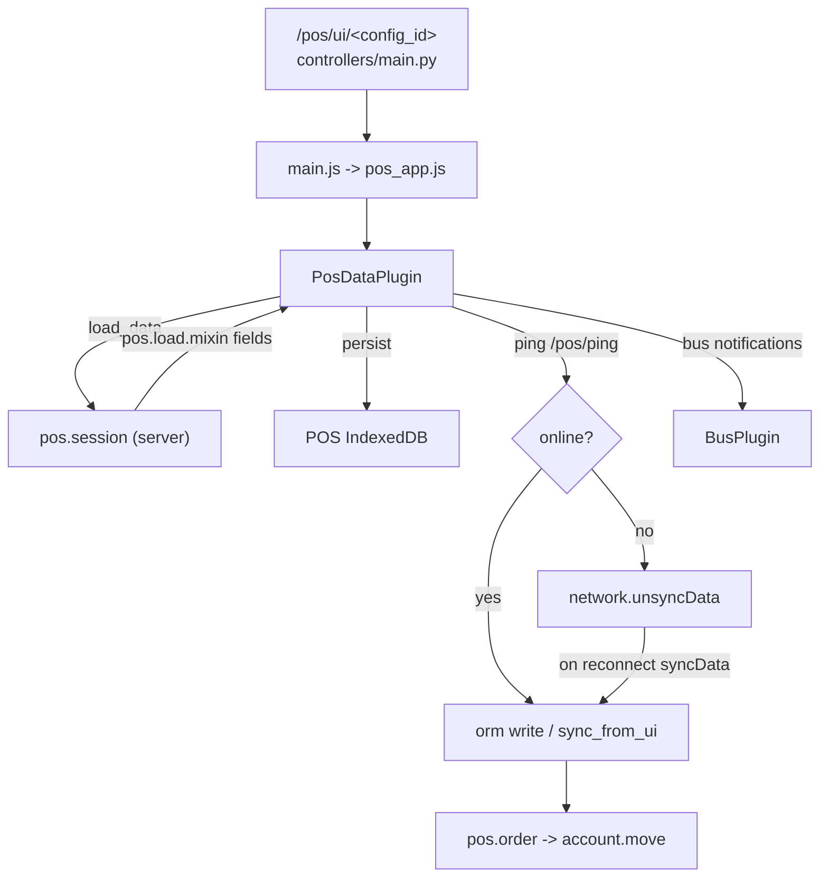

# Point of sale

Active contributors: Odoo SA (upstream)

## Purpose

`addons/point_of_sale` is a cashier terminal that runs as its own single-page OWL application, separate from the backend web client, and keeps selling when the network drops. Around it sit 45 further addons named `pos_*` (payment terminals, restaurant, self-ordering, loyalty, stock and sale bridges) and 28 `l10n_*` modules with `pos` in their name that adapt receipts and fiscal reporting per country.

## POS offline is not the fork's offline stack

The POS has had its own offline capability for years and it is a completely separate mechanism from the web-client offline framework this fork is built around. They do not share a service worker, an IndexedDB wrapper, a queue, or an encryption layer:

| | POS | Web client ([offline and PWA](../features/offline-and-pwa/index.md)) |
|---|---|---|
| Store | `addons/point_of_sale/static/src/app/models/utils/indexed_db.js` (plain, batched, 500-record batches, 5s transaction timeout) | `addons/web/static/src/core/utils/indexed_db.js` (AES-GCM encrypted, mutex, registry-hash wipe) |
| Worker | `addons/point_of_sale/static/src/app/service_worker.js`, scope `/pos` | `addons/web/static/src/service_worker.js`, scope `/odoo` |
| Pending writes | `network.unsyncData` in `addons/point_of_sale/static/src/app/plugins/pos_data_plugin.js`, replayed by `syncData()` | the `orm-to-sync` queue and the offline systray |
| Connectivity probe | `rpc("/pos/ping")` with a 2s retry | backoff ping on `/web/webclient/version_info` |

They would collide, so the POS explicitly turns the other one off. `addons/point_of_sale/static/src/app/plugins/offline_plugin.js` patches web's `OfflinePlugin.prototype.setup` to return early when `odoo.pos_config_id` or `session.data.config_id` is set, and clears `_crypto` so the ORM and many2x caching become no-ops. Without that patch, web's plugin would disable every button lacking `data-available-offline`, which in a POS screen is all of them.

## Directory layout

```text
addons/point_of_sale/
├── models/            # pos.config, pos.session, pos.order, pos.payment*, pos.load.mixin
├── controllers/main.py    # /pos/ui, /pos/ping, /pos/service-worker.js, /pos/ticket
├── receipt/           # QWeb receipt templates, shared by backend and POS UI
├── wizard/            # session details, daily sales report, invoicing
└── static/src/
    ├── app/           # the POS single-page app
    │   ├── main.js, pos_app.js        # boot and root component
    │   ├── screens/                   # product, payment, ticket, login, scale, tip
    │   ├── plugins/                   # pos_data_plugin, offline_plugin, router, printer
    │   ├── models/                    # client-side ORM (related_models) + indexed_db
    │   └── service_worker.js
    ├── backend/       # kanban dashboard, "Open POS" button, views
    └── customer_display/   # second screen shown to the shopper
addons/pos_restaurant/     # floors, tables, courses, bill splitting, kitchen printing
addons/pos_self_order/     # QR/kiosk self-ordering (depends on pos_restaurant)
addons/pos_hr/ pos_sale/ pos_stock/ pos_loyalty/ ...   # app bridges
addons/pos_adyen/ pos_stripe/ pos_razorpay/ ...        # payment terminals
```

## Key abstractions

| Name | File | Description |
|---|---|---|
| `pos.config` | `addons/point_of_sale/models/pos_config.py` | One configured point of sale: journals, payment methods, printers, preset behavior (1,493 lines) |
| `pos.session` | `addons/point_of_sale/models/pos_session.py` | A cashier shift, states `opening_control` → `opened` → `closing_control` → `closed`; also the data-loading entry point |
| `pos.order` | `addons/point_of_sale/models/pos_order.py` | A ticket, states `draft`, `paid`, `done`, `cancel`; `sync_from_ui` is how the client writes it (1,748 lines) |
| `pos.load.mixin` | `addons/point_of_sale/models/pos_load_mixin.py` | Per-model contract (`_load_pos_data_domain`, `_load_pos_data_fields`) for what gets shipped to the client |
| `PosDataPlugin` | `addons/point_of_sale/static/src/app/plugins/pos_data_plugin.js` | Client data layer: loading, IndexedDB persistence, connectivity, deferred writes (1,205 lines) |
| `PosStore` | `addons/point_of_sale/static/src/app/services/pos_store.js` | Application state and order manipulation (3,204 lines) |
| `IndexedDB` (POS) | `addons/point_of_sale/static/src/app/models/utils/indexed_db.js` | The POS-local record store |

## How it works

Opening the POS hits `/pos/ui/<config_id>` in `addons/point_of_sale/controllers/main.py`, which resolves or creates a `pos.session` and serves the standalone asset bundle declared as `point_of_sale._assets_pos` in `addons/point_of_sale/__manifest__.py`. That bundle reuses web's module loader, OWL, and core plugins but strips the debug tooling, so the POS boots without the backend web client.

`addons/point_of_sale/static/src/app/main.js` mounts a loader, then the `Chrome` root component. `PosDataPlugin` then calls `pos.session.load_data` (`addons/point_of_sale/models/pos_session.py:189`), which walks every model implementing `pos.load.mixin` and returns exactly the fields each one declares. The result is written into the POS IndexedDB store and rehydrated into a client-side relational model (`addons/point_of_sale/static/src/app/models/related_models/`) so the cashier works against local records, not RPCs.



While online, the client writes through `PosDataPlugin` to the ORM and to `pos.order.sync_from_ui`. When a write raises `ConnectionLostError` and the call was marked `queue`, the plugin pushes `{args, date, try, uuid}` onto `network.unsyncData` instead of throwing, and `checkConnectivity()` retries `/pos/ping` every two seconds until it succeeds, then calls `syncData()`. Calls to `sync_from_ui` are deliberately excluded from that buffer; paid orders are tracked separately through `localUnsyncedPaidOrderUuids`, the set of orders written to IndexedDB but not yet confirmed by the server.

Server-side, `sync_from_ui` (`addons/point_of_sale/models/pos_order.py:874`) is idempotent by design, which is what makes replay safe: it looks up an existing open order, updates it only while it is still `draft`, and ignores orders the server already finalized. Each run is tagged with a random `sync_token` for the logs, and a `device_identifier` from `addons/point_of_sale/static/src/app/utils/devices_identifier_sequence.js` distinguishes concurrent terminals.

The POS service worker is small and blunt: it caches every GET response it can, explicitly skipping `web/dataset` calls (the dataset lives in IndexedDB instead) and non-GET requests. It is served from `/pos/service-worker.js` with `Service-Worker-Allowed: /pos`.

## Integration points

- Accounting: `account` is a hard dependency; orders post into `account.move` and cash is reconciled through `account.bank.statement`. See [accounting](./accounting.md).
- Sales and stock: `pos_sale`, `pos_sale_stock`, `pos_sale_margin`, `pos_stock`, `pos_mrp`, `pos_repair` link tickets to sales orders and inventory, see [inventory and manufacturing](./inventory-and-manufacturing.md).
- Hardware: `point_of_sale` depends on `iot_webserial`, which talks to serial devices from the browser through the Web Serial API with no IoT box (`addons/point_of_sale/static/src/app/utils/scale/web_serial_scale_interface.js`). `addons/iot_drivers` is the separate hardware-proxy addon for box-attached peripherals; receipt printing goes through `addons/point_of_sale/static/src/app/plugins/pos_ticket_printer_plugin.js`.
- Payment terminals (`pos_adyen`, `pos_stripe`, `pos_razorpay`, `pos_viva_com`, `pos_mercado_pago` and others) plug into the `point_of_sale.payment_terminals` bundle by implementing `payment_interface.js`.
- Restaurant and self-order: `addons/pos_restaurant` adds floors, tables, courses, bill splitting and kitchen printing; `addons/pos_self_order` (auto-installed with `pos_restaurant`) serves a public QR/kiosk front end from `addons/pos_self_order/controllers/orders.py` and has its own web manifest controller.
- Bus: `PosDataPlugin` subscribes to websocket channels so a second terminal or the kitchen display sees order changes.
- Localization: 28 `l10n_*pos*` modules add fiscal receipts and e-invoicing per country, see [localizations and integrations](./localizations-and-integrations.md).

## Entry points for modification

Read `addons/point_of_sale/static/src/app/plugins/pos_data_plugin.js` first; it decides what data reaches the client, when a write is deferred, and what "offline" means in the POS. To expose a new field or model to the terminal, implement `_load_pos_data_fields` and `_load_pos_data_domain` on the server model through `pos.load.mixin` rather than adding an RPC. New screens go under `addons/point_of_sale/static/src/app/screens/`; per the manifest comment, files in `static/src/app` are picked up by the POS bundle automatically unless SCSS ordering matters.

## Key source files

| File | Purpose |
|---|---|
| `addons/point_of_sale/__manifest__.py` | Dependencies and the `point_of_sale._assets_pos` bundle definition |
| `addons/point_of_sale/controllers/main.py` | `/pos/ui`, `/pos/ping`, `/pos/service-worker.js`, public ticket routes |
| `addons/point_of_sale/models/pos_config.py` | Terminal configuration |
| `addons/point_of_sale/models/pos_session.py` | Shift lifecycle and `load_data` |
| `addons/point_of_sale/models/pos_order.py` | Orders and the idempotent `sync_from_ui` |
| `addons/point_of_sale/models/pos_load_mixin.py` | Contract for shipping model data to the client |
| `addons/point_of_sale/models/pos_payment_method.py` | Payment method and terminal binding |
| `addons/point_of_sale/static/src/app/main.js` | POS boot sequence |
| `addons/point_of_sale/static/src/app/plugins/pos_data_plugin.js` | Client data layer and offline buffering |
| `addons/point_of_sale/static/src/app/plugins/offline_plugin.js` | Neutralizes web's `OfflinePlugin` inside the POS |
| `addons/point_of_sale/static/src/app/models/utils/indexed_db.js` | POS-local IndexedDB wrapper |
| `addons/point_of_sale/static/src/app/service_worker.js` | Cache-everything worker scoped to `/pos` |
| `addons/point_of_sale/static/src/app/services/pos_store.js` | Application state and order operations |
| `addons/point_of_sale/static/src/app/screens/payment_screen/` | Payment flow UI |
| `addons/point_of_sale/static/src/customer_display/` | Shopper-facing second screen |
| `addons/pos_restaurant/__manifest__.py` | Restaurant extension |
| `addons/pos_self_order/controllers/orders.py` | Public self-ordering and kiosk endpoints |
| `addons/iot_webserial/__manifest__.py` | Browser-side serial device support |

## Related pages

- [Offline and PWA](../features/offline-and-pwa/index.md) (the fork's offline stack, a different mechanism from the one on this page)
- [Addon anatomy and inventory](./index.md)
- [Accounting](./accounting.md)
- [Sales suite](./sales-suite.md)
- [Inventory and manufacturing](./inventory-and-manufacturing.md)
- [Human resources](./hr-suite.md)
- [Localizations and integrations](./localizations-and-integrations.md)
- [Patterns and conventions](../how-to-contribute/patterns-and-conventions.md)
