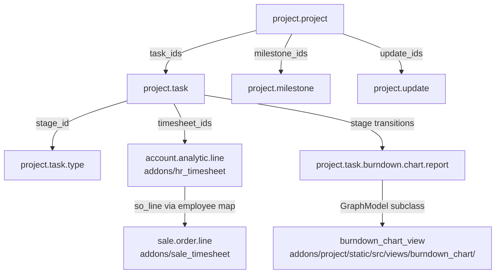

# Projects and services

Active contributors: Odoo SA (upstream)

## Purpose

`addons/project` is the task-management app: projects, stages, tasks with sub-tasks and dependencies, milestones, customer updates and portal sharing. Around it sit seventeen `project_*` bridge modules plus the timesheet chain (`hr_timesheet`, `sale_timesheet`) that turns logged hours into billable amounts. Equipment servicing lives separately in `addons/maintenance`.

## Directory layout

```text
addons/
  project/                  16.1k Python LOC, 114 JS files
    models/                 project.project, project.task, stages, milestones, updates, roles
    report/                 project.task.burndown.chart.report, report.project.task.user
    static/src/views/       one directory per js_class view + burndown_chart
    static/src/project_sharing/   the portal-side task editor
  project_todo/             personal to-do lists on top of project.task (auto_install)
  project_{stock,mrp,purchase,account,hr_expense,hr_skills,sms,...}/   15 more bridges
  project_timesheet_holidays/  time off reflected in timesheets
  hr_timesheet/             "Task Logs": timesheet fields on account.analytic.line
  hr_timesheet_attendance/  attendance-vs-timesheet report only (auto_install)
  sale_timesheet/           billing timesheets through sale order lines (auto_install)
  sale_timesheet_margin/    margin computation on timesheet-based sales
  maintenance/              equipment, requests, teams, stages (1.1k LOC)
  stock_maintenance/        lots consumed by maintenance requests (auto_install)
  repair/                   product repair orders (inventory-side, not field service)
```

Two things the plan for this page assumed are not in this repository: there is no `helpdesk` module and no field-service module (`industry_fsm`), and no `planning`. Both are Odoo Enterprise apps. The closest open-source equivalents are `maintenance` for equipment servicing and `repair` for product repairs, covered below and in [inventory and manufacturing](inventory-and-manufacturing.md).

## Key abstractions

| Name | File | Description |
| --- | --- | --- |
| `project.project` | `addons/project/models/project_project.py` | Task container; inherits `portal.mixin`, `mail.alias.mixin`, `rating.parent.mixin`, `mail.activity.mixin`, `mail.tracking.duration.mixin`, `analytic.plan.fields.mixin`. |
| `project.task` | `addons/project/models/project_task.py` | The work item. `_order = "priority desc, sequence, date_deadline asc, id desc"`, `_track_duration_field = 'stage_id'`. |
| `project.task.type` | `addons/project/models/project_task_type.py` | Kanban stage, shared across projects via `project_ids`; empty columns are kept visible by `project.task._read_group_stage_ids`. |
| `project.task.stage.personal` | `addons/project/models/project_task_stage_personal.py` | Per-user stage for a task, exposed as `personal_stage_id`/`personal_stage_type_id`. |
| `project.milestone` | `addons/project/models/project_milestone.py` | Deadline marker with `is_reached`, task counters and derived `is_deadline_exceeded`. |
| `project.update` | `addons/project/models/project_update.py` | Status report on a project: `status`, `progress`, task counts frozen at write time. |
| `project.role` | `addons/project/models/project_role.py` | Named set of users, used to staff projects. |
| `project.task.recurrence` | `addons/project/models/project_task_recurrence.py` | Repeating-task generator. |
| `project.task.burndown.chart.report` | `addons/project/report/project_task_burndown_chart_report.py` | `_auto = False` abstract report built from a CTE, one row per task per state transition date. |
| `account.analytic.line` (timesheet) | `addons/hr_timesheet/models/account_analytic_line.py` | A timesheet entry is an analytic line with `project_id`, `task_id`, `employee_id`, `unit_amount`. |
| `project.sale.line.employee.map` | `addons/sale_timesheet/models/project_sale_line_employee_map.py` | Maps an employee on a project to a sale order line, with `price_unit` and `cost`. |
| `maintenance.request` | `addons/maintenance/models/maintenance.py` | Corrective or preventive request with stage, priority, repeat rules. |
| `maintenance.equipment` | `addons/maintenance/models/maintenance.py` | Tracked asset (`maintenance.mixin` + mail thread) with category and serial number. |

## How it works

A task's position is described twice: `stage_id` is the shared kanban column, and `state` is a lifecycle selection (`01_in_progress`, `02_changes_requested`, `03_approved`, the closed states, `04_waiting_normal`). `state` is computed and recursive, so a task blocked by `depend_on_ids` lands in `04_waiting_normal` automatically. Stage changes are tracked for duration reporting through `_track_duration_field`, which is what feeds the burndown data.

Access is controlled by `privacy_visibility` on the project, with four levels: `followers` (team members only), `invited_users` (team members plus invited portal users), `employees` (all internal users) and `portal` (internal users plus invited portal users, the default). `allowed_internal_user_ids` is the computed, stored team list backing the first two levels. Portal collaborators get a reduced editor under `addons/project/static/src/project_sharing/`.



Timesheets are not a separate table. `hr_timesheet` extends `account.analytic.line` with `project_id`, `task_id`, `parent_task_id` and `milestone_id`, and adds conveniences such as `_get_favorite_project_id`, which defaults the project to one used in at least three of the last five entries. `sale_timesheet` then attaches a sale order line to each entry, either from the task or through `project.sale.line.employee.map`, so hours become invoiceable amounts; `sale_timesheet_margin` computes margin on top. `hr_timesheet_attendance` is the smallest module in the chain: it ships only `report/hr_timesheet_attendance_report_view.xml` and a security file, comparing recorded attendances with logged timesheets, and installs automatically when both `hr_timesheet` and `hr_attendance` are present. See [HR](hr-suite.md) for the attendance side.

Maintenance is structurally similar to a pipeline but independent of project: `maintenance.request` carries `stage_id` (`maintenance.stage`, `group_expand='_read_group_stage_ids'`), `priority`, a `maintenance_type` of `corrective` or `preventive`, and `repeat_unit`/`repeat_type` fields for recurring preventive work. `maintenance.mixin` is shared by `maintenance.equipment` and by any model that wants equipment-style maintenance counters. `stock_maintenance` adds the link from a request to the stock lots involved.

### Reporting views and the fill-temporal idea

`project` registers its own view classes as `js_class` values on the archs, the same mechanism CRM uses: `project_project_form`, `project_project_kanban`, `project_project_list`, `project_project_calendar`, `project_project_activity`, `project_task_form`, `project_task_kanban`, `project_task_graph`, `project_task_pivot`, `project_task_activity`, `project_task_calendar`. The burndown chart goes further, subclassing both the graph model and the search model (`addons/project/static/src/views/burndown_chart/burndown_chart_model.js`, `burndown_chart_search_model.js`) to force a date group-by, resolve stage sequences, and refuse group-by combinations the SQL report cannot answer.

That is a different solution to the same problem CRM solves with period filling. Odoo's graph model already has a `fillTemporal` notion (`addons/web/static/src/views/graph/graph_model.js`, `addons/web/models/models.py`); CRM's forecast views own a dedicated `addons/crm/static/src/views/fill_temporal_service.js` with a `GRANULARITY_TABLE` that expands empty months and quarters so a pipeline forecast shows periods with no records. Project's burndown instead materialises every date bucket server-side in the report CTE. If you are building a time-series view in this fork, compare both before choosing; the CRM approach is described in [CRM views](crm/crm-views.md).

## Integration points

- `project` depends on `analytic`, `base_setup`, `mail`, `portal_rating`, `resource`, `web`, `web_tour`, `digest`. It contributes its own digest KPIs in `addons/project/models/digest_digest.py`.
- `hr_timesheet` depends on `hr`, `analytic`, `project`, `uom`; `sale_timesheet` depends on `sale_project` and `hr_timesheet` and is `auto_install: True`.
- `project_todo`, `project_stock`, `project_mrp`, `project_account` and the other bridges are `auto_install: True`, so they appear as soon as both sides are installed.
- `maintenance` depends only on `mail`; `stock_maintenance` bridges it to `stock`.
- CRM does not depend on project in this repository. The overlap is conceptual (stages, kanban, mail thread mixins), not code-level; `sale_project` is the module that connects sold services to projects, see [Sales](sales-suite.md).

## Entry points for modification

To follow how a task moves, read `_compute_state` and `_compute_stage_id` in `addons/project/models/project_task.py`; almost every behavioural surprise in the app originates in the interaction between those two fields. For anything time-related in reporting, start from `addons/project/report/project_task_burndown_chart_report.py` rather than the JS, because the view is thin over a generated query. Remember the fork constraint: changes in this repository belong in `addons/crm` and must reach other addons through `_inherit`, `patch()` or view inheritance, per [patterns and conventions](../how-to-contribute/patterns-and-conventions.md).

## Key source files

| File | Purpose |
| --- | --- |
| `addons/project/models/project_project.py` | Project model, visibility, milestone aggregation, mail alias. |
| `addons/project/models/project_task.py` | Task model, state/stage computation, dependencies, personal stages. |
| `addons/project/models/project_task_type.py` | Kanban stages shared between projects. |
| `addons/project/models/project_milestone.py` | Milestones and deadline status. |
| `addons/project/models/project_update.py` | Project status updates. |
| `addons/project/models/project_task_recurrence.py` | Recurring task generation. |
| `addons/project/models/project_collaborator.py` | Portal collaborators on a project. |
| `addons/project/models/digest_digest.py` | Project KPIs added to the digest email. |
| `addons/project/report/project_task_burndown_chart_report.py` | `_auto = False` burndown data source. |
| `addons/project/static/src/views/burndown_chart/burndown_chart_model.js` | GraphModel subclass fetching stage sequences. |
| `addons/project/static/src/views/burndown_chart/burndown_chart_search_model.js` | Search model constraining group-bys to what the report supports. |
| `addons/project/static/src/views/project_task_kanban/` | The task kanban view class. |
| `addons/project/static/src/project_sharing/` | Portal-side task editing bundle. |
| `addons/hr_timesheet/models/account_analytic_line.py` | Timesheet fields and defaults on analytic lines. |
| `addons/hr_timesheet/models/project_task.py` | Allocated vs effective time on tasks. |
| `addons/hr_timesheet_attendance/report/hr_timesheet_attendance_report_view.xml` | The module's only view: attendance vs timesheet. |
| `addons/sale_timesheet/models/project_sale_line_employee_map.py` | Employee-to-sale-order-line mapping with price and cost. |
| `addons/sale_timesheet/models/sale_order.py` | Order-side invoicing of logged time. |
| `addons/maintenance/models/maintenance.py` | Stages, equipment categories, `maintenance.mixin`, equipment, requests, teams. |
| `addons/maintenance/models/res_config_settings.py` | Maintenance settings. |
| `addons/stock_maintenance/models/maintenance.py` | Lots consumed by maintenance requests. |
| `addons/repair/models/repair.py` | Repair orders for sold products. |

## Related pages

- [CRM](crm/index.md)
- [CRM views](crm/crm-views.md)
- [Sales](sales-suite.md)
- [HR](hr-suite.md)
- [Inventory and manufacturing](inventory-and-manufacturing.md)
- [Marketing](marketing-suite.md)
- [Patterns and conventions](../how-to-contribute/patterns-and-conventions.md)
