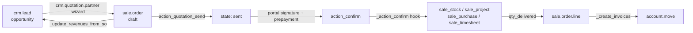

# Sales suite

Active contributors: Odoo SA (upstream)

## Purpose

`addons/sale` turns a quotation into a confirmed order and then into an invoice. `addons/sales_team` sits underneath it with the `crm.team` and `crm.team.member` models that both Sales and CRM share, and 28 further `sale_*` modules extend it, most of them thin bridges to stock, projects, timesheets, purchases and margins. `addons/sale_crm` is the handoff from an opportunity to a quotation.

## Directory layout

```text
addons/sales_team/                  # 555 lines: crm.team, crm.team.member, crm.tag
addons/sale/                        # 7,679 lines across models/
├── models/
│   ├── sale_order.py               # 2,925 L
│   ├── sale_order_line.py          # 2,363 L
│   ├── account_move.py, account_move_line.py, payment_transaction.py   # invoicing bridge
│   └── crm_team.py, product_template.py, res_company.py
├── controllers/                    # portal.py, product_configurator.py, combo_configurator.py
├── wizard/                         # advance invoice, discount, mass cancel, payment link
└── report/, data/, views/, static/, tests/

addons/sale_management/             # the "Sales" app UI + quotation templates
addons/sale_crm/                    # opportunity → quotation
addons/sale_stock/, sale_project/, sale_timesheet/, sale_purchase/, sale_mrp/   # delivery glue
addons/sale_pdf_quote_builder/, sale_product_matrix/, sale_loyalty/, sale_margin/, …
```

## Key abstractions

| Name | File | Description |
|---|---|---|
| `sale.order` | `addons/sale/models/sale_order.py` | Quotation and order in one model. `state` is `draft`, `sent`, `sale` or `cancel` (`SALE_ORDER_STATE`, line 26). |
| `sale.order.line` | `addons/sale/models/sale_order_line.py` | Order line, ordered `order_id, sequence, id`. `display_type` also lets a line be a section or note. |
| `sale.order.template` | `addons/sale_management/models/sale_order_template.py` | Reusable quotation template with its own lines and optional products. |
| `crm.team` | `addons/sales_team/models/crm_team.py` | Sales team: leader, members, favourites, dashboard entry point. |
| `crm.team.member` | `addons/sales_team/models/crm_team_member.py` | Intermediate membership record; CRM extends it with lead-assignment quotas. |
| `crm.quotation.partner` | `addons/sale_crm/wizard/crm_opportunity_to_quotation.py` | Transient wizard that resolves the customer before creating a quote from a lead. |
| `quotation.document` | `addons/sale_pdf_quote_builder/models/quotation_document.py` | Extra PDF pages merged into the printed quotation, with fillable form fields. |

## How it works

A quotation is created in `draft`, mailed with `action_quotation_send` (`addons/sale/models/sale_order.py:1525`) which flips it to `sent`, and confirmed with `action_confirm` (line 1619). Confirmation delegates the real work to `_action_confirm` (line 1674), which is the hook every glue module overrides: `sale_stock` creates delivery orders there, `sale_project` creates projects, `sale_purchase` creates purchase orders.

Two gates can stand before confirmation, both configured per company and both surfaced on the portal: an online signature (`require_signature`, with `signature`, `signed_by`, `signed_on` on the order) and a prepayment (`prepayment_percent`, resolved against `amount_total`). `addons/sale/controllers/portal.py` serves that customer-facing flow, and payment runs through the engine described in [Accounting](accounting.md).

Invoicing is quantity-driven rather than state-driven. Each line tracks `qty_delivered`, `qty_invoiced` and `qty_to_invoice`, and `invoice_status` rolls up to `to invoice`, `invoiced`, `upselling` or `no`. `_create_invoices` (line 2031) builds the `account.move` records from what is currently invoiceable, optionally grouped.



## Integration points

- `addons/sale` depends on only three modules: `sales_team`, `account_payment` (which pulls in `account`, `payment` and `portal`) and `utm`. The user-facing Sales app is `addons/sale_management`; `sale` itself is described in its manifest as "Sales internal machinery".
- `addons/sale_crm` is `auto_install`, so installing both CRM and Sales wires the handoff automatically. It adds `action_new_quotation`, `action_view_sale_quotation` and `action_view_sale_order` to `crm.lead` (`addons/sale_crm/models/crm_lead.py`), and `_update_revenues_from_so` pushes confirmed order amounts back onto the opportunity's expected revenue.
- `crm.team` is defined in `sales_team` and extended in both directions: `addons/sale_crm/models/crm_team.py` retargets the team dashboard button when the user is in the Sales app, while CRM builds its lead-assignment engine and per-member monthly quotas on `crm.team.member`. See [CRM](crm/index.md).
- Margin, expense and delivery behaviour is deliberately split into small bridges (`sale_margin`, `sale_stock_margin`, `sale_timesheet_margin`, `sale_expense`, `sale_loyalty_delivery`), each installed only when both sides are present. Stock and manufacturing are covered in [Inventory and manufacturing](inventory-and-manufacturing.md); service delivery in [Project and services](project-and-services.md).

## Entry points for modification

Most customisations belong in `_action_confirm` or in the invoice-preparation helpers on `sale.order.line`, not in the state field. If the change is about what gets created when an order is confirmed, add a bridge module that overrides `_action_confirm`; if it is about what lands on the invoice, override the line's `_prepare_invoice_line`. For the CRM side, `addons/sale_crm` is the model to copy: a thin `auto_install` addon that only adds actions and a wizard.

Note there is no subscription module in this repository. Recurring revenue exists only as CRM's `crm.recurring.plan` / MRR fields; `addons/mysubscription` is unrelated, a small backend menu addon depending on `base` and `web`.

## Key source files

| File | Purpose |
|---|---|
| `addons/sale/__manifest__.py` | Module definition; depends on `sales_team`, `account_payment`, `utm`. |
| `addons/sale/models/sale_order.py` | Order lifecycle, signature/prepayment gates, `_create_invoices`. |
| `addons/sale/models/sale_order_line.py` | Line pricing, taxes, delivered/invoiced quantities, sections and notes. |
| `addons/sale/models/account_move.py` | Links invoices back to their originating orders. |
| `addons/sale/models/payment_transaction.py` | Confirms orders when an online payment succeeds. |
| `addons/sale/controllers/portal.py` | Customer portal: view, sign and pay a quotation. |
| `addons/sale/controllers/product_configurator.py` | Product variant and optional-product configuration from the order form. |
| `addons/sale/wizard/sale_make_invoice_advance.py` | Down payments and advance invoices. |
| `addons/sale_management/__manifest__.py` | The installable "Sales" application on top of `sale`. |
| `addons/sale_management/models/sale_order_template.py` | Quotation templates and their lines. |
| `addons/sales_team/models/crm_team.py` | `crm.team`: leader, members, company scoping, dashboard. |
| `addons/sales_team/models/crm_team_member.py` | Membership records, uniqueness constraints, `_synchronize_memberships`. |
| `addons/sale_crm/models/crm_lead.py` | Quotation actions and revenue sync on the opportunity. |
| `addons/sale_crm/wizard/crm_opportunity_to_quotation.py` | Customer-resolution wizard (create / link existing / none). |
| `addons/sale_pdf_quote_builder/models/quotation_document.py` | Composable PDF quotation documents. |
| `addons/sale_stock/models/sale_order.py` | Delivery creation and stock-driven `qty_delivered`. |
| `addons/sale_timesheet/models/sale_order.py` | Timesheet-driven delivered quantities for service products. |

## Related pages

- [Apps](index.md)
- [CRM](crm/index.md)
- [Accounting](accounting.md)
- [Inventory and manufacturing](inventory-and-manufacturing.md)
- [Project and services](project-and-services.md)
- [ORM](../systems/orm.md)
- [Patterns and conventions](../how-to-contribute/patterns-and-conventions.md)
