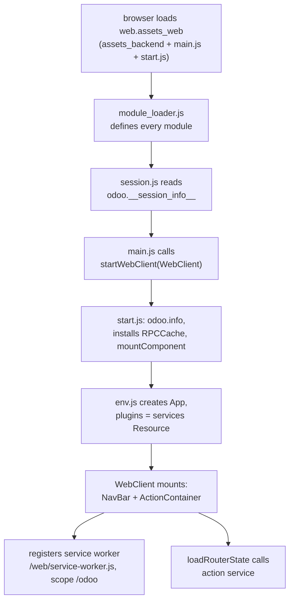

# Web client

Active contributors: bobbyabbott421-glitch (fork), Odoo SA (upstream)

## Purpose

The web client is the OWL single-page application that runs every Odoo action in the browser. `addons/web` ships the framework itself: the vendored UI framework, the plugin and service system, the RPC layer, registries, the action manager, the views framework, and the fork's entire offline/PWA stack. Business addons such as `addons/crm` consume and extend it; they never replace it.

## Directory layout

```text
addons/web/static/src/
├── main.js, start.js, env.js, session.js    boot chain and app environment
├── module_loader.js                         runtime module system (no bundler)
├── service_worker.js                        PWA service worker source
├── owl2/                                     Owl 2 -> Owl 3 compatibility layer
├── core/
│   ├── services.js, registry.js, orm_plugin.js, user.js, assets.js
│   ├── network/            rpc.js, rpc_cache.js, download.js, http_service.js
│   ├── offline/            offline_plugin.js, offline_error.js
│   ├── errors/             error_service.js, error_handlers.js, error_dialogs.js
│   ├── ui/                 ui_plugin.js, ui_utils.js, block_ui.js
│   ├── dialog/  popover/  overlay/  notifications/  hotkeys/  commands/
│   ├── pwa/                pwa_service.js, install_prompt.js
│   └── bottom_sheet/       bottom_sheet_plugin.js
├── model/                  JS model layer for views (relational_model/)
├── search/                 search model, control panel, with_search
├── views/                  form, list, kanban, calendar, graph, pivot, card, fields
├── webclient/              webclient.js, navbar/, actions/action_plugin.js, user_menu/
└── public/                 frontend-only code (website interactions, login, db manager)
```

## Key abstractions

| Name | File | Description |
| --- | --- | --- |
| Compat layer | `addons/web/static/src/owl2/owl3_compatibility_layer.js` | Patches vendored Owl 3 so Owl 2-era code keeps running |
| Module loader | `addons/web/static/src/module_loader.js` | `odoo.define` / `@odoo-module` system resolving `@web/...` imports at runtime |
| Registry | `addons/web/static/src/core/registry.js` | Global string-keyed registry with categories, sequences and UPDATE events |
| Services resource | `addons/web/static/src/core/services.js` | The OWL `Resource` named `services`; every plugin registers here |
| RPC | `addons/web/static/src/core/network/rpc.js` | JSON-RPC 2.0 POST layer; `ConnectionLostError` and `RPCError`; `rpcBus` events |
| RPC cache | `addons/web/static/src/core/network/rpc_cache.js` | RAM plus encrypted IndexedDB cache for RPC responses |
| ORM plugin | `addons/web/static/src/core/orm_plugin.js` | Typed ORM calls (`webRead`, `webSearchRead`, `webSave`, ...) over `/web/dataset/call_kw` |
| UI plugin | `addons/web/static/src/core/ui/ui_plugin.js` | Reactive `isSmall`/`size` signals, active-element stack, UI blocking |
| Legacy services | `addons/web/static/src/core/legacy_service_starter.js` | Starts `registry.category("services")` factories after all plugins |
| WebClient | `addons/web/static/src/webclient/webclient.js` | Root component; router state, service-worker registration |
| Action manager | `addons/web/static/src/webclient/actions/action_plugin.js` | Resolves and stacks actions, mounts view controllers |

## How it works

### Owl 3 behind an Owl 2 facade

The vendored framework lives in `addons/web/static/lib/owl/owl.js` and is Owl 3. `addons/web/static/src/owl2/owl3_compatibility_layer.js` patches it at load time: it replaces `Component` (and throws if a class still declares static `props` or `defaultProps`, since Owl 3 wants `useProps` schemas), adds `useLayoutEffect` (an Owl 2 `useEffect` equivalent), restores `useEnv`/`useSubEnv` through an `EnvPlugin`, and re-implements portals via a `t-custom-portal` directive. `addons/web/static/lib/owl/odoo_module.js` exposes the patched global as the `@odoo/owl` module; `addons/web/static/src/owl2/utils.js` re-exports the compat hooks as `@web/owl2/utils`. The layer's own header calls it a temporary bridge to be deleted once migration finishes.

There is no bundler. At asset generation time, `odoo/tools/js_transpiler.py` converts every source file carrying an `@odoo-module` annotation into a classic `odoo.define(...)` module; `addons/web/static/src/module_loader.js` then executes those factories in the browser and resolves import paths like `@web/core/registry` at runtime.

### Boot chain



`addons/web/static/src/main.js` exists only to call `startWebClient(WebClient)` so enterprise can swap the class. `addons/web/static/src/start.js` sets `odoo.info`, installs the RPC cache when `window.isSecureContext` and `session.browser_cache_secret` are both present, then mounts the app. `addons/web/static/src/env.js` builds the `App` with `plugins: services`, `getTemplate` from `addons/web/static/src/core/templates.js`, translation, and the `t-custom-click` directive; its `makeEnv()` returns a proxy that throws when code reads the removed `env.debug` or `env.isSmall` keys. Session data comes from `addons/web/static/src/session.js`, which captures `odoo.__session_info__` scraped into the page by the server.

`WebClient` (`addons/web/static/src/webclient/webclient.js`) renders the navbar and `ActionContainer` from template `web.WebClient`, loads the action stack from the URL on `ROUTE_CHANGE`, and in `onWillStart` registers the service worker at `/web/service-worker.js` with scope `/odoo`, resolving a `serviceWorkerIsActivated` promise other code can await.

### Plugins and the services resource

New-style global state is an OWL `Plugin` registered with `services.add(MyPlugin)` into the `services` Resource (`addons/web/static/src/core/services.js`, validated as `t.constructor(Plugin)`), and consumed with `usePlugin(MyPlugin)`. The registered plugins include the ORM plugin, `UIPlugin`, `HotkeyPlugin`, `DialogPlugin`, `PopoverPlugin`, `OverlayPlugin` and `OverlayManagerPlugin`, `NotificationPlugin` and `NotificationManagerPlugin`, `BottomSheetPlugin`, `EffectPlugin`, `TitlePlugin`, `LocalizationPlugin`, `DebugModePlugin`, the `ActionPlugin`, and the fork's `OfflinePlugin` (`addons/web/static/src/core/offline/offline_plugin.js`). Plugins hold reactive state in `signal` values read by calling them, for example `ui.isSmall()`. `MainComponentsContainer` (`addons/web/static/src/core/main_components_container.js`) renders anything registered in the `main_components` category, such as `BlockUI`.

### The legacy service bridge

An older service system also exists: plain objects with a `start(env, dependencies)` factory registered in `registry.category("services")` (menu, action, view, orm, ui, dialog, notification, hotkey, command, tooltip, and more). `LegacyServiceStarterPlugin` (`addons/web/static/src/core/legacy_service_starter.js`, sequence 100) starts them in dependency order after all plugins have started, and components consume them through `useService` in `addons/web/static/src/core/utils/hooks.js`. Most of these services are thin wrappers over a plugin, explicitly marked `@todo owl3 migration, temporary`; 17 files carry that marker. The repo rule is that new code uses the plugin API, never the bridges.

### RPC and the error chain

`rpc` in `addons/web/static/src/core/network/rpc.js` posts JSON-RPC 2.0 payloads and triggers `RPC:REQUEST`/`RPC:RESPONSE` on `rpcBus`; failures produce `ConnectionLostError` (network error, HTTP 502, or an unparseable response) or `RPCError` (server-side exception). The uncaught-error path runs through the error service in `addons/web/static/src/core/errors/error_service.js`, which dispatches to handlers in the `error_handlers` registry ordered by sequence: `offlineFailToFetchErrorHandler` (96, `addons/web/static/src/core/offline/offline_error.js`), `rpcErrorHandler` (97, `addons/web/static/src/core/errors/error_handlers.js`), `NonSecureContextErrorHandler` (98, `addons/web/static/src/core/errors/non_secure_context_error.js`), `lostConnectionHandler` (98, also in `offline_error.js`), and the default dialog handlers. The two offline handlers flip `OfflinePlugin.setOffline(true)`, which is one of the three offline-detection inputs described in [the offline stack](../../features/offline-and-pwa/index.md).

`RPCCache` (`addons/web/static/src/core/network/rpc_cache.js`) backs `orm.cache({type: "ram" | "disk"})`: a RAM layer plus an IndexedDB layer encrypted through `Crypto` (`addons/web/static/src/core/crypto.js`), versioned on `session.registry_hash`, capped at 2 GB with entries living up to one year. `?cache=0` in the URL disables it.

### Asset bundles and public/ code

`addons/web/__manifest__.py` defines the bundles. `web.assets_backend` (through the `web._assets_core` sub-bundle) ships the module loader, the vendored libs (OWL, luxon, Bootstrap, popper), all of `core/`, `model/`, `search/`, `webclient/`, and `views/` minus the graph and pivot code. Those two live in the lazy bundle `web.assets_backend_lazy` (plus `web.assets_backend_lazy_dark`), loaded on demand by the views framework. `web.assets_web` adds `main.js` and `start.js` to make the backend entry point. The `public/` directory is separate frontend-only code (website page interactions, login, database manager) built around `addons/web/static/src/public/interaction.js` and the `public.interactions` service; the backend webclient does not load it, since it ships in `web.assets_frontend`. See [bundle compilation](../../systems/assets.md).

## Integration points

- The server injects session info and `session.view_info` (from `ir.ui.view.get_view_info()` in `addons/web/models/ir_ui_view.py`) via `addons/web/controllers/webclient.py`; the manifest controller in `addons/web/controllers/webmanifest.py` serves the service worker, the web app manifest, and the offline page.
- Every ORM call from the client goes to `/web/dataset/call_kw/...` (the ORM plugin), so the Python ORM in `odoo/orm/` is the other half of every data flow.
- The fork's offline and PWA stack is entirely inside this addon: `OfflinePlugin`, the encrypted IndexedDB wrapper, the service worker, the systray. CRM only consumes it; see [the offline stack](../../features/offline-and-pwa/index.md).
- Enterprise replaces `main.js` to boot a subclassed `WebClient`; nothing here may assume community-only.

## Entry points for modification

Project rules pin this fork's changes to `addons/crm/`, so in practice you extend the web client from CRM with `patch()`, subclassing, or view inheritance rather than editing `addons/web/`. When a change inside `addons/web` is genuinely needed, new global behavior is a `Plugin` class registered via `services.add(...)`, and anything that must remain reachable through `useService` also gets a bridge in `registry.category("services")`. Front-end changes only take effect after `./scripts/dev/rebuild-assets.sh`; see [patterns and conventions](../../how-to-contribute/patterns-and-conventions.md).

## Key source files

| File | Purpose |
| --- | --- |
| `addons/web/static/src/owl2/owl3_compatibility_layer.js` | Patches vendored Owl 3 for Owl 2 compatibility |
| `addons/web/static/src/module_loader.js` | Runtime module system for all asset code |
| `addons/web/static/src/main.js` | Boot entry, swappable by enterprise |
| `addons/web/static/src/start.js` | `startWebClient`: session info, RPC cache, mount |
| `addons/web/static/src/env.js` | `makeEnv`, `mountComponent`, custom directives |
| `addons/web/static/src/webclient/webclient.js` | Root component, router, service-worker registration |
| `addons/web/static/src/core/services.js` | The `services` Resource plugins register into |
| `addons/web/static/src/core/registry.js` | Registry with categories and sequences |
| `addons/web/static/src/core/network/rpc.js` | RPC layer, `ConnectionLostError`, `rpcBus` |
| `addons/web/static/src/core/network/rpc_cache.js` | RAM + encrypted disk RPC cache |
| `addons/web/static/src/core/orm_plugin.js` | ORM plugin and its legacy `orm` service bridge |
| `addons/web/static/src/core/ui/ui_plugin.js` | Small-screen signals, active element, block UI |
| `addons/web/static/src/core/errors/error_service.js` | Uncaught error dispatch to `error_handlers` |
| `addons/web/static/src/core/legacy_service_starter.js` | Starts legacy services after plugins |
| `addons/web/static/src/core/main_components_container.js` | Renders `main_components` registry |
| `addons/web/static/src/core/offline/offline_plugin.js` | The fork's offline engine (see [sync queue](../../features/offline-and-pwa/sync-queue.md)) |
| `addons/web/static/src/webclient/actions/action_plugin.js` | Action manager plugin and `action` service |
| `addons/web/static/src/service_worker.js` | Service worker serving `/odoo` and the offline page |
| `addons/web/static/src/public/interaction.js` | Frontend interaction base for website pages |
| `addons/web/__manifest__.py` | All bundle definitions |

## Related pages

- [Views framework](views-framework.md): the view registry, arch parsing, `js_class`
- [Relational model](relational-model.md): the JS data layer under every standard view
- [The offline stack](../../features/offline-and-pwa/index.md)
- [Sync queue](../../features/offline-and-pwa/sync-queue.md)
- [Bundle compilation](../../systems/assets.md)
- [CRM views](../../apps/crm/crm-views.md): the worked example of extending this client
- [Test framework](../../systems/test-framework.md)
- [Patterns and conventions](../../how-to-contribute/patterns-and-conventions.md)
