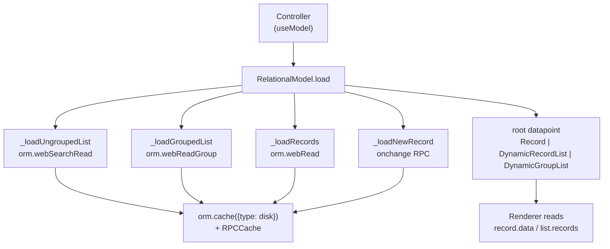

# Relational model

Active contributors: bobbyabbott421-glitch (fork), Odoo SA (upstream)

## Purpose

The relational model is the JavaScript data layer under the standard views. It loads records from the server, keeps the edited state in the browser, applies onchanges, validates, and saves. Form, list and kanban views all use it as their `Model` slot. It is also where this fork's offline write queue gets fed: every producer that queues an ORM call while the connection is lost lives in this directory. The queue engine itself is covered separately in [sync queue](../../features/offline-and-pwa/sync-queue.md).

## Directory layout

```text
addons/web/static/src/model/
├── model.js                      Model base class, useModel, useModelWithSampleData
├── record.js                     standalone Record component (cards, share target, one-off displays)
├── sample_server.js               fake ORM serving sample data for empty views
└── relational_model/
    ├── relational_model.js       RelationalModel orchestrator (root, config, loads)
    ├── record.js                 Record datapoint (form record, save flow)
    ├── dynamic_list.js           DynamicList base (selection, edit mode, multi edit)
    ├── dynamic_record_list.js    DynamicRecordList (ungrouped list/kanban root)
    ├── dynamic_group_list.js     DynamicGroupList (grouped root)
    ├── static_list.js            StaticList (x2many field value)
    ├── group.js                  Group datapoint (aggregates, folding)
    ├── datapoint.js              DataPoint base class
    ├── operation.js              x2many change operations
    ├── errors.js                 FetchRecordError
    └── utils.js                  field specs, formatting, getScheduleORMExtras
```

## Key abstractions

| Name | File | Description |
| --- | --- | --- |
| Model | `addons/web/static/src/model/model.js` | Base class; `useModel` creates it and re-renders on `update` events |
| RelationalModel | `addons/web/static/src/model/relational_model/relational_model.js` | Orchestrator: config, root datapoint, loads, hooks |
| DataPoint | `addons/web/static/src/model/relational_model/datapoint.js` | Common base with `config`, `fields`, `activeFields` |
| Record | `addons/web/static/src/model/relational_model/record.js` | One record: `_values`, `_changes`, save and offline save |
| DynamicList | `addons/web/static/src/model/relational_model/dynamic_list.js` | Shared list logic: selection, edit mode, multi save, resequence |
| StaticList | `addons/web/static/src/model/relational_model/static_list.js` | The in-record value of an x2many field, command-based |
| Group | `addons/web/static/src/model/relational_model/group.js` | A grouped row with aggregates and its own list |
| activeFields | `addons/web/static/src/model/relational_model/utils.js` | Per-view field metadata (modifiers, context) that drives what is fetched |
| Hooks | `addons/web/static/src/model/relational_model/relational_model.js` | `onWillSaveRecord`, `onRecordSaved`, `onWillLoadRoot`, ... customization points |

## How it works

### Model, config and the root datapoint

A controller creates its model with `useModel` or `useModelWithSampleData` (`addons/web/static/src/model/model.js`); the sample variant swaps in `buildSampleORM` from `addons/web/static/src/model/sample_server.js` when a first load returns no data and the arch allows `sample="1"`. `RelationalModel` (`addons/web/static/src/model/relational_model/relational_model.js`) then holds a `config` (resModel, fields, activeFields, domain, groupBy, orderBy, context, limit, offset) and one `root` datapoint created by `_createRoot`:

- `config.isMonoRecord` (a form) makes the root a `Record`,
- a non-empty `config.groupBy` makes it a `DynamicGroupList`,
- otherwise a `DynamicRecordList`.

Defaults: 80 records per page, 10,000 count limit, 80 groups. All mutating operations run inside the model's `Mutex` (`keepLast` guards concurrent root loads), so a save never races a reload.



### Loading data and the disk cache

`getFieldsSpec` in `addons/web/static/src/model/relational_model/utils.js` derives the fetch specification from `activeFields`, so a view only reads the fields it shows. Loads go through `orm.cache(...)` with the params built by `_getCacheParams`: `{ type: "disk", update: "always", noCache, callback }`. The `disk` type is `RPCCache` (`addons/web/static/src/core/network/rpc_cache.js`), the encrypted IndexedDB cache shared with the offline store (see [local store](../../features/offline-and-pwa/local-store.md) for the encryption and locking internals). While offline, loads are served from that cache; when a live response later arrives, the `callback` pushes fresh values into the root (`_setData`) and re-marks the view. While online, `noCache` makes every load after the first skip the disk cache, so a reload is never served stale; the exception is a form switching to another record or creating one, which reads through the cache.

Each successful load also does two offline bookkeeping tasks: `_setAvailableOffline` records the action/view (with the record id, or the current search state from `searchModel.getCurrentSearch()`) through `OfflinePlugin.setAvailableOffline`, and `_cacheMany2X` feeds relational display names to `OfflinePlugin.cacheMany2XSearch`. If a load fails with `ConnectionLostError`, `couldNotLoadRootOffline` is set so controllers can react.

### Editing and saving a record

`record.update(changes)` runs the changes through `_update`, which calls the server's `onchange` method when the field's `activeFields` entry has `onChange`, then applies values. Pending edits live in `record._changes` (x2many edits become `Operation` objects from `addons/web/static/src/model/relational_model/operation.js`), and `record.data` is what components read. `record.save()` calls `_save`:

1. abandon untouched new records in x2manys, then `_checkValidity`,
2. collect `_getChanges` (unity values are converted with `fromUnityToServerValues`),
3. call `orm.webSave(resModel, resId ? [resId] : [], changes, { context, specification, next_id })`,
4. on success, either reload with `_setData` or commit locally with `_commitSave`,
5. on `ConnectionLostError`, fall through to `_offlineSave`.

`urgentSave` is the page-close path: it tries `navigator.sendBeacon` to `/web/dataset/call_kw/<model>/web_save` when enabled, and notifies the user when that cannot work offline.

### Offline queue producers

These are the calls that keep the offline write queue alive; the entry format, keys and replay order are in [sync queue](../../features/offline-and-pwa/sync-queue.md).

- `Record._save` on `ConnectionLostError` calls `_offlineSave()` (`addons/web/static/src/model/relational_model/record.js`): `OfflinePlugin.scheduleORM(resModel, "web_save", [resIds, changes], { context, specification: {} })` with `extras` from `getScheduleORMExtras` plus `changes`, `originalValues` and a `timeStamp`. The entry key is `this._offlineId`, so repeated saves of one record overwrite one queue entry; `_commitSave` then makes the UI behave as if the save succeeded. New records queue the create, existing ones the write, both as `web_save`.
- `Record.delete` queues `"web_unlink"`, and `Record._toggleArchive` queues `"action_archive"`/`"action_unarchive"`, each with `getScheduleORMExtras` metadata.
- `DynamicList._deleteRecords`, `DynamicList._toggleArchive` and `DynamicList._saveRecords` do the same for list and kanban roots (`addons/web/static/src/model/relational_model/dynamic_list.js`), including multi-selection and domain-wide actions; `_saveRecords` falls back to per-record `_offlineSave`.
- `getScheduleORMExtras` in `addons/web/static/src/model/relational_model/utils.js` builds what the offline systray shows: action id and name, view type, timestamp, and a display name (or names and a count for batches).
- `Record.setOfflineChanges` re-applies a queued entry's changes when a parked save is reopened from the systray, using `extras.changes`.

`StaticList._applyValues` has one more offline fallback: when a paginated x2many needs to load records it has not fetched and the connection is lost, it reads them through `OfflinePlugin.readMany2XRecords` (`addons/web/static/src/model/relational_model/static_list.js`).

### Lists, groups and the x2many StaticList

`DynamicList` (`addons/web/static/src/model/relational_model/dynamic_list.js`) is the abstract base for the two root list types: it owns selection and domain-selection, `enterEditMode`/`leaveEditMode` (saving the edited record on exit), `sortBy`, drag-and-drop resequence through `orm.webResequence`, and the multi-edit flow (`_multiSave` batches a `web_save` or `web_save_multi` over the selection). `DynamicGroupList` (`addons/web/static/src/model/relational_model/dynamic_group_list.js`) holds `Group` datapoints, each with aggregates, a fold state, an optional record for the group-by value, and its own nested list config. `StaticList` is different: it is not a root; it is the value of a x2many field on a `Record`, tracking server ids plus unapplied commands (`x2ManyCommands` from `addons/web/static/src/core/orm_plugin.js`), a cache of already-loaded records, and commands for records never fetched (kept so onchange results can be replayed on save).

## Integration points

- Views select it as the `Model` slot (form, list, kanban in `addons/web/static/src/views/`); graph and pivot use their own models.
- Active fields come from arch parsing: `extractFieldsFromArchInfo` in `addons/web/static/src/model/relational_model/utils.js`, called by the ArchParsers' results.
- All server I/O goes through the ORM plugin (`addons/web/static/src/core/orm_plugin.js`) and its cache variants; the encrypted storage is shared with [the offline stack](../../features/offline-and-pwa/index.md).
- CRM subclasses it: `CrmFormModel` (`addons/crm/static/src/views/crm_form/crm_form.js`) and `CrmKanbanModel` (`addons/crm/static/src/views/crm_kanban/crm_kanban_model.js`) override `Model` slots; see [CRM views](../../apps/crm/crm-views.md).

## Entry points for modification

To change data behavior for one view, subclass `RelationalModel` (or `Record`) and set it as the view object's `Model` slot; use the `hooks` params (`onWillSaveRecord`, `onRecordSaved`, ...) rather than patching internals when the behavior is event-shaped. Anything that must survive offline has to stay a plain `scheduleORM` payload (model, method, args, kwargs, no id remapping), which rules out queueing onchange-driven or wizard flows; see [patterns and conventions](../../how-to-contribute/patterns-and-conventions.md).

## Key source files

| File | Purpose |
| --- | --- |
| `addons/web/static/src/model/model.js` | `Model` base, `useModel`, `useModelWithSampleData` |
| `addons/web/static/src/model/relational_model/relational_model.js` | Orchestrator: config, root, loads, cache params, offline marking |
| `addons/web/static/src/model/relational_model/record.js` | Record datapoint, save flow, `_offlineSave`, archive, delete |
| `addons/web/static/src/model/relational_model/dynamic_list.js` | List base: selection, edit mode, multi-edit, offline producers |
| `addons/web/static/src/model/relational_model/dynamic_record_list.js` | Ungrouped root list, quick create, paging |
| `addons/web/static/src/model/relational_model/dynamic_group_list.js` | Grouped root, group creation and moving |
| `addons/web/static/src/model/relational_model/static_list.js` | x2many value: commands, record cache, many2x offline read |
| `addons/web/static/src/model/relational_model/group.js` | Group datapoint with aggregates and folding |
| `addons/web/static/src/model/relational_model/datapoint.js` | `DataPoint` base class |
| `addons/web/static/src/model/relational_model/operation.js` | X2many change operations |
| `addons/web/static/src/model/relational_model/utils.js` | Field specs, value conversion, `getScheduleORMExtras` |
| `addons/web/static/src/model/sample_server.js` | Sample ORM for empty views |
| `addons/web/static/src/model/record.js` | Standalone `Record` component for cards and one-off record displays |
| `addons/web/static/src/core/network/rpc_cache.js` | The `disk` cache behind `orm.cache` |
| `addons/web/static/src/core/offline/offline_plugin.js` | `scheduleORM` and the queue APIs producers call |

## Related pages

- [Sync queue](../../features/offline-and-pwa/sync-queue.md): what happens to the calls queued here
- [The offline stack](../../features/offline-and-pwa/index.md)
- [Local store](../../features/offline-and-pwa/local-store.md): the encrypted IndexedDB layer under the RPC cache
- [Views framework](views-framework.md): who creates these models and with which activeFields
- [Web client](index.md): the ORM plugin and RPC layer below
- [CRM views](../../apps/crm/crm-views.md): `Model` slot swaps built on this layer
- [Test framework](../../systems/test-framework.md)
- [Patterns and conventions](../../how-to-contribute/patterns-and-conventions.md)
