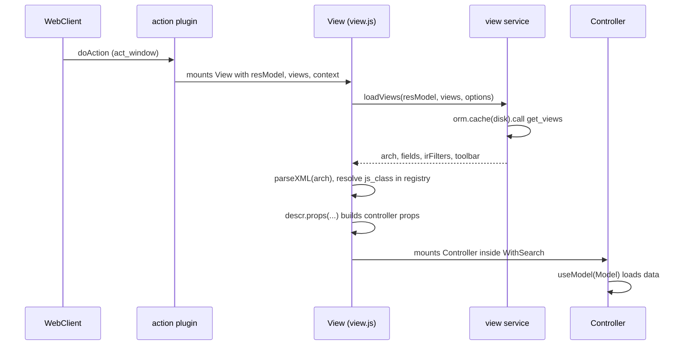

# Views framework

Active contributors: bobbyabbott421-glitch (fork), Odoo SA (upstream)

## Purpose

The views framework turns an action plus an XML arch into a live screen. It owns the `views` registry, arch parsing, the field components, and the control-panel and search machinery that wrap every view. Every standard view type (form, list, kanban, calendar, graph, pivot) and every addon customization built with `js_class` runs through the same few files described here.

## Directory layout

```text
addons/web/static/src/
├── views/
│   ├── view.js                  generic View component, js_class resolution
│   ├── view_service.js          loadViews (get_views RPC, disk-cached)
│   ├── view_compiler.js         arch-to-OWL-template compilation primitives
│   ├── view_hook.js             useActionLinks, useDeleteRecords, useExportRecords
│   ├── view_button/             <button type="object|action"> execution
│   ├── view_dialogs/             view-related dialogs (select_create, export)
│   ├── fields/                  field registry + all field components
│   ├── form/  list/  kanban/  calendar/          standard view types
│   ├── graph/  pivot/           lazy-loaded view types
│   ├── card/                    shared card primitives (used by kanban)
│   ├── widgets/                 generic view widgets
│   └── offline_action_helper.js fallback for views never visited online
└── search/
    ├── search_model.js          SearchModel (filters, favorites, groupbys)
    ├── search_arch_parser.js    <search> arch parser
    ├── with_search/with_search.js  wrapper feeding search results to views
    ├── control_panel/           control panel component
    └── search_bar/  search_panel/  cog_menu/  breadcrumbs/
```

## Key abstractions

| Name | File | Description |
| --- | --- | --- |
| View registry | `addons/web/static/src/core/registry.js` | `registry.category("views")` maps `js_class`/type keys to view objects |
| View object | `addons/web/static/src/views/form/form_view.js` | Descriptor with `ArchParser`/`Model`/`Renderer`/`Controller` slots |
| View component | `addons/web/static/src/views/view.js` | Loads arch and fields, resolves `js_class`, mounts the controller |
| View service | `addons/web/static/src/views/view_service.js` | `loadViews`: the `get_views` ORM call, cached on disk |
| ArchParser | `addons/web/static/src/views/kanban/kanban_arch_parser.js` | Turns the arch XML into a plain `archInfo` object |
| RelationalModel | `addons/web/static/src/model/relational_model/relational_model.js` | Default `Model` slot for form, list and kanban |
| Field registry | `addons/web/static/src/views/fields/field.js` | `registry.category("fields")` and the `Field` component |
| WithSearch | `addons/web/static/src/search/with_search/with_search.js` | Instantiates the SearchModel and feeds search params to views |
| Control panel | `addons/web/static/src/search/control_panel/control_panel.js` | Breadcrumbs, pager, view switcher, search bar host |
| OfflineActionHelper | `addons/web/static/src/views/offline_action_helper.js` | Fallback UI for actions never visited online |

## How it works

### View objects and the registry

A view type is a plain object registered under a key in `registry.category("views")`. The registry carries a validation schema (`viewRegistry.addValidation` in `addons/web/static/src/views/view.js`): a view object needs a `type` that exists in `session.view_info` and a `Controller` component. The other slots are optional. The canonical shape, from `addons/web/static/src/views/kanban/kanban_view.js`:

- `ArchParser`: parses the arch XML into `archInfo` (active actions, default group by, progressbar, ...).
- `Model`: the data layer class, `RelationalModel` by default (see [relational model](relational-model.md)); graph and pivot ship their own (`GraphModel`, `PivotModel`).
- `Renderer`: the OWL component that displays the data.
- `Controller`: the top component wired to the action manager, owning the model, buttons and dialogs.
- `Compiler`: turns arch snippets into OWL templates (`CardCompiler`, `FormCompiler`) using the primitives in `addons/web/static/src/views/view_compiler.js`.
- `SearchModel`: replaces the default search model; `ControlPanel`: replaces the control panel component.
- `buttonTemplate`, `searchMenuTypes`, `canOrderByCount`, `display`: knobs the generic `View` reads.
- `props(genericProps, view)`: a function turning the generic props into the controller's props, usually by running the ArchParser.

### From action to controller



The action plugin (`addons/web/static/src/webclient/actions/action_plugin.js`) resolves act_window actions and mounts the generic `View` component from `addons/web/static/src/views/view.js`. `View.loadView` completes the view description: it calls `viewService.loadViews` (`addons/web/static/src/views/view_service.js`), which invokes the model's `get_views` method through `orm.cache({ type: "disk" })`, so arch and fields survive a lost connection (the cache is invalidated when an `ir.ui.view` or `ir.filters` write is observed, via `rpcBus`). The arch is then parsed with `parseXML`, context flags like `create="0"` are folded into it, and the view object is looked up.

### The js_class mechanism

The lookup key is the `js_class` attribute on the arch's root element; if absent, the prop `jsClass` or the plain view `type` is used (both resolved in `View.loadView`). If the key is not yet in the registry, `View` loads the lazy bundle (`web.assets_backend_lazy`, or `..._lazy_dark` under the dark color scheme, through `loadBundle` in `addons/web/static/src/core/assets.js`) and retries, which is how graph and pivot views, shipped only in the lazy bundle, become available on first use. Addon XML binds archs to custom view objects with a single attribute, for example `js_class="crm_kanban"` in `addons/crm/views/crm_lead_views.xml`. CRM swaps every slot this way; see the worked example in [CRM views](../../apps/crm/crm-views.md).

### Arch parsing and compilation

ArchParsers never touch the DOM: `KanbanArchParser` (`addons/web/static/src/views/kanban/kanban_arch_parser.js`) reads attributes and child nodes (`header`, `control`, `progressbar`, templates) and returns a plain `archInfo` object built on `CardArchParser` (`addons/web/static/src/views/card/card_arch_parser.js`). The field nodes collected there are converted into the model's `activeFields` by `extractFieldsFromArchInfo` in `addons/web/static/src/model/relational_model/utils.js`, which is what decides what data gets fetched. Arch snippets embedded in the view (kanban cards, form buttons) are compiled into OWL templates by the `Compiler` slot using `useViewCompiler` from `addons/web/static/src/views/view_compiler.js`.

### Fields

`Field` (`addons/web/static/src/views/fields/field.js`) is the single component every `<field>` node renders; it picks the implementation from `registry.category("fields")` and validates entries against a schema (`component`, `supportedTypes`, `extractProps`, `fieldDependencies`, ...). It also carries the fork's per-type `availableOffline` map, used to decide which field widgets stay enabled offline. Implementations live one directory per field in `addons/web/static/src/views/fields/` (about 70 directories); formatting and parsing helpers are in `addons/web/static/src/views/fields/formatters.js` and `addons/web/static/src/views/fields/parsers.js`. Relational fields build on `addons/web/static/src/views/fields/relational_utils.js`: `Many2XAutocomplete.search()` feeds its successful `web_name_search` results to `OfflinePlugin.cacheMany2XSearch()` and falls back to `searchMany2XRecords()` on `ConnectionLostError`. The offline cache is described in [the offline stack](../../features/offline-and-pwa/index.md).

### Control panel and search

`View` mounts the controller inside `WithSearch` (`addons/web/static/src/search/with_search/with_search.js`), which instantiates the view object's `SearchModel` (default in `addons/web/static/src/search/search_model.js`) with the search view arch parsed by `addons/web/static/src/search/search_arch_parser.js`. The search model owns filters, favorites, group-bys and date periods, exposes `domain`/`context`/`groupBy`/`orderBy` to the view, and persists remembered searches used offline (`getCurrentSearch`). The control panel (`addons/web/static/src/search/control_panel/control_panel.js`) renders breadcrumbs, the pager, the view switcher (`alt+shift+v` cycles, each entry registers a command) and hosts the search bar; views can swap it through the `ControlPanel` slot. Layout composition comes from `extractLayoutComponents(descr)` in `addons/web/static/src/views/view.js` with `addons/web/static/src/search/layout.js`.

### Offline hooks in views

Two pieces of offline behavior belong to the framework itself: buttons opt in with the `data-available-offline` attribute (computed dynamically, for example `isNewButtonAvailableOffline` in `addons/web/static/src/views/form/form_controller.js`), and views never visited online render `OfflineActionHelper` (`addons/web/static/src/views/offline_action_helper.js`) offering the remembered searches. Both mechanisms are covered in [the offline stack](../../features/offline-and-pwa/index.md); the queue that replays offline writes is fed from the model layer, not from here.

## Integration points

- Consumed by the action manager: every act_window action with `view_mode` entries ends in this framework.
- Consumes the ORM plugin (`orm.cache`, `webSearchRead`, ...) through the model layer; see [relational model](relational-model.md).
- Extends into addons: CRM's `crm_kanban`, `crm_form`, `crm_list`, `crm_activity`, `crm_calendar`, `crm_graph`, `crm_pivot`, and the `forecast_*` variants all register view objects and bind them with `js_class` in `addons/crm/views/crm_lead_views.xml`.
- Lazy loading depends on the asset bundles; see [bundle compilation](../../systems/assets.md).

## Entry points for modification

A customization is usually: write a view object (often by spreading an existing one and swapping slots), register it in `registry.category("views")`, and bind an arch to it with `js_class` in the addon's view XML. A new field widget is an entry in `registry.category("fields")`. Controller or renderer tweaks use `patch()` instead of new classes. Conventions and the wiring-proof requirements are in [patterns and conventions](../../how-to-contribute/patterns-and-conventions.md); the full worked example is [CRM views](../../apps/crm/crm-views.md). JS changes require both test presets and an asset rebuild; see [test framework](../../systems/test-framework.md).

## Key source files

| File | Purpose |
| --- | --- |
| `addons/web/static/src/views/view.js` | Generic `View` component, `js_class` resolution, lazy bundle loading |
| `addons/web/static/src/views/view_service.js` | `loadViews` over `get_views`, disk-cached, cache invalidation |
| `addons/web/static/src/views/view_compiler.js` | Arch-to-template compilation primitives and `useViewCompiler` |
| `addons/web/static/src/views/view_hook.js` | Action links, delete confirmation, export dialog hooks |
| `addons/web/static/src/views/utils.js` | Shared view utilities (`processButton`, `computeViewClassName`) |
| `addons/web/static/src/views/form/form_view.js` | Reference view object (form) |
| `addons/web/static/src/views/kanban/kanban_view.js` | Reference view object (kanban, with `Compiler`) |
| `addons/web/static/src/views/kanban/kanban_arch_parser.js` | Arch parsing example |
| `addons/web/static/src/views/graph/graph_view.js` | Lazy-bundled view with its own Model and SearchModel |
| `addons/web/static/src/views/pivot/pivot_view.js` | Lazy-bundled pivot view object |
| `addons/web/static/src/views/card/card.js` | Standalone card component reusing the model layer |
| `addons/web/static/src/views/fields/field.js` | `Field` component, fields registry, `availableOffline` map |
| `addons/web/static/src/views/fields/relational_utils.js` | Many2X autocomplete with offline cache fallback |
| `addons/web/static/src/views/fields/formatters.js` | Field value formatting |
| `addons/web/static/src/views/fields/parsers.js` | Field value parsing |
| `addons/web/static/src/search/with_search/with_search.js` | SearchModel instantiation and search props |
| `addons/web/static/src/search/search_model.js` | Filters, favorites, group-bys, remembered searches |
| `addons/web/static/src/search/control_panel/control_panel.js` | Control panel component |
| `addons/web/static/src/views/offline_action_helper.js` | Offline fallback for unvisited views |
| `addons/web/static/src/webclient/actions/action_plugin.js` | Action resolution and controller mounting |

## Related pages

- [Relational model](relational-model.md): the `Model` slot's default implementation
- [Web client](index.md): plugins, RPC and the boot chain around this framework
- [CRM views](../../apps/crm/crm-views.md): every `js_class` slot swap in practice
- [The offline stack](../../features/offline-and-pwa/index.md)
- [Bundle compilation](../../systems/assets.md): lazy bundles behind graph and pivot
- [Test framework](../../systems/test-framework.md)
- [Patterns and conventions](../../how-to-contribute/patterns-and-conventions.md)
