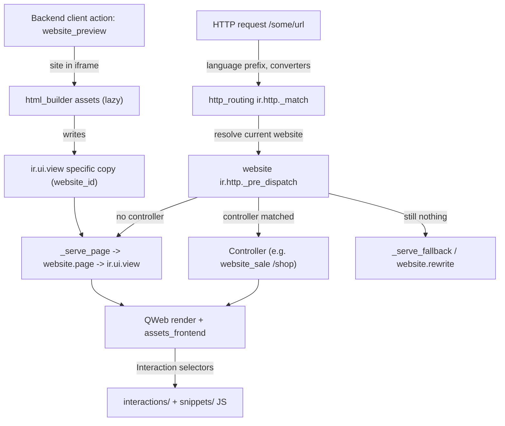

# Website suite

Active contributors: Odoo SA (upstream)

## Purpose

`addons/website` is a CMS bolted onto the same ORM the back office uses: pages are `ir.ui.view` records, menus and SEO metadata are models, and public URLs are dispatched through a website-aware `ir.http`. Around it sit 52 addons whose directory name starts with `website`, plus the editing stack (`addons/html_editor`, `addons/html_builder`), live chat (`addons/im_livechat`) and `addons/theme_default`. Front-end pages run a lightweight "Interaction" runtime rather than the back-office web client, while editing the site happens inside a back-office client action that embeds the site in an iframe.

## Directory layout

```text
addons/
  html_editor/                     # auto_install; Wysiwyg component + editor plugin system
  html_builder/                    # generic block/snippet builder (used by website and mass_mailing)
  website/
    models/website.py              # 2,728 lines: the `website` record, multi-site resolution
    models/mixins.py               # 1,100 lines: SEO, published, multi, searchable mixins
    models/ir_http.py              # 507 lines: _match, _pre_dispatch, _serve_page, _serve_fallback
    models/ir_ui_view.py           # website_id on views; specific-view copy-on-write
    models/website_page.py         # website.page, website.controller.page
    models/website_menu.py         # website.menu tree
    models/website_form.py         # which fields a public form may write
    models/theme_models.py         # theme.ir.ui.view / .ir.asset / .website.page / theme.utils
    controllers/main.py            # 2,281 lines: page serving, sitemap, editor endpoints
    controllers/form.py            # /website/form/<model> submission handling
    static/src/interactions/**     # 73 files: frontend behaviour (assets_frontend)
    static/src/snippets/**         # 41 files: per-snippet frontend logic
    static/src/builder/**          # edit-mode components (backend/iframe bundles)
    views/snippets/s_*.xml         # one XML file per snippet template
  website_sale/                    # eCommerce: ~12,850 lines of models + controllers
  website_blog/  website_forum/  website_slides/  website_livechat/
  website_crm/                     # auto_install: contact form -> crm.lead
  im_livechat/  theme_default/
```

## Key abstractions

| Name | File | Description |
| --- | --- | --- |
| `website` | `addons/website/models/website.py` | One site: domain, default language, `theme_id`, `specific_user_account`, and the resolution of "current website" per request |
| `website.page` | `addons/website/models/website_page.py` | A CMS page bound to an `ir.ui.view` plus URL, publication and visibility |
| `website.controller.page` | `addons/website/models/website_controller_page.py` | A model-listing page generated from a controller rather than authored HTML |
| `website.menu` | `addons/website/models/website_menu.py` | Hierarchical site navigation |
| `website.seo.metadata` | `addons/website/models/mixins.py` | `website_meta_title/description/keywords`, `website_meta_og_img`, `seo_name`, `is_seo_optimized` |
| `website.published.mixin` | `addons/website/models/mixins.py` | `is_published`, `publish_on`, `published_date`, `can_publish` |
| `website.visitor` / `website.track` | `addons/website/models/website_visitor.py` | Anonymous visitor identity and per-page visit tracking |
| `website.rewrite` / `website.route` | `addons/website/models/website_rewrite.py` | URL redirects and the catalogue of known routes |
| `theme.ir.ui.view` and friends | `addons/website/models/theme_models.py` | Theme-owned views/assets/attachments/menus/pages, copied into the site on theme install |
| `Interaction` | `addons/web/static/src/public/interaction.js` | Base class for frontend behaviour, instantiated per element matching its static `selector` |
| `Colibri` | `addons/web/static/src/public/colibri.js` | Mini reactive engine driving an interaction's dynamic content |
| `Wysiwyg` | `addons/html_editor/static/src/wysiwyg.js` | The editor component; behaviour is composed from editor plugins |

## How it works

A public request never reaches the back-office client. `addons/http_routing` supplies URL converters and a `_match` that strips the language prefix; `addons/website/models/ir_http.py` then resolves the current website, runs `_pre_dispatch`, and if no controller matched falls back to `_serve_page` (a `website.page`) or `_serve_fallback`. The response is QWeb-rendered server side, and the browser loads `web.assets_frontend`, which boots the interactions found in the DOM.



Editing runs in the back office, not the frontend. `web.assets_backend` includes `website.assets_editor`, and the `website_preview` client action (`addons/website/static/src/client_actions/website_preview/`) loads the live site into an iframe. Edit-mode code is deliberately split out of the public bundle: `web.assets_frontend` explicitly removes `website/static/src/interactions/**/*.edit.js` and `website/static/src/snippets/**/*.edit.js`, and those files are shipped instead through `website.assets_inside_builder_iframe`. The builder itself, `html_builder.assets`, is lazy-loaded once the editor is ready. Saving a snippet change writes an `ir.ui.view`; `addons/website/models/ir_ui_view.py` adds `website_id` and enforces the specific-view rule, so editing a generic view on one site produces a site-specific copy instead of mutating the shared one.

Public forms are a separate path. `addons/website/controllers/form.py` exposes the submission endpoint and calls `extract_data` then `insert_record`; `addons/website/models/website_form.py` decides what a visitor may write through `_get_form_writable_fields` and `get_authorized_fields`, and each target model can filter the payload by implementing `website_form_input_filter`.

`addons/website_crm` is that hook in practice. It is `auto_install` when both `website` and `crm` are present, adds `crm_default_team_id` and `crm_default_user_id` to `website`, and its `crm.lead.website_form_input_filter` (`addons/website_crm/models/crm_lead.py`) stamps `medium_id`, `team_id` and `user_id` on the submission and sets `type` to `lead` or `opportunity` depending on whether the target team has `use_leads`. It also links `crm.lead.visitor_ids` to `website.visitor`, so a lead carries the visitor's page-view history. Where those leads go next is covered in [CRM](crm/index.md).

## Integration points

- `website` depends on `digest`, `web`, `html_editor`, `http_routing`, `portal`, `social_media`, `auth_signup`, `mail`, `google_recaptcha`, `utm` and `html_builder`, and declares the external Python dependency `geoip2`.
- It patches core models from inside the addon: `ir_http.py`, `ir_ui_view.py`, `ir_qweb.py`, `ir_asset.py`, `ir_attachment.py`, `ir_ui_menu.py`, `ir_access.py`, `res_users.py`, `res_lang.py`, `res_company.py`.
- Business front ends are separate addons layered on the same mixins: `website_sale` (eCommerce, depends on `website`, `sale`, `website_payment`, `website_mail`, `portal_rating`, `digest`, `delivery`, `html_builder`), `website_blog`, `website_forum`, `website_slides` (eLearning), `website_event*`, `website_hr_recruitment`, `website_project`.
- `im_livechat` is a standalone application (depends on `mail`, `digest`, `utm`, `phone_validation`) and `website_livechat` is the `auto_install` glue that drops the chat bubble on public pages. `addons/website/static/src/mail/core/common/**` is contributed to `im_livechat.assets_embed_core`, `mail.assets_public` and `portal.assets_chatter_helpers`.
- `html_builder` is shared, not website-specific: its own manifest states it is designed for both the website builder and the mass-mailing editor.
- `website_sale` turns a cart into a `sale.order` and hands invoicing to the sales and accounting stack; see [accounting](accounting.md) for sale-order invoicing.

## Entry points for modification

For anything about which page a URL resolves to, start at `addons/website/models/ir_http.py` (`_match`, `_pre_dispatch`, `_serve_page`, `_serve_fallback`) and the routes in `addons/website/controllers/main.py`. For a new drag-and-drop block, add a snippet template under `addons/website/views/snippets/` and, if it needs behaviour, an `Interaction` subclass under `addons/website/static/src/interactions/` (public) with its editor counterpart in a `*.edit.js` sibling. For a new public form target, implement `website_form_input_filter` on the destination model and expose its fields through the `website_form` opt-in, using `addons/website_crm/models/crm_lead.py` as the reference. Note that this fork restricts source changes to `addons/crm/`, so extend these addons from there, following [patterns and conventions](../how-to-contribute/patterns-and-conventions.md).

## Key source files

| File | Purpose |
| --- | --- |
| `addons/website/__manifest__.py` | Dependencies, `geoip2` external dependency, and the full bundle map (frontend, minimal, lazy, builder iframe, backend) |
| `addons/website/models/website.py` | The `website` record and current-site resolution |
| `addons/website/models/ir_http.py` | Website-aware dispatch and page fallback |
| `addons/website/models/ir_ui_view.py` | `website_id` on views, specific-view copy-on-write |
| `addons/website/models/mixins.py` | SEO, published, multi-website, searchable, cover-properties mixins |
| `addons/website/models/website_page.py` | `website.page` model and URL handling |
| `addons/website/models/website_menu.py` | Site navigation tree |
| `addons/website/models/website_form.py` | Authorized-field computation for public forms |
| `addons/website/models/website_visitor.py` | `website.visitor` and `website.track` |
| `addons/website/models/theme_models.py` | Theme records and `theme.utils` |
| `addons/website/controllers/main.py` | Page serving, sitemap, editor and configurator endpoints |
| `addons/website/controllers/form.py` | Form submission, `extract_data`, `insert_record` |
| `addons/website/static/src/client_actions/website_preview/` | Backend editing client action |
| `addons/website/static/src/builder/` | Builder plugins and website-specific options |
| `addons/web/static/src/public/interaction.js` | Frontend `Interaction` base class |
| `addons/web/static/src/public/public_root.js` | Frontend bootstrap that instantiates interactions |
| `addons/html_editor/__manifest__.py` | Editor bundles: `assets_editor`, `assets_media_dialog`, `assets_readonly` |
| `addons/html_builder/__manifest__.py` | Lazy `html_builder.assets` and the builder-iframe bundle |
| `addons/website_sale/controllers/main.py` | `/shop` routes: catalog, checkout, address, payment |
| `addons/website_sale/controllers/cart.py` | Cart add/update endpoints |
| `addons/website_sale/models/product_template.py` | Published products, variants, ecommerce pricing |
| `addons/website_sale/models/sale_order.py` | Cart-as-order behaviour |
| `addons/website_crm/models/crm_lead.py` | `website_form_input_filter`: form submission to lead |
| `addons/website_crm/models/website.py` | Default CRM team and salesperson per site |

## Related pages

- [Addons overview](index.md)
- [CRM](crm/index.md)
- [Web client](web/index.md)
- [Accounting](accounting.md)
- [Marketing suite](marketing-suite.md)
- [Patterns and conventions](../how-to-contribute/patterns-and-conventions.md)
