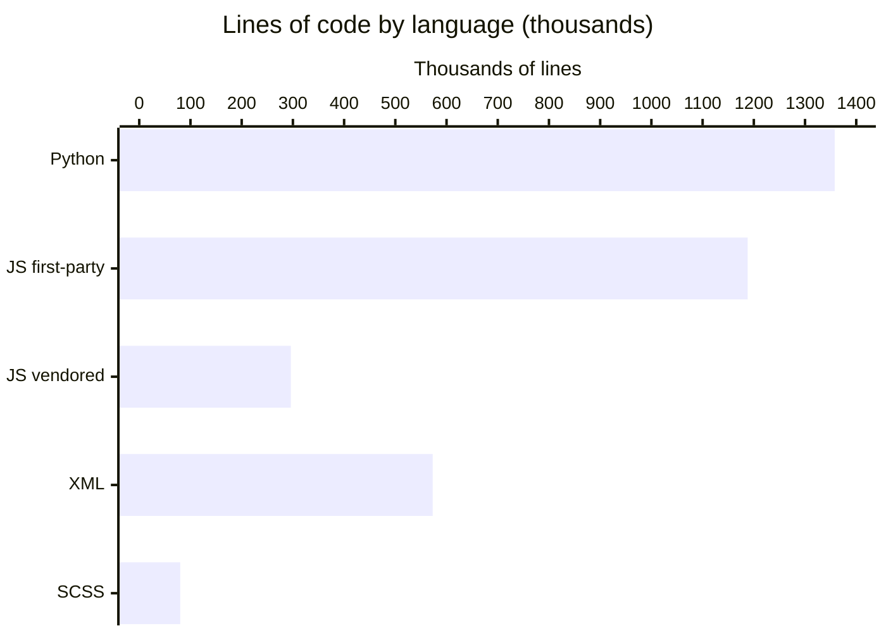

# By the numbers

Active contributors: Odoo SA (upstream)

Data collected on 2026-09-30.

A quantitative snapshot of the repository: how much code there is, where it is
concentrated, and which numbers this clone cannot tell you. Every figure below
was measured on the working tree at that date, counting newlines in tracked
source files under `odoo/` and `addons/` and skipping `.git`, `node_modules`,
and `__pycache__`.

## Size

Lines of code by language, with vendored third-party JavaScript
(`*/static/lib/*`) separated from first-party JavaScript:

| Language | Lines | Files |
| --- | --- | --- |
| Python | 1,358,170 | 9,397 |
| JavaScript, first-party | 1,188,246 | 6,557 |
| JavaScript, vendored (`static/lib/`) | 296,333 | 142 |
| XML (views, data, templates) | 572,615 | 6,044 |
| SCSS | 80,493 | 1,241 |
| CSS | 28,868 | 40 |

Translations are counted separately because they dwarf the code and are
generated, not written: 20,257 `.po` files plus 603 `.pot` templates, together
about 23.6 million lines. They are excluded from the chart.

Where the Python and JavaScript sit:

| Area | Size |
| --- | --- |
| `odoo/` core server (Python) | 203,139 lines |
| `addons/` business modules (Python) | 1,155,031 lines |
| `addons/web/static/src` (web client JS) | 123,651 lines across 563 files |
| `addons/web/static/lib` (vendored JS) | 250,847 lines across 125 files |
| `addons/crm` Python | 12,414 lines |
| `addons/crm/static` JS | 3,699 lines across 47 files |
| `addons/crm` XML | 5,193 lines |

Module and test counts: 642 addon directories under `addons/`, plus 16 modules
shipped inside the core package at `odoo/addons/` (`base` and 15 `test_*`
framework support modules). Tests are 2,684 Python files under `tests/`
directories and 1,299 `.test.js` files for the Hoot browser suites. The
dependency inventory, including the vendored libraries behind that 296k-line
number, is in [dependencies](reference/dependencies.md).

## Activity

There is no usable churn or commit-trend data in this clone. The local history
contains exactly two commits:

| Branch | Commit | Author | Date | Subject |
| --- | --- | --- | --- | --- |
| `20.0` | `ee8c13ea` | Maryam Kia (Odoo SA) | 2026-08-13 | `[FIX] mail: duplicate notifications` |
| `eval/base` (HEAD) | `96e36339` | bobbyabbott421-glitch | 2026-09-30 | `[ADD] scripts/dev: reproducible local dev environment` |

The first commit is a squashed snapshot: it introduces the entire Odoo 20.0
codebase *and* this fork's offline/PWA framework in one change, with a
`X-original-commit: ca58f567...` trailer pointing at the upstream commit it was
taken from. Its subject line describes a one-file mail fix, which is what the
upstream commit did, not what the snapshot contains. The second commit adds
`scripts/dev/`: 850 lines across 11 files.

So questions like "which files change most often", "how has the offline stack
evolved", or "when was this function introduced" cannot be answered from
`git log` here. Use file size and structure as the proxy instead, and read
[design decisions](background/design-decisions.md) for the reasoning that the
history does not record. The squash is discussed further in
[lore](lore.md).

## Bot-attributed commits

Zero of the two local commits carry a `Co-authored-by:` trailer, bot or
otherwise, so bot-attributed commits are 0%. That percentage is not meaningful:
the denominator is 2, and the squashed snapshot collapses years of upstream
authorship into a single commit whose trailers say nothing about who wrote the
code inside it. Treat this figure as "unknowable in this clone" rather than as
evidence about how the code was produced.

## Complexity

Largest Python files:

| File | Lines |
| --- | --- |
| `addons/account/models/account_move.py` | 8,339 |
| `addons/stock/tests/test_move.py` | 7,043 |
| `odoo/orm/models.py` | 6,617 |
| `addons/account/tests/test_account_move_reconcile.py` | 6,207 |
| `odoo/addons/base/tests/test_ir_ui_view.py` | 6,149 |
| `addons/mrp/tests/test_order.py` | 5,737 |
| `addons/mail/models/mail_thread.py` | 5,446 |

Four of the seven are test modules, which is the shape of the codebase in
general: accounting and stock carry the heaviest business logic, and their test
suites are proportionally heavier.

Largest first-party JavaScript files:

| File | Lines |
| --- | --- |
| `addons/spreadsheet/static/src/o_spreadsheet/o_spreadsheet.js` | 90,650 |
| `addons/web/static/tests/views/list/list_view.test.js` | 22,473 |
| `addons/web/static/src/core/emoji_picker/emoji_data.js` | 21,885 |
| `addons/web/static/tests/views/form/form_view.test.js` | 13,937 |
| `addons/web/static/tests/views/fields/one2many_field.test.js` | 13,907 |

The spreadsheet file is a built third-party bundle that happens to live under
`static/src` rather than `static/lib`, and `emoji_data.js` is a generated data
table, so neither is hand-maintained code. The largest genuinely hand-written
JavaScript files are the view test suites. Under `static/lib`, the biggest
entries are `addons/web/static/lib/pdfjs/build/pdf.worker.js` (59,020),
`addons/web/static/lib/zxing-library/zxing-library.js` (27,951), and
`addons/web/static/lib/pdfjs/build/pdf.js` (26,312).

Average file size by area gives a rough density signal: `addons/web/static/src`
averages about 220 lines per file (123,651 lines / 563 files), and `addons/crm`
about 79 lines per JavaScript file (3,699 / 47) against a much denser Python
side, where `addons/crm/models/crm_lead.py` alone is 2,871 lines, 23% of the
addon's Python. Per-file rankings and the
biggest addons are broken down in
[complexity hotspots](cleanup-opportunities/complexity-hotspots.md).

Inline cleanup markers: 1,341 `TODO`/`FIXME` lines in Python and 305 in
first-party JavaScript under `static/src` (vendored libraries and test files
excluded). Their distribution is in
[TODOs and FIXMEs](cleanup-opportunities/todos-and-fixmes.md).

## Related pages

- [Overview](overview/index.md)
- [Architecture](overview/architecture.md)
- [Complexity hotspots](cleanup-opportunities/complexity-hotspots.md)
- [TODOs and FIXMEs](cleanup-opportunities/todos-and-fixmes.md)
- [Dependencies](reference/dependencies.md)
- [Lore](lore.md)
