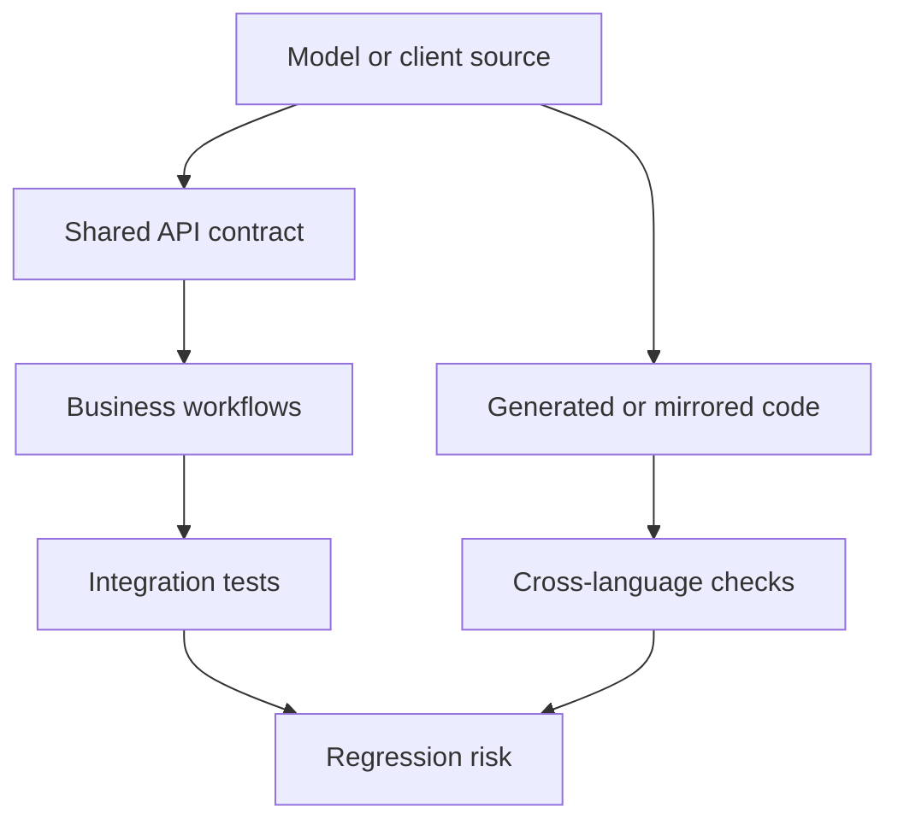

# Complexity hotspots
Active contributors: Odoo SA (upstream)

## Purpose

These files are places where changes are risky because they combine large
amounts of behavior, generated code, tests, or cross-language contracts. A
large line count does not mean a file should be split, and this page is not a
refactoring plan.

The fork rule is stricter than the hotspot list: upstream files are included
for orientation, but local cleanup is normally limited to `addons/crm/`.

## Directory layout

```text
odoo/orm/models.py                           core ORM hotspot
odoo/addons/base/tests/test_ir_ui_view.py   base view test hotspot
addons/account/models/                       accounting model hotspots
addons/account/static/src/helpers/           mirrored tax helper
addons/stock/tests/                          large inventory tests
addons/web/static/tests/views/               large web client tests
addons/spreadsheet/static/src/o_spreadsheet/ generated distribution
addons/crm/models/crm_lead.py                fork-relevant hotspot
```

## Key abstractions

| Hotspot | Verified lines | Why changes are risky |
|---|---:|---|
| `addons/account/models/account_move.py` | 8,339 | Central accounting move behavior spans posting, taxes, payments, and reporting. |
| `addons/stock/tests/test_move.py` | 7,043 | A large integration test encodes many inventory flows and fixtures. |
| `odoo/orm/models.py` | 6,617 | Core model, recordset, cache, and CRUD behavior has broad fan-out. |
| `addons/account/tests/test_account_move_reconcile.py` | 6,207 | Reconciliation behavior has a large regression surface. |
| `odoo/addons/base/tests/test_ir_ui_view.py` | 6,149 | View inheritance and rendering tests exercise framework-wide behavior. |
| `addons/spreadsheet/static/src/o_spreadsheet/o_spreadsheet.js` | 90,650 | Generated bundled distribution, not hand-maintained source. |
| `addons/web/static/tests/views/list/list_view.test.js` | 22,473 | List view tests cover a wide client model and renderer contract. |
| `addons/crm/models/crm_lead.py` | 2,871 | CRM pipeline, scoring, revenue, conversion, and duplicate logic share one model. |

Counts come from `wc -l` on the named files. The generated spreadsheet file
also reports a 2026-09-18 build header and says it must not be edited at
`addons/spreadsheet/static/src/o_spreadsheet/o_spreadsheet.js:2-8`.

## How it works



The accounting tax engine is the clearest cross-language case. The JavaScript
helper `addons/account/static/src/helpers/account_tax.js` is 2,674 lines and
explicitly says its methods mirror `addons/account/models/account_tax.py`,
which is 5,205 lines in this checkout. The shared behavior is exercised
through the controller and configuration-parameter exchange in
`addons/account/controllers/tests_shared_js_python.py`. Refactoring one side
without preserving the other changes browser and server tax totals.

The CRM hotspot is different. `addons/crm/models/crm_lead.py` owns the
`crm.lead` schema and much of its lifecycle, including lead conversion,
probability, recurring revenue, duplicate handling, and Predictive Lead
Scoring. A small field or compute change can affect views, mail mixins,
security, and scheduled work.

## Integration points

`odoo/orm/models.py` is consumed by every model, while
`odoo/addons/base/tests/test_ir_ui_view.py` exercises the view system used by
all addons. Accounting and stock hotspots connect to their own models and
large integration suites. The web list suite is part of the client test
assets, and the spreadsheet file is loaded as a generated asset. CRM is
described in more detail in the [CRM application](../apps/crm/index.md).

## Entry points for modification

Do not start by splitting a large upstream file. First identify the model,
view, asset, or test contract that the requested behavior crosses, then find
the smallest extension point. For this fork, begin with a CRM model or
`addons/crm/` patch and add a focused test before considering cleanup.

## Key source files

| File | Purpose |
|---|---|
| `addons/account/models/account_move.py` | Accounting move model and workflows. |
| `addons/account/models/account_tax.py` | Server-side tax computation. |
| `addons/account/static/src/helpers/account_tax.js` | Browser-side tax computation mirror. |
| `addons/account/controllers/tests_shared_js_python.py` | Shared JS/Python tax test exchange. |
| `addons/account/tests/test_account_move_reconcile.py` | Reconciliation regression suite. |
| `addons/stock/tests/test_move.py` | Inventory move integration suite. |
| `odoo/orm/models.py` | Core ORM model implementation. |
| `odoo/addons/base/tests/test_ir_ui_view.py` | Base view test suite. |
| `addons/web/static/tests/views/list/list_view.test.js` | Web list view tests. |
| `addons/spreadsheet/static/src/o_spreadsheet/o_spreadsheet.js` | Generated spreadsheet bundle. |
| `addons/crm/models/crm_lead.py` | CRM lead model and pipeline behavior. |

## Related pages

- [Cleanup opportunities](index.md)
- [TODOs and FIXMEs](todos-and-fixmes.md)
- [ORM](../systems/orm.md)
- [CRM](../apps/crm/index.md)
- [Assets](../systems/assets.md)
