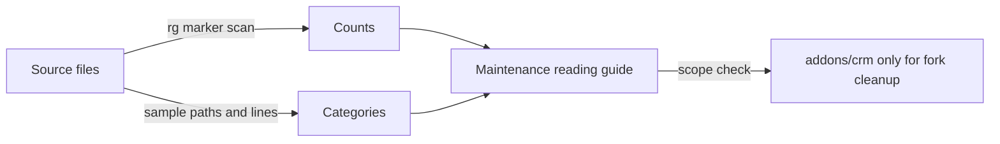

# TODOs and FIXMEs
Active contributors: Odoo SA (upstream)

## Purpose

This page samples deferred work in comments without turning every marker into
a defect. The counts are a reproducible inventory as of the scan, and the
examples show the kinds of compatibility, migration, testing, and design debt
that a maintainer will encounter.

## Directory layout

```text
odoo/                              core Python markers
addons/                            addon Python and JavaScript markers
addons/web/static/src/             web framework markers
addons/crm/                        fork-specific marker scope
```

## Key abstractions

| Scope | File or command | Result |
|---|---|---|
| Python addons | `addons/` with `rg -n -i '\b(TODO\|FIXME)\b' --glob '*.py'` | 1,341 marker-bearing lines, 1,363 occurrences. |
| Python core | `odoo/` with the same expression | 193 marker-bearing lines, 194 occurrences. |
| JavaScript source | Every `*/static/src/` directory under `addons/` | 457 marker-bearing lines, 462 occurrences. |
| JavaScript source plus tests | `*/static/src/` and `*/static/tests/` | 712 marker-bearing lines, 720 occurrences. |
| CRM scope | `addons/crm/`, all three markers | 20 occurrences on 20 lines, 19 TODO/FIXME and one HACK. |

The headline Python and JavaScript counts intentionally match TODO and FIXME
only. HACK is reported separately because it is a different signal. The scan
counts matching lines and occurrences, and includes comments and strings, so
identifiers such as a local variable named `todo` can contribute to the
occurrence total. It does not search generated logs or Markdown.

## How it works



### Core compatibility and migration debt

These comments are useful context when reading upstream code, but are not
local refactoring instructions:

- `odoo/tools/config.py:493` records that the three multiprocessing memory
  limits still need a sensible default.
- `odoo/tools/config.py:790-797` retains empty `db_replica_host` handling for
  old SaaS versions.
- `odoo/http/session.py:78` keeps an 84-character compatibility length until
  v18.4 is deprecated.
- `odoo/http/session.py:321` marks a v20 backward-compatibility path for
  removal.
- `odoo/http/router.py:24` still imports the Werkzeug URL helper while
  planning a switch to `urllib`.
- `odoo/modules/migration.py:48` calls out the version comparison case that
  will matter in the year 2106.
- `odoo/tools/safe_eval/runtime.py:763-764` leaves addon restrictions in the
  safe-evaluation whitelist for a future tightening.
- `odoo/orm/models.py:492` marks the old translation API flag for deprecation
  or removal.

### Web client migration and legacy bridges

The web source has 17 exact `@todo owl3 migration` markers. They cluster in
the plugin/service transition, including
`addons/web/static/src/core/orm_plugin.js:401`,
`addons/web/static/src/core/offline/offline_plugin.js:489`,
`addons/web/static/src/core/ui/ui_plugin.js:212`,
`addons/web/static/src/core/overlay/overlay_plugin.js:74`,
`addons/web/static/src/core/dialog/dialog_plugin.js:122`,
`addons/web/static/src/core/popover/popover_plugin.js:82`,
`addons/web/static/src/core/legacy_service_starter.js:2`, and
`addons/web/static/src/core/l10n/localization_plugin.js:156`.

Other frontend markers describe concrete compatibility seams:

- `addons/web/static/src/start.js:64` keeps `odoo.debug` because legacy code
  still relies on it.
- `addons/web/static/src/core/global_bus_plugin.js:13` calls the service-to-
  plugin bridge temporary.
- `addons/web/static/src/views/form/form_controller.js:752` notes incomplete
  disable/enable handling during pager updates.
- `addons/web/static/src/views/list/list_arch_parser.js:146` documents a
  deliberately awkward encoded object for a widget.
- `addons/web/static/src/views/view_compiler.js:494` says the compiler cache
  purge does not purge OWL's application cache.
- `addons/web/static/src/views/fields/relational_utils.js:77` identifies
  duplicated active-action logic that should be merged.
- `addons/web/static/src/model/model.js:240` keeps an OWL 3 compatibility
  addition for Studio.

These are especially risky to “clean up” locally because the web addon owns
the shared offline and mobile framework.

### Business-addon and test debt

Many markers describe stable behavior that is hard to remove without changing
an addon contract:

- `addons/stock/wizard/stock_replenishment_info.py:179` plans to remove the
  `json_replenishment_graph` field.
- `addons/mail/models/mail_thread_blacklist.py:84` questions a `sudo` that is
  now related to `compute_sudo`.
- `addons/mail/models/mail_activity.py:740` records a missing cleanup for an
  attachment with a void `res_id`.
- `addons/stock/models/stock_move.py:72` says a field should be stored for
  grouping to work.
- `addons/website_sale/controllers/main.py:334` and `:362` retain old
  `category` and `attribute_values` query parameters during v20 migration.
- `addons/website/models/website_page.py:328` keeps a workaround until domain
  support for translated XML fields improves.
- `addons/hr/models/hr_version.py:190` marks a field for removal in master.
- `addons/purchase/models/purchase_order_line.py:505` keeps logic until
  onchanges are replaced with computes.

Tests contain many markers because they document fixtures and known gaps:
`addons/stock/tests/test_batch_picking.py:102` cannot handle an onchange in
the test form, `addons/website/tests/test_ui.py:210` postpones debug mode
until props validation is fixed, and `addons/mail/tests/test_res_partner.py:236`
documents repeated partner creation for normalized multi-email input.

### CRM-specific scope

The fork's `addons/crm/` scan is small: 20 marker occurrences across 20
lines. The most actionable samples are all in tests or narrowly scoped model
comments:

- `addons/crm/models/crm_stage.py:45` wants hard-coded test IDs removed.
- `addons/crm/models/crm_lead.py:2646` questions team-specific stages when
  calculating lost counts.
- `addons/crm/models/res_config_settings.py:164` asks whether a missing cron
  should be recreated.
- `addons/crm/tests/common.py:406` says normalized email matching currently
  works only for exact email.
- `addons/crm/tests/common.py:657` identifies a merge/assignment condition
  that is not fulfilled.
- `addons/crm/tests/test_crm_lead_convert.py:143` notes that setting a lead
  won does not account for the sales team when finding a won stage.
- `addons/crm/tests/test_crm_lead_convert_mass.py:109` says partner creation
  is not checked for lost leads.
- `addons/crm/tests/test_crm_lead_merge.py:219` points to a historical
  no-user/no-team merge case by commit hash.

This is the only section that can directly become a cleanup candidate for
this fork. Each item still needs a regression test and a check against the
CRM extension boundary.

## Integration points

Markers occur in the ORM, HTTP, web client, and business addons. The
`addons/crm/` examples interact with [CRM's model and view
extensions](../apps/crm/index.md), while the web examples touch the shared
[offline/PWA stack](../features/offline-and-pwa/index.md). The broad counts
also feed the [repository size snapshot](../by-the-numbers.md).

## Entry points for modification

For upstream markers, look for an existing upstream fix or add an extension
from `addons/crm/`; do not edit `odoo/` or another upstream addon as local
cleanup. For CRM markers, start at the cited line, write a focused regression
test, and run the CRM test wrappers described in
[tooling](../how-to-contribute/tooling.md).

## Oldest or most interesting markers

Git cannot prove an oldest marker here because the upstream history is a
squashed commit. The most time-specific examples are the v18.4 and v20
compatibility removals in `odoo/http/session.py:78` and `:321`, the
saas-21.1/22.1 migration comments in `odoo/tools/config.py:790-797`, and the
year-2106 edge case in `odoo/modules/migration.py:48`. The 17 OWL migration
markers are interesting because they sit beside a functioning plugin API,
including the offline plugin, rather than representing unused code.

## Key source files

| File | Purpose |
|---|---|
| `odoo/tools/config.py` | Core configuration and compatibility options. |
| `odoo/http/session.py` | Session compatibility behavior. |
| `odoo/modules/migration.py` | Module version comparison and migration helpers. |
| `odoo/orm/models.py` | ORM compatibility and model behavior. |
| `addons/web/static/src/start.js` | Web client bootstrap and legacy debug bridge. |
| `addons/web/static/src/core/offline/offline_plugin.js` | Shared offline plugin marked for OWL migration. |
| `addons/web/static/src/core/legacy_service_starter.js` | Temporary service startup bridge. |
| `addons/crm/models/crm_lead.py` | CRM lead model marker. |
| `addons/crm/tests/common.py` | CRM test helper markers. |
| `addons/crm/tests/test_crm_lead_convert.py` | Lead conversion marker examples. |

## Related pages

- [Cleanup opportunities](index.md)
- [Complexity hotspots](complexity-hotspots.md)
- [Contribution patterns](../how-to-contribute/patterns-and-conventions.md)
- [Offline and PWA](../features/offline-and-pwa/index.md)
