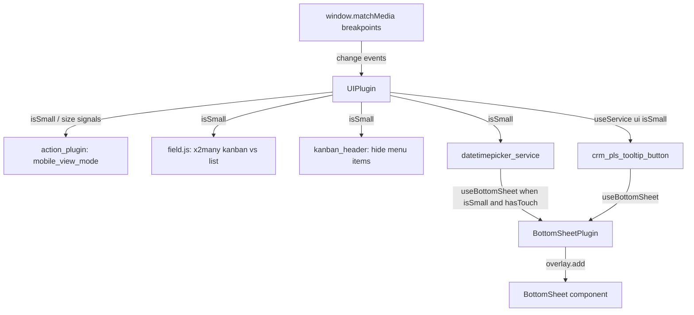

# Mobile web

Active contributors: bobbyabbott421-glitch (fork), Odoo SA (upstream)

## Purpose

There is no separate mobile client. The same OWL web client renders on phones, and mobile-specific behavior is switched on by one reactive signal, `isSmall`, exposed by `UIPlugin`. "Native mobile" in this fork means the installable PWA described in [Service worker and install](offline-and-pwa/service-worker-and-install.md); the project rules forbid a native app project (React Native, Flutter, Swift, Kotlin, Capacitor).

## Directory layout

```text
addons/web/static/src/core/ui/
├── ui_plugin.js                # UIPlugin: isSmall / size signals, active element, block UI
└── ui_utils.js                 # SIZES, MEDIAS_BREAKPOINTS, refreshMedias(), utils.isSmall()
addons/web/static/src/core/bottom_sheet/
├── bottom_sheet_plugin.js      # BottomSheetPlugin.add(target, component, props, options)
├── bottom_sheet.js             # the BottomSheet component (drag, snap, dismiss)
├── bottom_sheet.xml            # web.BottomSheet template
└── bottom_sheet.scss           # + bottom_sheet.variables.scss
addons/web/static/src/core/popover/popover_hook.js   # usePopover(..., { useBottomSheet })
addons/crm/views/crm_lead_views.xml                  # view_crm_lead_kanban (o_kanban_mobile)
addons/web/tests/test_js.py                          # WebSuite / MobileWebSuite presets
```

## Key abstractions

| Name | File | Description |
| --- | --- | --- |
| `UIPlugin` | `addons/web/static/src/core/ui/ui_plugin.js` | Holds the `isSmall` and `size` signals, the UI active-element stack, and block/unblock counters. |
| `SIZES` / `MEDIAS_BREAKPOINTS` | `addons/web/static/src/core/ui/ui_utils.js` | The six breakpoints and their names (`XS` … `XXL`); `isSmall` means `size <= SIZES.SM`. |
| `BottomSheetPlugin` | `addons/web/static/src/core/bottom_sheet/bottom_sheet_plugin.js` | Renders `BottomSheet` through the overlay plugin with the popover plugin's `add()` signature. |
| `usePopover` | `addons/web/static/src/core/popover/popover_hook.js` | Picks the `bottom_sheet` service instead of `popover` when `options.useBottomSheet` is set. |
| `view_crm_lead_kanban` | `addons/crm/views/crm_lead_views.xml` | The lead kanban arch carrying `class="o_kanban_mobile"`, the card layout used on phones. |
| `MobileWebSuite` | `addons/web/tests/test_js.py` | The mobile JS-test preset: `browser_size = '375x667'`, `touch_enabled = True`. |

## How it works

`UIPlugin` builds one `MediaQueryList` per entry in `MEDIAS_BREAKPOINTS` (`max-width: 575`, `576-767`, `768-991`, `992-1199`, `1200-1399`, `min-width: 1400`) through `refreshMedias()`, then sets `size` to the index of the matching query and `isSmall` to `size <= SIZES.SM`, so any viewport up to 767px counts as small. Both are plain signals rather than `computed` values, and the comment in the file explains why: field initializers run in the constructor, before `setup()` repopulates the media list, and a `matchMedia` "change" event only fires on a transition, so a value computed too early would never self-correct. A `change` listener on each query updates both signals and triggers a `resize` event on the plugin bus. A separate `(pointer: coarse)` query toggles the `o_touch_device` class on `document.body`.

New code reads the signal through the plugin, `usePlugin(UIPlugin)` then `ui.isSmall()`. Components still on the legacy path use `useService("ui").isSmall`, a getter defined by the temporary `uiService` bridge at the bottom of the same file. The old `env.isSmall` is gone: `addons/web/static/src/env.js` keeps a `REMOVED_KEYS` map and throws with the replacement to use, behind a `Proxy` rather than a getter because o-spreadsheet probes `"isSmall" in env`.



Consumers gate on the signal instead of forking a mobile code path. `addons/web/static/src/webclient/actions/action_plugin.js` re-selects the view of an `act_window` action when `ui.isSmall()`, using the action's `mobile_view_mode`; `addons/web/static/src/views/fields/field.js` renders x2many fields as a kanban rather than a list on small screens; `addons/web/static/src/views/kanban/kanban_header.js` hides column menu entries; `addons/web/static/src/views/list/column_width_hook.js` caps the shrink width at 80% of `browser.innerWidth`. Desktop rendering is unchanged in each case, which is the project rule: every mobile behavior is conditional, nothing about the desktop path moves.

### Bottom sheets

A bottom sheet is the mobile substitute for a floating popover or a dialog. `BottomSheetPlugin.add(target, component, props, options)` mirrors the popover plugin's signature, adds a `BottomSheet` overlay through `OverlayPlugin`, and toggles the `bottom-sheet-open` class on `document.body` while at least one sheet is open. The `BottomSheet` component in `addons/web/static/src/core/bottom_sheet/bottom_sheet.js` caps itself at 90% of the viewport height, tracks drag progress and a dismiss threshold, re-measures on `useViewportChange` (virtual keyboards, collapsing browser bars), closes on Escape, and registers a back-button handler.

Call sites opt in through `usePopover(component, { useBottomSheet: <condition> })`, which swaps the service. The conditions used in the tree differ by call site: `addons/web/static/src/core/datetime/datetimepicker_service.js` uses `ui.isSmall && hasTouch()`, `addons/web/static/src/core/dropdown/dropdown.js` uses `hasTouch() && this.props.bottomSheet` (opt-in per dropdown), and `addons/web/static/src/views/fields/many2many_tags/many2many_tags_field.js` uses `hasTouch()` alone. The datetime picker is the fullest example: it declares `dependencies: ["bottom_sheet", "popover", "ui"]`, builds its popover with `makePopover` over whichever service `useBottomSheet()` selects, and skips the input-refocus step in `onPatched` while the sheet is open. In CRM, `addons/crm/static/src/views/crm_form/crm_pls_tooltip_button.js` opens the predictive-lead-scoring tooltip as a bottom sheet with `useBottomSheet: this.ui.isSmall`.

### The CRM kanban on a phone

`view_crm_lead_kanban` (`addons/crm/views/crm_lead_views.xml`, priority 100) is the leads kanban: `<kanban class="o_kanban_mobile" archivable="false" js_class="crm_kanban" sample="1">`. The `o_kanban_mobile` class selects the compact card layout styled in `addons/web/static/src/views/kanban/kanban_controller.scss`; `js_class="crm_kanban"` selects the CRM view class described in [CRM views](../apps/crm/crm-views.md). The card shows the lead name, contact name, tags, and a footer with priority, activities, and the assigned user's avatar. The arch is bound by `crm_lead_all_leads_view_kanban` (an `ir.actions.act_window.view` record in the same file) and reused by the per-team leads action `crm_case_form_view_salesteams_lead` in `addons/crm/views/crm_team_views.xml`. CRM sets no `mobile_view_mode` on its actions, so the mobile view re-selection in `action_plugin.js` leaves the normal view order in place.

## Integration points

- `UIPlugin` is registered with `services.add(UIPlugin)` and also exposed as the legacy `"ui"` service; `BottomSheetPlugin` likewise registers the `"bottom_sheet"` service, marked `@todo owl3 migration` and temporary.
- `usePopover` is the only intended entry to a bottom sheet; the plugin is not meant to be called directly from components.
- The offline UI reads the same DOM that mobile layouts render, so a control added for small screens still needs `data-available-offline` to stay usable offline. See [Offline UI](offline-and-pwa/offline-ui.md).

## Entry points for modification

To add a mobile-only behavior, read the signal (`usePlugin(UIPlugin)` in a plugin, `useService("ui").isSmall` in a component that is still on the service) and branch, leaving the desktop branch untouched. To turn an existing popover into a sheet on phones, pass `useBottomSheet` to the existing `usePopover` call rather than adding a second overlay path; `crm_pls_tooltip_button.js` is the shortest example in `addons/crm`. Any such change must pass both JS presets: `./scripts/dev/test-js.sh desktop` and `./scripts/dev/test-js.sh mobile`, the latter running the suite at 375x667 with touch enabled (`MobileWebSuite` in `addons/web/tests/test_js.py`); run `./scripts/dev/rebuild-assets.sh` first, since a stale bundle produces a fake failure.

## Key source files

| File | Purpose |
| --- | --- |
| `addons/web/static/src/core/ui/ui_plugin.js` | `UIPlugin`: `isSmall`/`size` signals, media-query listeners, `o_touch_device` class, legacy `"ui"` service bridge. |
| `addons/web/static/src/core/ui/ui_utils.js` | `SIZES`, `MEDIAS_BREAKPOINTS`, `getMediaQueryLists()`, `refreshMedias()`, `utils.isSmall()`. |
| `addons/web/static/src/env.js` | `REMOVED_KEYS` throwing for `env.isSmall` with the replacement API in the message. |
| `addons/web/static/src/core/bottom_sheet/bottom_sheet_plugin.js` | `BottomSheetPlugin.add()`, open-sheet counter, `bottom-sheet-open` body class, `"bottom_sheet"` service bridge. |
| `addons/web/static/src/core/bottom_sheet/bottom_sheet.js` | The sheet component: 90% max height, drag/snap/dismiss state, viewport-change handling, Escape and back-button close. |
| `addons/web/static/src/core/bottom_sheet/bottom_sheet.xml` | `web.BottomSheet` template. |
| `addons/web/static/src/core/bottom_sheet/bottom_sheet.scss` | Sheet styling and the `bottom-sheet-open` body state. |
| `addons/web/static/src/core/popover/popover_hook.js` | `usePopover` / `makePopover`; the `useBottomSheet` switch between the two services. |
| `addons/web/static/src/core/datetime/datetimepicker_service.js` | Worked example: picker opens as a sheet when `ui.isSmall && hasTouch()`. |
| `addons/web/static/src/core/dropdown/dropdown.js` | Per-dropdown opt-in (`hasTouch() && props.bottomSheet`) plus sheet-specific menu classes. |
| `addons/web/static/src/views/fields/many2many_tags/many2many_tags_field.js` | Tag popover as a sheet on touch devices. |
| `addons/web/static/src/webclient/actions/action_plugin.js` | Mobile view re-selection from `action.mobile_view_mode` when `ui.isSmall()`. |
| `addons/web/static/src/views/fields/field.js` | x2many fields render as kanban instead of list on small screens. |
| `addons/web/static/src/views/kanban/kanban_header.js` | Column menu entries hidden on small screens. |
| `addons/web/static/src/views/list/column_width_hook.js` | Small-screen column shrink limit (80% of window width). |
| `addons/web/static/src/views/kanban/kanban_controller.scss` | `o_kanban_mobile` card layout rules. |
| `addons/crm/views/crm_lead_views.xml` | `view_crm_lead_kanban` arch with `o_kanban_mobile` and the act_window view bindings. |
| `addons/crm/views/crm_team_views.xml` | Per-team leads action reusing the same kanban arch. |
| `addons/crm/static/src/views/crm_form/crm_pls_tooltip_button.js` | CRM bottom-sheet call site (PLS tooltip). |
| `addons/web/tests/test_js.py` | `WebSuite` (desktop) and `MobileWebSuite` (375x667, touch) Hoot presets. |
| `scripts/dev/test-js.sh` | Runs either preset for `crm` or the whole `web` suite. |

## Related pages

- [Offline UI](offline-and-pwa/offline-ui.md): why a mobile control still needs `data-available-offline`.
- [Service worker and install](offline-and-pwa/service-worker-and-install.md): the installable PWA that "native mobile" refers to.
- [Offline and mobile CRM](../apps/crm/offline-and-mobile-crm.md): the CRM side: share target, team switcher, offline-aware search.
- [CRM views](../apps/crm/crm-views.md): the `crm_kanban` view class behind the mobile arch.
- [Test framework](../systems/test-framework.md): how the Hoot presets are collected and run.
- [Testing](../how-to-contribute/testing.md): running both presets and rebuilding assets first.
- [Glossary](../overview/glossary.md): small-screen signal, bottom sheet, `js_class`.
