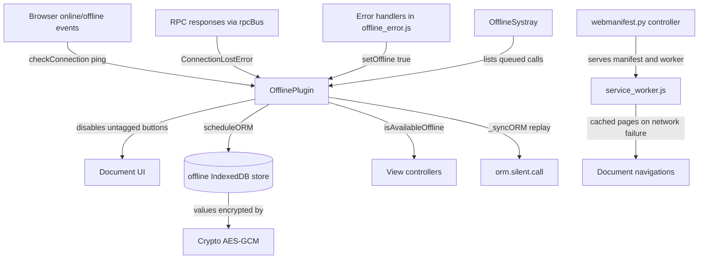

# Offline and PWA

Active contributors: bobbyabbott421-glitch (fork)

## Purpose

The offline and PWA stack is this fork's centerpiece. It lets the web client keep working without a network connection: previously visited views and records stay reachable, writes made while disconnected are queued and replayed, and the app installs as a PWA. The whole stack lives in `addons/web`; `addons/crm` only consumes it (see [CRM's consumption of the stack](../../apps/crm/offline-and-mobile-crm.md)).

## Directory layout

```
addons/web/
├── controllers/webmanifest.py            # manifest, worker, offline page, scoped apps
├── views/webclient_templates.xml          # web.webclient_offline page template
└── static/src/
    ├── service_worker.js                  # shared service worker (scope /odoo)
    ├── core/
    │   ├── offline/offline_plugin.js      # OfflinePlugin: state, queue, visited UI
    │   ├── offline/offline_error.js       # error handlers that flip the client offline
    │   ├── errors/non_secure_context_error.js
    │   ├── utils/indexed_db.js            # IndexedDB wrapper (mutex, version wipe, quota)
    │   ├── crypto.js                      # AES-GCM helper
    │   ├── pwa/pwa_service.js             # install prompt capture and install state
    │   ├── pwa/install_prompt.js           # Safari install instructions dialog
    │   └── network/rpc.js                 # ConnectionLostError
    ├── model/relational_model/            # queue producers (record.js, dynamic_list.js)
    ├── views/
    │   ├── offline_action_helper.js/.xml   # fallback for never-visited views
    │   └── fields/relational_utils.js     # many2x autocomplete + offline cache
    └── webclient/
        ├── webclient.js                   # service worker registration
        └── offline_systray/               # queued-changes systray item
```

## Key abstractions

| Name | File | Description |
|---|---|---|
| OfflinePlugin | `addons/web/static/src/core/offline/offline_plugin.js` | OWL plugin: offline state, sync queue, visited-UI tracking, many2x cache |
| IndexedDB | `addons/web/static/src/core/utils/indexed_db.js` | IndexedDB wrapper: per-tab mutex, version wipe, quota handling |
| Crypto | `addons/web/static/src/core/crypto.js` | AES-GCM encryption keyed from `session.browser_cache_secret` |
| ConnectionLostError | `addons/web/static/src/core/network/rpc.js` | Error class for failed RPCs, the offline trigger |
| Service worker | `addons/web/static/src/service_worker.js` | Caches `/odoo` and `/odoo/offline`, serves them when the network fails |
| WebManifest | `addons/web/controllers/webmanifest.py` | Controller serving the web manifest, worker script, offline page, scoped apps |
| pwa service | `addons/web/static/src/core/pwa/pwa_service.js` | `beforeinstallprompt` capture, install state in localStorage |
| OfflineSystray | `addons/web/static/src/webclient/offline_systray/offline_systray.js` | Systray item listing queued writes |

## How it works

### What works offline

- **Previously visited views and records.** Every successful view load while online is recorded in the `visited-ui-items` table (`setAvailableOffline` in `addons/web/static/src/core/offline/offline_plugin.js`, called by `_setAvailableOffline` in `addons/web/static/src/model/relational_model/relational_model.js`). While offline, view data itself comes from the encrypted RPC disk cache in `addons/web/static/src/core/network/rpc_cache.js`; `noCache` is forced to `false` while offline in `_getCacheParams` in `relational_model.js`, so cached reads still resolve when the network attempt rejects.
- **Queued writes.** Form saves, deletes, archive and unarchive, and list or kanban edits made while disconnected are stored in the `orm-to-sync` table and replayed on reconnect (see [sync queue](sync-queue.md)).
- **Cached many2x searches.** Successful `web_name_search` results are cached encrypted in `many2x_<model>` tables; offline searches fall back to a normalized substring match over the decrypted cache (see [local store](local-store.md)).
- **Service-worker pages.** Document navigations that fail are answered from the cached `/odoo` homepage, or with the `/odoo/offline` page (see [service worker and install](service-worker-and-install.md)).

### What does not work offline

- Controls whose interactive element lacks the `data-available-offline` attribute: they get `disabled` and the `o_disabled_offline` class while offline (see [offline UI](offline-ui.md)).
- Anything that needs a live server response at the moment of the action. The queue replays `model`, `method`, `args` and `kwargs` verbatim with no id remapping between calls, so a flow that needs a server onchange, a transient-model wizard, or an id produced by another queued call cannot be queued. This is a deliberate restriction of `_syncORM()` in `addons/web/static/src/core/offline/offline_plugin.js` and a project rule in `AGENTS.md`.
- **The point of sale app.** `addons/point_of_sale/static/src/app/plugins/offline_plugin.js` patches `OfflinePlugin.prototype.setup` to return early when a POS session is active (and drops its crypto), because the POS ships its own offline strategy with different conflict semantics (`pos.order.sync_from_ui` with server-side idempotency). The two stacks do not mix; see [point of sale](../../apps/point-of-sale.md).

### The secure-context requirement

Offline storage works only in a secure context, that is over HTTPS or on `localhost`. Outside one, the degradation is total, never partial: `OfflinePlugin` swaps its store for the no-op `FakeIndexedDB` and creates no `Crypto` (`addons/web/static/src/core/offline/offline_plugin.js`), and `scheduleORM()` throws `NonSecureContextError`, defined in `addons/web/static/src/core/errors/non_secure_context_error.js` and surfaced as a sticky danger notification by `NonSecureContextErrorHandler` in the same file. For local testing off-localhost, `scripts/dev/start.sh --https` serves TLS on port 8069.

### Offline detection

Three detectors feed `OfflinePlugin.setOffline()`:

1. **Browser events.** `offline` and `online` listeners call `checkConnection()`, which pings `/web/webclient/version_info` (`addons/web/static/src/core/offline/offline_plugin.js`).
2. **Every RPC response.** A `rpcBus` `RPC:RESPONSE` listener sets offline whenever the response error is a `ConnectionLostError` from `addons/web/static/src/core/network/rpc.js`. This catches cases the browser events miss, like a server that is down.
3. **Uncaught error handlers.** `offlineFailToFetchErrorHandler` (browser fetch `TypeError`s, sequence 96) and `lostConnectionHandler` (`ConnectionLostError` in an uncaught promise, sequence 98) in `addons/web/static/src/core/offline/offline_error.js` both force `setOffline(true)`.

While offline, the ping repeats with exponential backoff: the delay starts at 2000 ms and is multiplied by 1.5 plus a random 0-500 ms jitter on each round.

### Component overview



## Integration points

- **Registered as a plugin.** `services.add(OfflinePlugin)` at the bottom of `addons/web/static/src/core/offline/offline_plugin.js`. A temporary legacy bridge exposes the same object as the `"offline"` service (`.offline`, `.syncingORM`, `.scheduledORM`); new code uses `usePlugin(OfflinePlugin)` and the signals instead (see [web client platform](../../apps/web/index.md)).
- **Consumes** the `session` object scraped from `odoo.__session_info__` (`addons/web/static/src/session.js`), notably `registry_hash` and `browser_cache_secret`; the `ORM` plugin through `orm.silent.call`; and the `DebugModePlugin`, which switches the visited-UI table to its `-debug` variant.
- **Producers** live in the relational model layer (see [the JS data layer that produces queue entries](../../apps/web/relational-model.md)).
- **CRM consumption**: the share-target controller subclass and the share-target item in `addons/crm` (see [CRM's consumption of the stack](../../apps/crm/offline-and-mobile-crm.md)).
- The `IndexedDB` wrapper is shared infrastructure: the menus (`addons/web/static/src/webclient/menus/menu_service.js`), localization (`addons/web/static/src/core/l10n/localization_plugin.js`) and the RPC cache (`addons/web/static/src/core/network/rpc_cache.js`) all use it.

## Entry points for modification

Start in `addons/web/static/src/core/offline/offline_plugin.js` for anything about queue keys, replay order, visited-UI storage, or button disabling. To queue a new kind of write, catch `ConnectionLostError` at the ORM call site and call `scheduleORM()` with `extras` built by `getScheduleORMExtras` (`addons/web/static/src/model/relational_model/utils.js`). Never add a second offline engine or conflict handling; both are project rules in `AGENTS.md`, and the rationale is on [why last-write-wins](../../background/design-decisions.md).

## Key source files

| File | Purpose |
|---|---|
| `addons/web/static/src/core/offline/offline_plugin.js` | Offline state, sync queue, visited UI, many2x cache, button disabling |
| `addons/web/static/src/core/offline/offline_error.js` | Error handlers that detect offline from failed fetches |
| `addons/web/static/src/core/errors/non_secure_context_error.js` | Error and handler for non-secure contexts |
| `addons/web/static/src/core/utils/indexed_db.js` | IndexedDB wrapper: mutex, version wipe, quota |
| `addons/web/static/src/core/crypto.js` | AES-GCM encryption helper |
| `addons/web/static/src/core/network/rpc.js` | `ConnectionLostError` and the rpc bus |
| `addons/web/static/src/core/network/rpc_cache.js` | Encrypted disk cache serving view data offline |
| `addons/web/static/src/model/relational_model/record.js` | Form-save, delete and archive queue producers |
| `addons/web/static/src/model/relational_model/dynamic_list.js` | List and kanban queue producers |
| `addons/web/static/src/model/relational_model/relational_model.js` | Visited-UI marking and many2x caching on load |
| `addons/web/static/src/model/relational_model/utils.js` | `getScheduleORMExtras`, display-name helpers |
| `addons/web/static/src/views/fields/relational_utils.js` | Many2x autocomplete with offline fallback |
| `addons/web/static/src/service_worker.js` | Shared service worker |
| `addons/web/controllers/webmanifest.py` | Manifest, worker, offline page and scoped-app routes |
| `addons/web/static/src/core/pwa/pwa_service.js` | Install prompt capture and state |
| `addons/web/static/src/webclient/offline_systray/offline_systray.js` | Queued-changes systray item |

## Related pages

- [Sync queue](sync-queue.md)
- [Local store](local-store.md)
- [Service worker and install](service-worker-and-install.md)
- [Offline UI](offline-ui.md)
- [The JS data layer that produces queue entries](../../apps/web/relational-model.md)
- [Web client platform](../../apps/web/index.md)
- [CRM's consumption of the stack](../../apps/crm/offline-and-mobile-crm.md)
- [Why last-write-wins](../../background/design-decisions.md)
- [registry_hash and asset bundles](../../systems/assets.md)
- [Debugging](../../how-to-contribute/debugging.md)
- [Glossary](../../overview/glossary.md)
