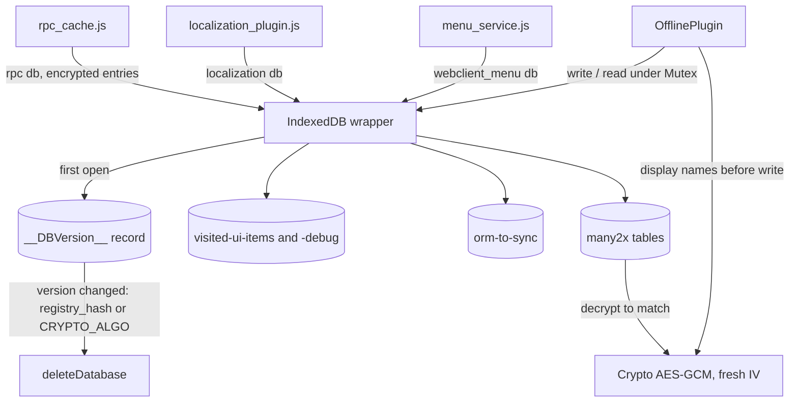

# Local store

Active contributors: bobbyabbott421-glitch (fork)

## Purpose

The local store is the `offline` IndexedDB database behind the whole offline stack: every queued write, visited-UI marker and cached relational search name lands here, encrypted. It is built from two small pieces, the `IndexedDB` wrapper and the `Crypto` helper, and it wipes itself whenever the asset registry or the encryption algorithm changes.

## Directory layout

```
addons/web/static/src/core/
├── utils/indexed_db.js   # IndexedDB wrapper: mutex, version wipe, quota, batched search
├── crypto.js             # AES-GCM helper keyed from session.browser_cache_secret
├── offline/offline_plugin.js   # the "offline" database and its tables
├── network/rpc_cache.js        # another database ("rpc") on the same wrapper
├── l10n/localization_plugin.js # another database ("localization")
└── utils/concurrency.js        # the Mutex used by the wrapper
addons/web/static/src/webclient/menus/menu_service.js  # another database ("webclient_menu")
addons/web/static/src/views/fields/relational_utils.js # feeds the many2x tables
addons/web/static/src/session.js                      # registry_hash / browser_cache_secret source
```

## Key abstractions

| Name | File | Description |
|---|---|---|
| `IndexedDB` | `addons/web/static/src/core/utils/indexed_db.js` | Wrapper: per-tab `Mutex`, lazy table creation, `invalidate()`, `deleteDatabase()` |
| `__DBVersion__` | `addons/web/static/src/core/utils/indexed_db.js` | Version record that wipes the database when its value changes |
| `Crypto` | `addons/web/static/src/core/crypto.js` | AES-GCM (`CRYPTO_ALGO`) with a fresh random IV per value |
| `offline` database | `addons/web/static/src/core/offline/offline_plugin.js` | `new IndexedDB("offline", session.registry_hash + CRYPTO_ALGO)` |
| `FakeIndexedDB` | `addons/web/static/src/core/offline/offline_plugin.js` | No-op store used outside a secure context |
| `orm-to-sync` | `addons/web/static/src/core/offline/offline_plugin.js` | Sync-queue table (see [sync queue](sync-queue.md)) |
| `visited-ui-items` | `addons/web/static/src/core/offline/offline_plugin.js` | Visited action/view/record markers, with a `-debug` variant |

## How it works

### The wrapper

`new IndexedDB(name, version)` in `addons/web/static/src/core/utils/indexed_db.js` tracks the set of tables it has seen (`this._tables`) and serializes every operation through a per-tab `Mutex` from `addons/web/static/src/core/utils/concurrency.js`, so within one tab all reads and writes are ordered. `_execute()` opens the database, creates missing object stores in `onupgradeneeded`, and when a brand new table shows up it reopens with `db.version + 1` so the store can be added. Public API: `read`, `write` (single or batched items in one transaction), `delete`, `search`, `getAllEntries`, `getAllKeys`, `invalidate(tables)`, `deleteDatabase()`.

### The version wipe

The first table of every database is `__DBVersion__` with the single record key `__version__`. On construction, `_checkVersion(version)` writes the version when it is absent, and when the stored version differs it deletes the entire database (`_deleteDatabase`) and writes the new one. The offline database's version string is `session.registry_hash + CRYPTO_ALGO`, so two things wipe it: an asset-registry change (a new `registry_hash`, see [registry_hash and asset bundles](../../systems/assets.md)) or a change of encryption algorithm. Both values come from `odoo.__session_info__`, scraped by `addons/web/static/src/session.js`.

### `invalidate()` and quota handling

`invalidate(tables)` accepts an exact table name, a `RegExp`, an array of either, or nothing (then every table except `__DBVersion__` is cleared). `OfflinePlugin` uses it on `RPC:CLEAR-CACHES` to clear both visited-UI tables and all `many2x_` tables at once (`addons/web/static/src/core/offline/offline_plugin.js`). Writes run with `durability: "relaxed"` and an explicit `transaction.commit()` for speed; a `QuotaExceededError` logs the `navigator.storage.estimate()` usage and rejects with `IDBQuotaExceededError` so callers can react (the RPC cache deletes its whole database on that error, see `addons/web/static/src/core/network/rpc_cache.js`).

### Encryption

`Crypto` in `addons/web/static/src/core/crypto.js` imports the hex string `session.browser_cache_secret` with `crypto.subtle.importKey` as an AES-GCM key, then encrypts each value with a fresh random 12-byte IV (`crypto.getRandomValues(new Uint8Array(12))`, 64-bit counter length) after JSON-stringifying it. `decrypt()` reverses that and JSON-parses the plaintext. The IV must never be reused with a given key, which is why a new one is drawn per value. The secret itself is generated server-side as an HMAC over the user's session-token fields in `addons/web/controllers/home.py` and only injected into the bootstrap page (which is `Cache-Control: no-store`), so the encryption key rotates whenever the user changes their password or second factor.

### Tables of the `offline` database

| Table | Key | Value |
|---|---|---|
| `visited-ui-items` (+ `visited-ui-items-debug`) | `JSON.stringify({action, viewType, resId})` | `true` for form and quick-create visits, else a map `searchKey -> {count, search}` |
| `orm-to-sync` | caller `options.id` or payload hash | JSON-stringified `{model, method, args, kwargs, extras}` |
| `many2x_<model>` | record id | encrypted display name |

The visited-UI table is chosen by a computed on the debug plugin, so debug sessions do not pollute the normal table (`addons/web/static/src/core/offline/offline_plugin.js`). While online, every search state re-inserted by `setAvailableOffline` is deleted and re-added to mark recency, and its `count` is incremented, which is what "most-visited first" ordering reads back (`getAvailableSearches`).

### The many2x cache

`Many2XAutocomplete.search()` in `addons/web/static/src/views/fields/relational_utils.js` feeds every successful `web_name_search` result to `cacheMany2XSearch`, and `onSearchMore` feeds its `name_search` results the same way. Loaded view data feeds it too: `_cacheMany2X` in `addons/web/static/src/model/relational_model/relational_model.js` walks the many2one and many2many values of every loaded record. Only the first line of a multi-line display name is kept (`display_name.split("\n")[0]`). Offline, `searchMany2XRecords` decrypts candidate values and matches a normalized substring (`normalize` from `addons/web/static/src/core/l10n/utils.js`); `readMany2XRecords` serves ids already set on the record.



### Non-secure degradation

Outside a secure context the degradation is total, never partial. `OfflinePlugin` instantiates `FakeIndexedDB` (defined at the top of `addons/web/static/src/core/offline/offline_plugin.js`): `read` resolves `{}`, `getAllKeys` and `getAllEntries` resolve `[]`, and `write`, `delete` and `invalidate` do nothing. `_crypto` stays falsy unless both `window.isSecureContext` and `session.browser_cache_secret` hold, and every many2x cache method returns early without it. Queueing throws `NonSecureContextError` instead of silently writing (see [sync queue](sync-queue.md)).

### Cross-tab locking

Two locks cooperate. Within a tab, the wrapper's `Mutex` orders all operations. Across tabs, replay of the `orm-to-sync` table runs under `navigator.locks.request("db-sync", ...)` (Web Locks API, secure context only), so only one tab syncs at a time; the rest see the entries move as `_updateScheduledORMList` reloads them.

### Security stance

Values are encrypted at rest with the per-session secret, and the database name plus version string are user-independent. The cache only ever stores data the user already received from the server; it never widens what a user can see, which is a project rule in `AGENTS.md`.

## Integration points

- Consumers of the wrapper besides the offline stack: `addons/web/static/src/webclient/menus/menu_service.js` (`webclient_menu`), `addons/web/static/src/core/l10n/localization_plugin.js` (`localization`), `addons/web/static/src/core/network/rpc_cache.js` (`rpc`, its entries encrypted with the same `Crypto`, and a 2 GB `MAX_STORAGE_SIZE` self-check that deletes its database).
- The offline database is opened once at plugin construction in `addons/web/static/src/core/offline/offline_plugin.js`, versioned on `session.registry_hash + CRYPTO_ALGO`.
- Session values (`registry_hash`, `browser_cache_secret`) come from `odoo.__session_info__`, read by `addons/web/static/src/session.js`.

## Entry points for modification

Table behavior changes (keys, values, new tables) go through the calls in `addons/web/static/src/core/offline/offline_plugin.js`; the wrapper in `addons/web/static/src/core/utils/indexed_db.js` should stay generic. Never add a second IndexedDB wrapper or encryption helper; both are project rules in `AGENTS.md`, and a parallel store would miss the version wipe, the mutex and the quota handling.

## Key source files

| File | Purpose |
|---|---|
| `addons/web/static/src/core/utils/indexed_db.js` | The wrapper: mutex, version wipe, invalidate, quota, batched search |
| `addons/web/static/src/core/crypto.js` | AES-GCM `Crypto` and `CRYPTO_ALGO` |
| `addons/web/static/src/core/offline/offline_plugin.js` | The `offline` database, its tables, `FakeIndexedDB` |
| `addons/web/static/src/views/fields/relational_utils.js` | Feeds and reads the many2x cache |
| `addons/web/static/src/model/relational_model/relational_model.js` | `_cacheMany2X` from loaded view data |
| `addons/web/static/src/session.js` | `registry_hash` and `browser_cache_secret` source |
| `addons/web/static/src/core/utils/concurrency.js` | The `Mutex` used by the wrapper |
| `addons/web/static/src/core/network/rpc_cache.js` | Sibling `rpc` database on the same wrapper |
| `addons/web/static/src/webclient/menus/menu_service.js` | Sibling `webclient_menu` database |
| `addons/web/static/src/core/l10n/localization_plugin.js` | Sibling `localization` database |
| `addons/web/static/src/core/errors/non_secure_context_error.js` | Error for queueing outside a secure context |

## Related pages

- [Offline and PWA](index.md)
- [Sync queue](sync-queue.md)
- [Service worker and install](service-worker-and-install.md)
- [Offline UI](offline-ui.md)
- [Web client platform](../../apps/web/index.md)
- [CRM's consumption of the stack](../../apps/crm/offline-and-mobile-crm.md)
- [registry_hash and asset bundles](../../systems/assets.md)
- [Debugging](../../how-to-contribute/debugging.md)
- [Glossary](../../overview/glossary.md)
