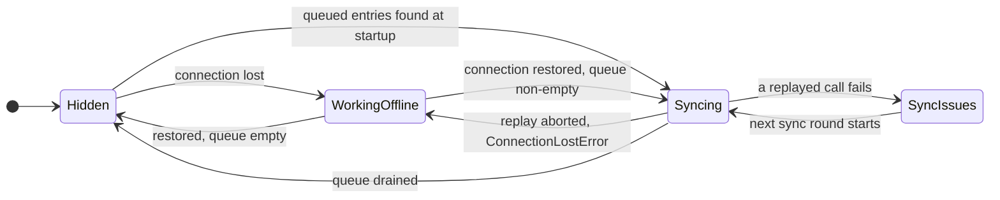

# Offline UI

Active contributors: bobbyabbott421-glitch (fork)

## Purpose

When the connection drops, the client must keep the controls that work offline usable and make the rest visibly unavailable, then show what is queued for replay. This page covers the DOM-level mechanism (`data-available-offline`), the visited-UI bookkeeping that answers availability questions synchronously, the offline systray, and the fallbacks for views that were never visited online.

## Directory layout

```
addons/web/static/src/
├── core/offline/offline_plugin.js              # setOffline, _offlineUI, _visited, backoff ping
├── core/offline/offline_error.js               # error handlers detecting offline
├── core/errors/non_secure_context_error.js     # notification for non-secure contexts
├── model/relational_model/relational_model.js  # _setAvailableOffline marking
├── model/relational_model/record.js            # setOfflineChanges (reopen a queued save)
├── views/
│   ├── offline_action_helper.js/.xml           # never-visited view fallback
│   ├── form/form_controller.js/.xml            # New-button availability
│   ├── list/list_controller.js/.xml
│   └── kanban/kanban_controller.js/.xml
├── search/search_bar/offline_search_bar.js     # remembered searches in the search bar
└── webclient/
    ├── offline_systray/offline_systray.js/.xml  # queue display
    └── navbar/navbar.js/.xml                    # app-menu gating while offline
```

## Key abstractions

| Name | File | Description |
|---|---|---|
| `data-available-offline` | `addons/web/static/src/core/offline/offline_plugin.js` | Attribute that keeps an interactive element enabled while offline |
| `SELECTORS_TO_DISABLE` | `addons/web/static/src/core/offline/offline_plugin.js` | `button:not([data-available-offline]):not([disabled])`, the elements disabled offline |
| `isAvailableOffline()` | `addons/web/static/src/core/offline/offline_plugin.js` | Synchronous answer from the in-memory `_visited` map |
| `_setAvailableOffline` | `addons/web/static/src/model/relational_model/relational_model.js` | Marks each successfully loaded view as available offline |
| OfflineSystray | `addons/web/static/src/webclient/offline_systray/offline_systray.js` | Systray item (sequence 1000) listing queued calls |
| OfflineActionHelper | `addons/web/static/src/views/offline_action_helper.js` | Fallback offering remembered searches for never-visited views |
| OfflineSearchBar | `addons/web/static/src/search/search_bar/offline_search_bar.js` | Search bar variant listing remembered searches |

## How it works

### The `data-available-offline` attribute

On going offline, `_offlineUI()` in `addons/web/static/src/core/offline/offline_plugin.js` first re-enables everything carrying `.o_disabled_offline[data-available-offline]`, then finds every element matching `SELECTORS_TO_DISABLE` (`button:not([data-available-offline]):not([disabled])`) and sets `disabled` plus the `o_disabled_offline` class on it. `_onlineUI()` removes both from every `.o_disabled_offline` element on reconnection. The attribute must sit on the interactive element itself, the `<button>`, not on a wrapper: the selector matches the button node, so a control whose own node lacks it is disabled while offline. A `MutationObserver` on `document.body` (`childList`, `subtree`, `attributeFilter: ["data-available-offline"]`) re-runs `_offlineUI()` for DOM added or changed while offline, so dialogs and dropdowns opened offline get the same treatment.

Views compute the attribute dynamically with `t-att-data-available-offline`:

- Form: the New button checks `isAvailableOffline(actionId, "form", false)` (`addons/web/static/src/views/form/form_controller.js`, template in `addons/web/static/src/views/form/form_controller.xml`).
- Kanban: quick-create kanbans check `"kanban_quick_create"`, others fall back to `"form"` (`addons/web/static/src/views/kanban/kanban_controller.js`, template in `addons/web/static/src/views/kanban/kanban_controller.xml`).
- List: editable, ungrouped lists check `"list_quick_create"`, others fall back to `"form"` (`addons/web/static/src/views/list/list_controller.js`, template in `addons/web/static/src/views/list/list_controller.xml`).

### Visited-UI marking and lookup

`_setAvailableOffline(config, result)` in `addons/web/static/src/model/relational_model/relational_model.js` runs from the RPC disk-cache callback after each load while online, and calls `setAvailableOffline` on the plugin. Mono-record loads (forms) store the record id, or mark the `<viewType>_quick_create` variant when a list or kanban quick-creates; multi-record loads store the current search state, keyed by search key with a use count, re-inserted on each visit so "last visited" wins, and only when the result actually contained records. Keys are `JSON.stringify({action, viewType, resId})` in the `visited-ui-items` table (see [local store](local-store.md)).

On going offline, `_populateVisited()` reads all keys once and builds the plain `_visited` object, because IndexedDB reads are async while rendering needs the answer now. `isAvailableOffline(actionId, [viewType], [resId])` then answers synchronously: an action with no view type, a view type, or for forms a specific record id.

If a load fails anyway (`ConnectionLostError`), `RelationalModel.load` sets `couldNotLoadRootOffline`, and the list and kanban controllers render `OfflineActionHelper` instead of the view. It lists the remembered searches (`getAvailableSearches`, sorted last-visited first then by use count) and its "Reset Filters" button, tagged `data-available-offline`, applies the first one (`addons/web/static/src/views/offline_action_helper.js`). The same search list feeds `OfflineSearchBar` in `addons/web/static/src/search/search_bar/offline_search_bar.js`: while offline, the list and kanban controllers swap the normal `SearchBar` for it (`addons/web/static/src/views/list/list_controller.xml`, `addons/web/static/src/views/kanban/kanban_controller.xml`).

The navbar gates app-menu entries the same way: `_isAvailable(menu)` in `addons/web/static/src/webclient/navbar/navbar.js` checks `isAvailableOffline(menu.actionID)`, and entries that fail get the `o_disabled_offline` class (`addons/web/static/src/webclient/navbar/navbar.xml`).

### The offline systray

The systray item (`addons/web/static/src/webclient/offline_systray/offline_systray.js`, registered in the `systray` registry at sequence 1000) renders only while offline or while calls are queued, and its own button carries `data-available-offline`: clicking it triggers `checkConnection()` immediately.

Entries come from the plugin's `_ormToSync` signal (see [sync queue](sync-queue.md)). `groupEntries` groups them by `extras.actionName` and sorts each group by `extras.timeStamp`; each row shows the record display name, a status badge, and a discard button. Status comes from the method: `web_save` with empty `args[0]` is Created, `web_save` with ids is Edited, `unlink`/`web_unlink` is Deleted, `action_archive` is Archived, `action_unarchive` is Unarchived (`STATUS` map, colors 10, 3, 1, 2, 4). Tooltips show the timestamp, the records, and for saves the old and new values from `extras.originalValues` and `extras.changes` (`addons/web/static/src/webclient/offline_systray/offline_systray.xml`).

The badge state, in priority order: while `syncingORM` a spinner and "Syncing"; while offline a warning badge, `link_off` icon and "Working offline"; when any entry has `extras.error` a danger badge and "Sync issues". Text follows syncing, then offline, then error, while color follows error, then offline, so an offline state with parked failures shows "Working offline" in danger colors. On small screens the entry renders as an icon-only clickable div with the label as aria label and tooltip, using `text-*` color classes instead of `text-bg-*` (`uiService.isSmall`, `addons/web/static/src/webclient/offline_systray/offline_systray.xml`).

Per-entry actions:

- **Discard** opens a `ConfirmationDialog` and calls `removeScheduledORM(id)`, deleting the entry from memory and the `orm-to-sync` table.
- **Open** is enabled only for `web_save` entries from a form view whose record is available offline while offline (`isClickable`); it calls `doAction` with `props.offlineId`, and `FormController.onRootLoaded` re-applies the queued values through `Record.setOfflineChanges` in `addons/web/static/src/model/relational_model/record.js`. While online, opening also dequeues the entry; while offline the entry stays queued for the next sync.



### Offline detection and the backoff ping

Two error handlers in `addons/web/static/src/core/offline/offline_error.js` flip the client offline from uncaught errors: `offlineFailToFetchErrorHandler` (sequence 96) recognizes the browser fetch `TypeError`s ("Failed to fetch" in Chromium, "Load failed" in WebKit, "NetworkError when attempting to fetch resource." in Firefox), and `lostConnectionHandler` (sequence 98) handles an `UncaughtPromiseError` wrapping `ConnectionLostError`, suppressing the default error dialog. Both call `setOffline(true)`. A third detector watches every RPC response through the `rpcBus` `RPC:RESPONSE` event in `addons/web/static/src/core/offline/offline_plugin.js`, and browser `online`/`offline` events trigger `checkConnection()`.

While offline, `checkConnection()` pings `/web/webclient/version_info` in a loop with exponential backoff: the delay starts at 2000 ms and becomes `delay * 1.5 + 500 * Math.random()` on each round. The ping's own response updates the state through the `RPC:RESPONSE` listener, so a successful ping is what turns the client online again and starts the replay.

Outside a secure context none of this runs: `scheduleORM` throws `NonSecureContextError` and `NonSecureContextErrorHandler` in `addons/web/static/src/core/errors/non_secure_context_error.js` shows a sticky danger notification (see [offline and PWA](index.md)).

## Integration points

- The plugin's `setOffline` is called from the detectors above and from the legacy `"offline"` service bridge at the bottom of `addons/web/static/src/core/offline/offline_plugin.js`.
- View controllers consume `isAvailableOffline` and `getAvailableSearches`; the systray, navbar and action helper render on top of the plugin's signals.
- `Record.setOfflineChanges` re-applies queued saves; see [the JS data layer that produces queue entries](../../apps/web/relational-model.md).
- Mobile behavior (badge text vs. badge color, search bar) gates on the small-screen signal, described in the web client platform pages (see [web client platform](../../apps/web/index.md)).

## Entry points for modification

A control that must stay usable offline needs `data-available-offline` on its own interactive element, computed from `isAvailableOffline` when availability depends on what was visited. Systray presentation changes go in `addons/web/static/src/webclient/offline_systray/offline_systray.js` and its `.xml`; availability bookkeeping changes go in `_setAvailableOffline` in `addons/web/static/src/model/relational_model/relational_model.js`. Remember that DOM added while offline is only re-processed by the `MutationObserver`, so attributes set through wrappers do nothing.

## Key source files

| File | Purpose |
|---|---|
| `addons/web/static/src/core/offline/offline_plugin.js` | `_offlineUI`, MutationObserver, `_visited`, `isAvailableOffline`, backoff ping |
| `addons/web/static/src/core/offline/offline_error.js` | Fetch and connection error handlers |
| `addons/web/static/src/core/errors/non_secure_context_error.js` | Non-secure-context notification |
| `addons/web/static/src/model/relational_model/relational_model.js` | `_setAvailableOffline`, `couldNotLoadRootOffline` |
| `addons/web/static/src/model/relational_model/record.js` | `setOfflineChanges` for reopened queued saves |
| `addons/web/static/src/webclient/offline_systray/offline_systray.js` | Queue display, statuses, discard and open |
| `addons/web/static/src/webclient/offline_systray/offline_systray.xml` | Systray markup and tooltip template |
| `addons/web/static/src/views/offline_action_helper.js` | Never-visited view fallback |
| `addons/web/static/src/views/offline_action_helper.xml` | Helper markup |
| `addons/web/static/src/search/search_bar/offline_search_bar.js` | Remembered-search search bar |
| `addons/web/static/src/views/form/form_controller.js` | Form New-button availability |
| `addons/web/static/src/views/kanban/kanban_controller.js` | Kanban New-button availability, action helper |
| `addons/web/static/src/views/list/list_controller.js` | List New-button availability, action helper |
| `addons/web/static/src/webclient/navbar/navbar.js` | App-menu gating while offline |

## Related pages

- [Offline and PWA](index.md)
- [Sync queue](sync-queue.md)
- [Local store](local-store.md)
- [Service worker and install](service-worker-and-install.md)
- [The JS data layer that produces queue entries](../../apps/web/relational-model.md)
- [Web client platform](../../apps/web/index.md)
- [CRM's consumption of the stack](../../apps/crm/offline-and-mobile-crm.md)
- [Debugging](../../how-to-contribute/debugging.md)
- [Glossary](../../overview/glossary.md)
