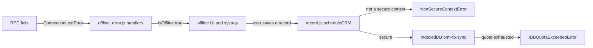

# Debugging

Active contributors: bobbyabbott421-glitch (fork), Odoo SA (upstream)

## Purpose

Where the evidence lives when something goes wrong in this fork: the logs the dev scripts write, server and client debug modes, the errors specific to the offline stack, and the browser tools that show the service worker and the IndexedDB stores. The commands that produce those logs are on [Development workflow](development-workflow.md); the log format itself is on [Logging](../how-to-monitor/logging.md).

## Where logs go

Everything runtime lands under `logs/` and `var/`, both gitignored (`.gitignore` lines 57-58). `scripts/dev/_common.sh` derives the paths from its own location, so they are always `<repo>/logs`.

| Path | What it holds |
| --- | --- |
| `logs/odoo.log` | The dev server log. `start.sh` tees its own output and the server's into it, and appends the database initialization log (`db-init` run). |
| `logs/<script>.log` | The last run of each script. Examples seen in a real run: `test-py-all.log`, `test-js-desktop-crm.log`, `test-js-mobile-crm.log`, `test-guard.log`, `rebuild-assets.log`, `db-init.log`. |
| `logs/measure-<script>.txt` | GNU `time -v` output for that run, including `Elapsed (wall clock)` and `Maximum resident set size`. |
| `logs/odoo.pid`, `logs/tls-proxy.pid` | PIDs of the server and, in `--https` mode, the socat TLS proxy. `stop.sh` and the test scripts read them to decide whether a `start.sh` server is running. |
| `logs/offline-spike/` | PNG screenshots captured during a manual offline QA pass (offline pipeline, reload, action helper, bottom sheet). Not produced by any script. |
| `var/tls/odoo-dev.crt`, `var/tls/odoo-dev.key` | Self-signed certificate generated by `start.sh --https`. |

Each wrapper writes its log by deleting the previous content first, and appends to `logs/odoo.log` when the run is a database initialization. `run_measured` in `scripts/dev/_common.sh` is the helper that does this: it tees to the log, records wall time and peak RSS with `/usr/bin/time`, and returns the command's exit code.

## Server-side debugging

- `--log-level` takes `info`, `debug_rpc`, `warn`, `test`, `critical`, `runbot`, `debug_sql`, `error`, `debug`, `debug_rpc_answer`, or `notset` (`odoo/tools/config.py`). The test wrappers all pass `--log-level=test`, which is why the test result lines are in the logs.
- `--log-handler MODULE:LEVEL` raises one logger only, e.g. `--log-handler=odoo.sql_db:DEBUG`. `--log-sql` is shorthand for that, and `--log-web` for `odoo.http:DEBUG`. `--logfile` writes to a file instead of stderr.
- `--dev` enables development features, comma-separated: `access` (log the traceback of access errors), `qweb` (log the compiled XML when QWeb fails), `reload` (restart the server when source changes), and `replica`. `--dev=all` means `access,reload,qweb,xml`. The same value can come from the `ODOO_DEV` environment variable.
- `odoo-bin shell -d crm_offline --no-http` opens the ORM environment directly. `./scripts/dev/rebuild-assets.sh` uses exactly this to call `env['ir.attachment'].regenerate_assets_bundles()` and `env['ir.qweb']._pregenerate_assets_bundles()`. In the shell, `env` is the environment for the configured database, `env.ref('crm.crm_menu_root')` resolves an XML id, and server options are on `odoo.tools.config`.

## Client debug mode

`odoo.debug` carries the client debug mode, and `DebugModePlugin` in `addons/web/static/src/core/debug_mode_plugin.js` reads it. Any non-empty `?debug=` value makes `isActive()` true, so the debug menu appears; the specific values add behavior: `assets` serves unminified asset files and rebuilds a bundle when one of its source files changes, and `tests` puts the client in test mode (`addons/web/views/webclient_templates.xml` checks `'tests' in debug`). The debug menu (`addons/web/static/src/core/debug/debug_menu_items.js`) offers Activate Test Mode, Regenerate Assets, Become Superuser, Enable or Disable RPC Cache, and Leave Debug Mode. "Regenerate Assets" is the in-browser equivalent of `./scripts/dev/rebuild-assets.sh`. The JS unit suites themselves open `/web/tests?&headless&loglevel=2&preset=desktop` or `preset=mobile` (`addons/web/tests/test_js.py`), and `start_tour` runs tours with the `debug=assets` query parameter (`odoo/tests/common.py`).

## Errors specific to this fork

| Error | Where it comes from | What to do |
| --- | --- | --- |
| `NonSecureContextError` | `scheduleORM` in `addons/web/static/src/core/offline/offline_plugin.js` throws it when `window.isSecureContext` is false, with the message "Offline features not available in a non-secure context". `NonSecureContextErrorHandler` in `addons/web/static/src/core/errors/non_secure_context_error.js` shows it as a sticky danger notification. | You are not on HTTPS or `localhost`. Restart with `./scripts/dev/start.sh` for `http://localhost:8069`, or `./scripts/dev/start.sh --https` when the page is opened on any other host. Offline storage is disabled entirely, not partially: the framework substitutes a no-op `FakeIndexedDB`. |
| `ConnectionLostError` | `addons/web/static/src/core/network/rpc.js`. It is raised for any failed RPC and is what flips the app offline. Its handlers are `offlineFailToFetchErrorHandler` and `lostConnectionHandler` in `addons/web/static/src/core/offline/offline_error.js`. | Expected while offline: `TypeError: Failed to fetch` from translation or menu loading is normal there. While online it means the server is unreachable or the request failed, so check `logs/odoo.log` and whether the server is still up. |
| `IDBQuotaExceededError` | `addons/web/static/src/core/utils/indexed_db.js` defines it. When a write fails with `QuotaExceededError`, the wrapper logs `IndexedDB error: Quota Exceeded (X out of Y used)` using `navigator.storage.estimate()` and rejects with this error. | Free space, or clear the browser's stored data for the origin. Check usage with `await navigator.storage.estimate()` in the console. The offline store is wiped anyway when the asset registry hash changes, which `rebuild-assets.sh` triggers. |
| Asset staleness | The running server caches bundles in memory and serves them from `ir.attachment` records generated at install or upgrade time. | A test that fails only after a js/css/scss/xml change is not a real result. Run `./scripts/dev/rebuild-assets.sh` (it stops the server first) and re-run. Re-visit the views online afterwards: the changed registry hash empties the offline cache. |
| `0 tests collected` | Odoo collects tests only from modules installed or updated in that run, and still exits 0. | Do not run raw `./odoo-bin`. Use the wrappers, which pass `-u crm` or `-u crm,web` and fail on `of 0 tests when loading database`. See [Testing](testing.md). |
| A browser test "passing" instantly | A missing `websocket-client` or Chrome makes browser tests raise `SkipTest`, still exit 0. | `./scripts/dev/setup.sh` installs both, and the JS wrappers refuse to start without them. |

## Browser DevTools

- **Application, Service Workers.** The shared worker is served at `/web/service-worker.js` with scope `/odoo` (`addons/web/controllers/webmanifest.py`). The DevTools entry shows its state and offers Update and Unregister; "Bypass for network" is the fastest way to compare cached and live behavior.
- **The service worker has its own console target.** In Chrome's console target selector, pick the worker to see its install, fetch, and session-info-masking messages. `addons/web/static/src/service_worker.js` logs there, not in the page console.
- **Application, Cache Storage.** The precache holds `/odoo` and `/odoo/offline`; deleting an entry reproduces a cold cache.
- **Application, IndexedDB.** Database `offline` holds the framework's tables, including `orm-to-sync` (the pending ORM calls), `visited-ui-items`, and the `many2x_<model>` caches. Database `rpc` holds the response cache that lets a visited view render while offline. Values are AES-GCM ciphertext, so count and inspect keys rather than payloads; the queue key is the caller's `options.id` or a hash of the payload.
- **Application, Storage.** Shows usage against quota, the same numbers `navigator.storage.estimate()` returns.
- **Network tab, Offline checkbox.** A quick way to reproduce the offline UI: the framework disables every `<button>` without `data-available-offline` and adds `o_disabled_offline`, and `.o_offline_systray` appears in the navbar.

## Common ORM debugging

- Start from `./odoo-bin shell -d crm_offline --no-http` and inspect: `env['crm.lead'].search_count([])`, `env.ref('crm.crm_menu_root')`, `odoo.tools.config['db_name']`.
- The ORM API surface is in `odoo/orm/`; the classic `odoo/models.py` and `odoo/fields.py` are re-export shims. Access rules are unified in `ir.access` (`odoo/addons/base/models/ir_access.py`), not `ir.rule`. See [ORM](../systems/orm.md).
- For a failing test, read the traceback in `logs/test-py-<Class>.log` before re-running: the log also records which `odoo-bin` command was used and the exact tags.
- To inspect what the queue would replay, look at the offline systray in the browser: entries carry `extras.timeStamp`, `actionName`, `displayNames`, and `extras.error` when a replay failed. Failed entries stay parked and are excluded from replay until acted on.

## Key source files

| File | Purpose |
| --- | --- |
| `scripts/dev/_common.sh` | `run_measured`, the PID helpers, port and database guards, and the log paths. |
| `scripts/dev/start.sh` | Tees server and database init output into `logs/odoo.log`. |
| `addons/web/static/src/core/errors/non_secure_context_error.js` | `NonSecureContextError` and its notification handler. |
| `addons/web/static/src/core/offline/offline_error.js` | The offline error handlers that react to `ConnectionLostError`. |
| `addons/web/static/src/core/network/rpc.js` | Where `ConnectionLostError` is defined and raised. |
| `addons/web/static/src/core/offline/offline_plugin.js` | Throws `NonSecureContextError` from `scheduleORM`; owns the queue and replay. |
| `addons/web/static/src/core/utils/indexed_db.js` | `IDBQuotaExceededError` and the `navigator.storage.estimate()` log. |
| `addons/web/static/src/core/debug_mode_plugin.js` | Reads `odoo.debug` for the client debug mode. |
| `addons/web/static/src/core/debug/debug_menu_items.js` | The debug menu entries, including Regenerate Assets. |
| `addons/web/static/src/service_worker.js` | The shared worker whose console has its own DevTools target. |
| `addons/web/controllers/webmanifest.py` | Serves `/web/service-worker.js` and `/odoo/offline`. |
| `odoo/tools/config.py` | `--dev`, `--log-level`, `--log-handler`, `--logfile`, `--log-sql`, `--log-web`. |
| `odoo/tests/loader.py` | The collection rule behind the "0 tests collected" trap. |

## Related pages

- [Development workflow](development-workflow.md)
- [Testing](testing.md)
- [Tooling](tooling.md)
- [Logging](../how-to-monitor/logging.md)
- [CLI and maintenance](../systems/cli-and-maintenance.md)
- [Local store](../features/offline-and-pwa/local-store.md)
- [Offline and PWA](../features/offline-and-pwa/index.md)
- [Pitfalls](../background/pitfalls.md)
