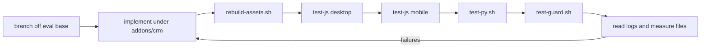

# Development workflow

Active contributors: bobbyabbott421-glitch (fork), Odoo SA (upstream)

## Purpose

This page is the concrete cycle for a change in this fork: branch, implement under `addons/crm/`, regenerate assets if anything front-end moved, run the Python and JavaScript suites under both presets, run the forbidden-statement guard, read the logs, and reset the database when it is polluted. Every command here is a wrapper in `scripts/dev/`, which prints the `./odoo-bin` invocation it runs.

## Directory layout

```text
scripts/dev/
├── README.md            # usage and the notes on the test runner
├── _common.sh           # shared config, port/db guards, result checks (sourced, not run)
├── setup.sh             # once per machine
├── start.sh             # serve, optionally --https
├── stop.sh              # stop a start.sh server and its TLS proxy
├── test-py.sh           # crm Python tests
├── test-js.sh           # JS unit tests, desktop|mobile [crm|web]
├── test-guard.sh        # only(/debug( guard
├── rebuild-assets.sh    # regenerate front-end bundles
└── reset-db.sh          # drop and recreate crm_offline
logs/                    # gitignored: odoo.log, <script>.log, measure-*.txt
```

## The cycle



1. **Branch.** Fork lineage is `20.0` to `eval/base`, upstream is `origin/20.0`. Keep the change confined to `addons/crm/`; the rules are on [How to contribute](index.md) and the code patterns on [Patterns and conventions](patterns-and-conventions.md).
2. **Implement.** New files are covered by the manifest's existing globs, see below. A new Python test module must be imported in `addons/crm/tests/__init__.py`, and a new model, controller, or data file in its own `__init__.py` or the manifest's `data` list.
3. **Rebuild assets** if the change touched js, css, scss, or xml: `./scripts/dev/rebuild-assets.sh`. It stops a `start.sh` server first, because the server caches assets in memory and would keep serving stale ones. Restart the server afterwards if you were checking in the browser.
4. **Test.** `./scripts/dev/test-js.sh desktop`, then `./scripts/dev/test-js.sh mobile`, then `./scripts/dev/test-py.sh`, then `./scripts/dev/test-guard.sh`. Tests bind port 8069 themselves, so the scripts stop a `start.sh` server first and refuse to run if another process holds the port.
5. **Read the logs**, not just the exit code: `logs/test-py-all.log`, `logs/test-js-desktop-crm.log`, `logs/test-js-mobile-crm.log`, `logs/test-guard.log`, plus the wall time and peak RSS in `logs/measure-<script>.txt`.
6. **Reset when polluted.** `./scripts/dev/reset-db.sh` drops `crm_offline` and its filestore (`~/.local/share/Odoo/filestore/<db>`) and recreates it with crm, mail, and demo data. The server is not started afterwards.

## Commands the wrappers run

`./scripts/dev/test-py.sh` prints and logs the exact command. Without arguments it runs the whole crm Python suite, choosing between two forms: `-i crm` only if crm is not yet installed in the database, otherwise `-u crm --test-tags /crm`. `-i crm` on a database where crm is already installed installs nothing and collects zero tests, which is one of the false-green modes described on [Testing](testing.md).

```bash
# all crm Python tests
./odoo-bin -d crm_offline -u crm --test-enable --test-tags /crm --stop-after-init --log-level=test
./odoo-bin -d crm_offline -i crm --test-enable --test-tags /crm --stop-after-init --log-level=test

# one crm Python test class
./scripts/dev/test-py.sh TestCRMLead
./odoo-bin -d crm_offline -u crm --test-enable --test-tags /crm:TestCRMLead --stop-after-init --log-level=test

# crm JS unit tests, desktop and mobile presets
./scripts/dev/test-js.sh desktop
./scripts/dev/test-js.sh mobile
./odoo-bin -d crm_offline -u crm,web --test-enable --test-tags /crm:WebSuite.test_unit_desktop --stop-after-init --log-level=test
./odoo-bin -d crm_offline -u crm,web --test-enable --test-tags /crm:MobileWebSuite.test_unit_mobile --stop-after-init --log-level=test

# the whole web JS suite instead of crm's (thousands of tests, slow)
./scripts/dev/test-js.sh desktop web

# forbidden-statement guard
./scripts/dev/test-guard.sh
./odoo-bin -d crm_offline -u crm,web --test-enable --test-tags /web:HootSuite.test_check_suite --stop-after-init --log-level=test
```

`test-js.sh` and `test-guard.sh` use `-u crm,web`; `web` is required because both suites live in `addons/web/tests/test_js.py`, and Odoo collects tests only from modules installed or updated during the run. The module part of the tag then selects whose `*.test.js` files run: `/crm:` is the fast default, `/web:` is the full suite.

## Front-end changes and assets

After any js, css, scss, or xml edit, run `./scripts/dev/rebuild-assets.sh` before re-testing. It deletes every generated asset attachment and regenerates the bundles in the database:

```bash
./odoo-bin shell -d crm_offline --no-http
env['ir.attachment'].regenerate_assets_bundles()
env['ir.qweb']._pregenerate_assets_bundles()
env.cr.commit()
```

Assets are generated at install or upgrade time and served as `ir.attachment` records, so a change is invisible to the running server and to the test browser until this runs. See [Assets](../systems/assets.md) for how bundles are built.

## UI changes and tours

A UI change needs a tour to be provable. Onboarding steps live in `addons/crm/static/src/js/tours/crm.js`, registered in the `web_tour.tours` registry and enabled by the `crm_tour` record in `addons/crm/data/crm_tour.xml`. Test tours driven by Python live in `addons/crm/static/tests/tours/` and ship in the `web.assets_tests` bundle. The Python test is an `HttpCase` subclass tagged `post_install` that calls `self.start_tour("/odoo", "tour_name", login="admin")`, as in `addons/crm/tests/test_crm_ui.py`. The framework behind both is on [Test framework](../systems/test-framework.md) and [Onboarding tours](../features/onboarding-tours.md).

## Manifest asset globs

Verify rather than touch the manifest. `addons/crm/__manifest__.py` already routes new files:

- `web.assets_backend` includes `crm/static/src/**`, so new front-end source needs no manifest change.
- `web.assets_tests` includes `crm/static/tests/tours/**/*`.
- `web.assets_unit_tests` includes `crm/static/tests/mock_server/**/*`, `crm/static/tests/crm_test_helpers.js`, `crm/static/tests/**/*.test.js`, and `crm/static/tests/crm_mock_server.js`.

The only reason to edit that block is to exclude or lazily load a file, done as a pair: `('remove', 'crm/static/src/views/<dir>/**')` under `web.assets_backend` plus the same path in `web.assets_backend_lazy`, the pattern used for `crm_activity`, `crm_graph`, `crm_pivot`, `forecast_graph`, and `forecast_pivot`.

## Overrides

`scripts/dev/_common.sh` defines the defaults the wrappers read from the environment: `ODOO_DB` (`crm_offline`), `ODOO_PORT` (`8069`), `ODOO_HTTPS_BACKEND_PORT` (`8070`), `ODOO_ADMIN_LOGIN` and `ODOO_ADMIN_PASSWORD` (`admin`), `PGHOST` (`/var/run/postgresql`), and `PGPORT` (`5432`). So `ODOO_DB=other_db ./scripts/dev/test-py.sh` runs the same suite against a different database. The full tooling inventory is on [Tooling](tooling.md).

## Entry points for modification

Change `scripts/dev/_common.sh` only for shared configuration or a new result guard, and add a new script rather than overloading an existing one. For the application itself, work under `addons/crm/`: `models/` for server behavior, `views/crm_lead_views.xml` for arch and `js_class` bindings, `static/src/views/<component>/` for view code, and `tests/` plus `static/tests/` for the proof.

## Key source files

| File | Purpose |
| --- | --- |
| `scripts/dev/README.md` | Authoritative usage of every wrapper and the notes on the three false-green modes. |
| `scripts/dev/_common.sh` | Environment defaults, port and database guards, `assert_tests_selected` / `assert_no_skips`. |
| `scripts/dev/test-py.sh` | Chooses `-i crm` or `-u crm --test-tags /crm`, asserts tests were selected, lists skips. |
| `scripts/dev/test-js.sh` | Desktop and mobile presets, `-u crm,web`, asserts selection and no skips. |
| `scripts/dev/test-guard.sh` | `HootSuite.test_check_suite` against the whole unit-test bundle. |
| `scripts/dev/rebuild-assets.sh` | Deletes generated attachments and regenerates bundles through `odoo-bin shell`. |
| `scripts/dev/reset-db.sh` | Drops the database and filestore, recreates with crm, mail, demo data. |
| `scripts/dev/start.sh` | Serves on 8069, or TLS on 8069 with Odoo on 8070 with `--https`. |
| `scripts/dev/setup.sh` | System packages, PostgreSQL, `.venv`, Chrome, `websocket-client`, `phonenumbers`. |
| `addons/crm/__manifest__.py` | The asset globs and data file order a new file must fit into. |
| `addons/crm/tests/test_crm_ui.py` | The `HttpCase` plus `start_tour` pattern for UI changes. |
| `addons/crm/static/tests/tours/` | Test tours shipped in `web.assets_tests`. |
| `addons/crm/static/src/js/tours/crm.js` | The onboarding tour steps. |

## Related pages

- [How to contribute](index.md)
- [Testing](testing.md)
- [Patterns and conventions](patterns-and-conventions.md)
- [Tooling](tooling.md)
- [Getting started](../overview/getting-started.md)
- [Assets](../systems/assets.md)
- [Test framework](../systems/test-framework.md)
- [CLI and maintenance](../systems/cli-and-maintenance.md)
