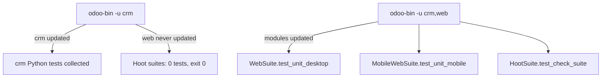

# Testing

Active contributors: bobbyabbott421-glitch (fork), Odoo SA (upstream)

## Purpose

This page covers how tests are written and run in this fork: the three ways the Odoo runner reports success while testing nothing, the `scripts/dev/` guards against each, the Python and JavaScript conventions, the tours, and what covers offline behavior. The framework underneath (`TransactionCase`, `HttpCase`, `--test-tags`, Hoot) is on [Test framework](../systems/test-framework.md).

## The three false-green modes and their guards

All three come from the runner itself, not from this fork's code, and all three exit 0. `scripts/dev/` exists to make them visible.

| False green | Why it happens | Guard |
| --- | --- | --- |
| Zero tests collected | Odoo only collects tests from modules it installed or updated in that run. `-i crm` installs nothing when crm is already installed in `crm_offline`, so the run collects 0 tests and exits 0. | `test-py.sh` uses `-i crm` only when crm is missing from the database and `-u crm --test-tags /crm` otherwise. `assert_tests_selected` in `scripts/dev/_common.sh` fails the run if the log contains `of 0 tests when loading database`. |
| JS suites never collected | Both Hoot suites live in `addons/web/tests/test_js.py`. `-u crm` updates crm and its dependents, never `web`, so the suite is not collected at all. | `test-js.sh` and `test-guard.sh` pass `-u crm,web`. The module part of the tag then chooses whose files run: `/crm:` for crm's own tests, `/web:` for the whole suite. |
| A browser test skips silently | A browser test raises `SkipTest` when a dependency is missing, for instance `websocket-client` or Chrome, and a skipped test still exits 0. | `setup.sh` installs `websocket-client` and `phonenumbers`. `test-js.sh` and `test-guard.sh` additionally refuse to start without Chrome or `websocket-client`, and `assert_no_skips` fails the run when the log contains `: skipped `. |

`scripts/dev/_common.sh` holds both guards as shell functions: `assert_tests_selected <logfile> <label>` and `assert_no_skips <logfile> <label>`. `test-py.sh` calls only the first and prints a note when Python tests skipped, because some crm Python tests skip themselves on purpose when an optional module is absent. The JS wrappers treat any skip as failure.

## Python conventions

- Test modules live in `addons/crm/tests/test_*.py` and must be imported in `addons/crm/tests/__init__.py`. An unimported module is silently never collected, and nothing reports that.
- The shared base is `TestCrmCommon` in `addons/crm/tests/common.py`, built on `TestSalesCommon` and mail's `MailCase`. Concrete classes extend it: `TestCRMLead` in `addons/crm/tests/test_crm_lead.py` is the example to follow. There is **no** `TestCrmOffline` class. That name appears in `AGENTS.md` and `scripts/dev/README.md` only as the illustrative argument to `./scripts/dev/test-py.sh`; a repository-wide search finds no such class. Use `./scripts/dev/test-py.sh TestCRMLead` to narrow a run.
- UI tests extend `HttpCase` (together with the common base) and are tagged `@tagged('post_install', '-at_install')`, so they run after the module is installed and modules are updated. `addons/crm/tests/test_crm_ui.py` is the reference.
- Run them with `./scripts/dev/test-py.sh` (whole crm suite) or `./scripts/dev/test-py.sh <Class>`. `-u crm --test-enable --test-tags /crm` is the command behind both.
- Do not delete, skip, retag, or weaken an existing test. The only existing test file that may change is `addons/crm/tests/__init__.py`.

## JavaScript conventions

- Tests are `*.test.js` under `addons/crm/static/tests/`, using `test` and `expect` from `@odoo/hoot`, view helpers such as `mountView` and `onRpc` from `@web/../tests/web_test_helpers`, and `defineMailModels` from `@mail/../tests/mail_test_helpers`. `addons/crm/static/tests/forecast_view.test.js` shows the shape; `addons/crm/static/tests/crm_mock_server.js` and `addons/crm/static/tests/mock_server/` hold the model mocks.
- The manifest's `web.assets_unit_tests` globs already cover new test files, mocks, and the shared helpers in `addons/crm/static/tests/crm_test_helpers.js`.
- Every new test must pass under **both** presets: `./scripts/dev/test-js.sh desktop` and `./scripts/dev/test-js.sh mobile` (375x667 with touch). A test that only passes at one size is a mobile-behavior bug, since desktop behavior must not change.
- Never use `only(` or `debug(` in a `.test.js`. `./scripts/dev/test-guard.sh` runs `HootSuite.test_check_suite`, which scans the whole `web.assets_unit_tests` bundle and fails on either. Run it whenever you add or edit a JS test.
- Touch-dependent behavior belongs in the mobile preset rather than in a desktop-only test: `addons/web/tests/test_js.py` builds `MobileWebSuite` as `browser_size = "375x667"` with `touch_enabled = True`.

## Tours

- Onboarding tour steps live in `addons/crm/static/src/js/tours/crm.js`, registered in the `web_tour.tours` registry; the `crm_tour` record in `addons/crm/data/crm_tour.xml` enables it. See [Onboarding tours](../features/onboarding-tours.md).
- Test tours driven by `start_tour` live in `addons/crm/static/tests/tours/` and ship in the `web.assets_tests` bundle. They are JavaScript files that register a tour under the same `web_tour.tours` registry, and the Python side starts them: `self.start_tour("/odoo", "crm_rainbowman", login="temp_crm_user")`.
- Add a tour when a UI change cannot be proven by a unit test: form flow, control-panel button, drag and drop between kanban columns.

## What covers offline behavior

Offline is a framework feature of `addons/web`, and CRM consumes it without its own offline Python test. Coverage sits in three places:

- Framework JS tests: `addons/web/static/tests/core/offline/offline_plugin.test.js` (queue scheduling, replay, error parking), `addons/web/static/tests/core/offline/offline_error.test.js`, and `addons/web/static/tests/webclient/offline_systray.test.js` (queue UI). Run them with `./scripts/dev/test-js.sh desktop web` or `mobile web`; they are part of the module selector `/web:`.
- CRM tours: `addons/crm/tests/test_crm_ui.py` drives the pipeline in a real browser, and CRM's JS suites in `addons/crm/static/tests/` run under both presets.
- Manual browser QA: the `odoo-offline-qa` skill in `.factory/skills/odoo-offline-qa/SKILL.md` documents the procedure the automated suites cannot prove: a secure context, `rebuild-assets.sh` first, going offline, reloading from the cache, editing a lead so a write queues in IndexedDB `offline` under `orm-to-sync`, going back online, and confirming with `psql` that the row changed and the queue drained. Its assertions are the ones to quote in a report: `window.isSecureContext`, `navigator.onLine`, `.o_offline_systray`, `.o_disabled_offline`, and the queue key count.

Two properties of that procedure matter when reading results: an empty queue plus an unchanged row means the write was dropped, and a non-empty queue after reconnection is a real finding rather than a timing artifact, because failed replays stay parked in the queue with `extras.error` and are shown as "Sync issues". The stack itself is described on [Offline and PWA](../features/offline-and-pwa/index.md) and [Local store](../features/offline-and-pwa/local-store.md).

## Reporting results

There is no CI in this repository, so every test command must actually be run and its result reported, including the ones skipped and why. A run whose log shows `of 0 tests when loading database` or `: skipped ` is not a result. Failures listed under "Known baseline failures" in `AGENTS.md` are out of scope: do not fix them and do not report them as regressions. The one known case is the `scroll loses target` test of the `throttleForAnimation` group in `addons/web/static/tests/core/utils/timing.test.js`, which fails on the untouched baseline and lives in upstream `addons/web`.

## Key source files

| File | Purpose |
| --- | --- |
| `scripts/dev/_common.sh` | `assert_tests_selected` and `assert_no_skips`, the two result guards. |
| `scripts/dev/test-py.sh` | crm Python suite, with the `-i crm` versus `-u crm` decision. |
| `scripts/dev/test-js.sh` | Desktop and mobile Hoot presets with `-u crm,web`. |
| `scripts/dev/test-guard.sh` | The `only(` / `debug(` check on the unit-test bundle. |
| `addons/crm/tests/__init__.py` | The import list that decides which crm test modules run. |
| `addons/crm/tests/common.py` | `TestCrmCommon`, the shared crm test base. |
| `addons/crm/tests/test_crm_lead.py` | `TestCRMLead`, the reference Python test class. |
| `addons/crm/tests/test_crm_ui.py` | `HttpCase` plus `start_tour` UI tests. |
| `addons/crm/static/tests/crm_mock_server.js` | Model mocks for the JS suites. |
| `addons/crm/static/tests/crm_test_helpers.js` | Shared JS fixtures. |
| `addons/crm/static/tests/tours/` | Test tours shipped in `web.assets_tests`. |
| `addons/crm/static/src/js/tours/crm.js` | Onboarding tour steps. |
| `addons/web/tests/test_js.py` | `HootSuite`, `WebSuite`, and `MobileWebSuite` definitions. |
| `addons/web/static/tests/core/offline/offline_plugin.test.js` | Framework tests for the sync queue. |
| `addons/web/static/tests/webclient/offline_systray.test.js` | Framework tests for the offline systray. |
| `.factory/skills/odoo-offline-qa/SKILL.md` | The manual browser QA procedure for offline behavior. |
| `odoo/tests/loader.py` | Collection rule: only modules installed or updated in the run. |

## Related pages

- [Development workflow](development-workflow.md)
- [How to contribute](index.md)
- [Patterns and conventions](patterns-and-conventions.md)
- [Debugging](debugging.md)
- [Test framework](../systems/test-framework.md)
- [Offline and PWA](../features/offline-and-pwa/index.md)
- [Pitfalls](../background/pitfalls.md)
- [Logging](../how-to-monitor/logging.md)
