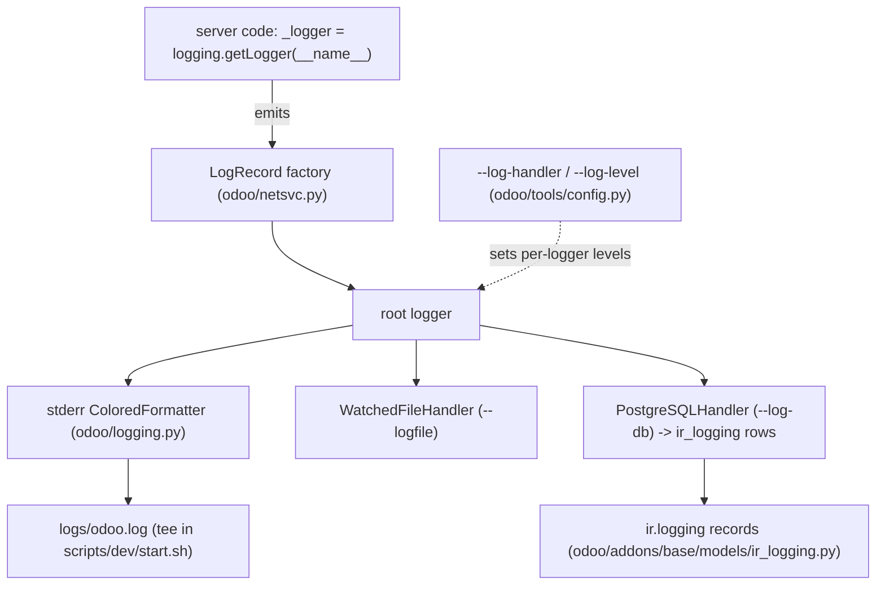

# Logging

Active contributors: Odoo SA (upstream)

## Purpose

Everything Odoo logs, from ORM internals to per-request access lines, flows through Python's `logging` module with Odoo-specific configuration, formatters, and a database handler. This page covers how the pipeline is assembled, which knobs select verbosity, where logs land in this fork's dev environment, and how to add log statements of your own.

## How it works

`init_logger()` in `odoo/netsvc.py` assembles the pipeline at startup:

- It installs a custom `LogRecord` factory (`odoo/netsvc.py`, class `LogRecord`) that attaches `thread_native`, `dbname`, and, when tests are running, metadata from the current test.
- It routes Python warnings into the log and turns some deprecation noise off.
- It installs exactly one root handler: a stderr `StreamHandler` with `ColoredFormatter` by default, a `SysLogHandler` with `--syslog` (deprecated since Odoo 20, the startup warning says to use `--log-config` instead), or a `WatchedFileHandler` on `--logfile`. A `--log-config` file (JSON or TOML, dictConfig format) replaces all of this unless it sets `keep_odoo_default`.

### Levels and handlers

`--log-level` (`odoo/tools/config.py`) accepts `info` (default), `debug`, `debug_sql`, `debug_rpc`, `debug_rpc_answer`, `runbot`, `warn`, `error`, `critical`, `test`, `notset`. Most of these are translated into per-logger presets by `PSEUDOCONFIG_MAPPER` in `odoo/netsvc.py`: `debug` sets `odoo:DEBUG` and `odoo.sql_db:INFO`, `debug_sql` sets `odoo.sql_db:DEBUG`, `runbot` sets `odoo:RUNBOT`, and `warn`/`error`/`critical` clamp the `odoo` logger accordingly. The legacy names `test`, `debug_rpc`, and `debug_rpc_answer` are accepted but map to no extra configuration, so they behave like `info`; `--log-level=test` is what the dev test scripts pass.

For per-module control, `--log-handler MODULE:LEVEL` is repeatable and accumulates across config file, environment, and command line (`odoo/tools/config.py`). Two shortcuts exist: `--log-web` is `odoo.http:DEBUG`, and `--log-sql` is `odoo.sql_db:DEBUG`.

One custom level exists: `RUNBOT = 25`, registered by `odoo/_monkeypatches/logging.py` as `logging.RUNBOT` with a `_logger.runbot()` method, displayed as INFO in the level-to-name table. It is the level for verbose output only wanted on the test platform, used for example by the Chrome test helpers in `odoo/tests/common.py` and migration timing in `odoo/modules/migration.py`. `odoo/loglevels.py` holds only the `LOG_*` string constants and `exception_to_unicode()`; despite the historical name, there is no TEST level registered in this tree.

### Request and SQL logging

`odoo/http/server_log.py` writes one access line per request on the `odoo.http.server` logger: remote address, session id, request line (annotated with the RPC model.method when one is being called), status, body size, query count, query time, remaining time, and cursor mode (`ro`, `rw`, or red `ro->rw` when a read-only attempt was retried as read/write). Timings are color-graded: query count turns yellow above 100 and red above 1000, query time above 0.1s/3s. Request headers go to the child logger `odoo.http.server.headers`, which sits at WARNING unless explicitly lowered. Werkzeug is still pinned in `requirements.txt` and `odoo/http/__init__.py` uses its `LocalProxy` for the `request` object, but the access log itself is this Odoo file, not werkzeug middleware.

At the database layer, `Cursor.execute()` in `odoo/sql_db.py` logs every query at DEBUG on `odoo.sql_db`, prefixed with its delay and the formatted statement, and maintains the per-cursor `sql_log_count` plus per-thread `query_count`/`query_time` that feed the access line. When DEBUG is on, cursor close also prints per-table read/write statistics (`print_log()`, called from `_close()` in `odoo/sql_db.py`).

### `ir.logging` and `--log-db`

`--log-db=DBNAME` adds a `PostgreSQLHandler` (`odoo/logging.py`) that writes raw `INSERT`s into the `ir_logging` table, `--log-db-level` filters them (default `warning`). The `ir.logging` model lives at `odoo/addons/base/models/ir_logging.py` with fields `name`, `type` (`client` or `server`), `dbname`, `level`, `message`, `path`, `line`, `func`, and it has list, form, and search views in `odoo/addons/base/views/ir_logging_views.xml` under a Settings menu (`ir_logging_all_menu` in `odoo/addons/base/views/base_menus.xml`). Because inserts bypass the ORM, including from remote databases, the file defines its log-access columns manually and documents why: an ORM-level insert could deadlock module upgrades on `res_users`.

### Where dev logs land

`scripts/dev/start.sh` redirects everything the server prints into `logs/odoo.log` *and* the terminal (`exec > >(tee -a "$ODOO_LOG_FILE") 2>&1`); `ODOO_LOG_FILE` is defined in `scripts/dev/_common.sh`. The first-run database initialization logs go to `logs/db-init.log` and are also appended into `logs/odoo.log`. Each test or maintenance script writes its own `logs/<name>.log` (for example `logs/test-py-all.log`), and [profiling](profiling.md) adds `logs/measure-*.txt`.

## Entry points for modification

To add a log statement, follow the universal pattern: `_logger = logging.getLogger(__name__)` at module top, then `_logger.info(...)`, `_logger.debug(...)`, etc. with lazy `%s` formatting, exactly as `odoo/addons/base/models/ir_profile.py` does. Use `mute_logger('odoo.module.name')` (a context manager defined in `odoo/tools/misc.py`) in tests to silence expected noise, and `_logger.runbot(...)` for output that only matters on the test platform.

## Key source files

| File | Purpose |
| --- | --- |
| `odoo/netsvc.py` | `init_logger()`, handler and level configuration, `PSEUDOCONFIG_MAPPER` |
| `odoo/logging.py` | `ColoredFormatter`, `JSONFormatter`, `PostgreSQLHandler`, color constants |
| `odoo/loglevels.py` | `LOG_*` string constants, `exception_to_unicode()` |
| `odoo/_monkeypatches/logging.py` | Registers the `RUNBOT` level (25) and patches `WatchedFileHandler` |
| `odoo/tools/config.py` | `--log-level`, `--log-handler`, `--log-web`, `--log-sql`, `--logfile`, `--log-db`, `--log-config` options |
| `odoo/http/server_log.py` | Per-request access log with SQL counters and color thresholds |
| `odoo/sql_db.py` | Per-query DEBUG logging, `sql_log_count`, per-table stats at cursor close |
| `odoo/addons/base/models/ir_logging.py` | `ir.logging` model, target of `--log-db` |
| `odoo/addons/base/views/ir_logging_views.xml` | `ir.logging` list, form, and search views |
| `odoo/tools/misc.py` | `mute_logger` context manager for tests |
| `scripts/dev/start.sh` | Tees server output to `logs/odoo.log` |
| `scripts/dev/_common.sh` | Defines `ODOO_LOG_FILE` and the per-script log paths |

## Related pages

- [Profiling](profiling.md), the other half of this section
- [Debugging](../how-to-contribute/debugging.md) for reading these logs against real symptoms
- [HTTP server](../systems/http-server.md) for the request cycle the access line describes
- [Server runtime](../systems/server-runtime.md) for worker processes and cursors
