# Profiling

Active contributors: Odoo SA (upstream)

## Purpose

Odoo has a built-in request profiler: it records executed SQL queries with their call stacks and periodic stack samples during a request or test, stores the result in the `ir.profile` table, and renders it in the browser with speedscope. This page covers how to turn it on, what it records, and the cheaper SQL counters and dev-script measurements that often answer the question first.

## How it works

The core is the `Profiler` context manager in `odoo/tools/profiler.py`. It takes named collectors, by default `sql` (every query with its full statement, delay, and stack, via per-thread `query_hooks`) and `traces_async` (a background thread sampling the stack, default every 0.001s). A `qweb` collector records QWeb directive timing, and parameters tune the run: `disable_gc`, `entry_count_limit`, `time_limit`, and `memory_profile` (RSS samples via psutil, pinned as `psutil==5.9.8` in `requirements.txt`). On exit it INSERTs the result into `ir_profile`, logging `ir_profile <id> (<session>) created`; pass `db=None` and use `.json()` to dump to a file instead.

There is no `--profiling` command-line option (nothing in `odoo/tools/config.py` registers one). Profiling is per user, switched on from the web client debug menu: `addons/web/static/src/webclient/debug/profiling/profiling_service.js` (active only in debug mode) posts to `/web/set_profiling`, handled by the `Profiling` controller in `addons/web/controllers/profiling.py`, which calls `ir.profile.set_profiling()` (`odoo/addons/base/models/ir_profile.py`) and stores `profile_session`, `profile_collectors`, and `profile_params` in the session.

```mermaid
graph LR
    menu["debug menu (profiling_service.js)"] -->|"POST /web/set_profiling"| ctrl["Profiling controller (addons/web/controllers/profiling.py)"]
    ctrl -->|"profile_session in session"| sess["ir.profile.set_profiling()"]
    sess --> req["request dispatch (odoo/http/router.py)"]
    req --> prof["Profiler + collectors (odoo/tools/profiler.py)"]
    prof --> row["ir_profile row"]
    row --> sp["/web/speedscope/&lt;id&gt; renders speedscope"]
```

Enabling is gated: `set_profiling()` checks the `base.profiling_enabled_until` `ir.config_parameter`, which an administrator sets through the `base.enable.profiling.wizard` transient (5 minutes to 1 month). Sessions expire on their own, and `odoo/http/router.py` wraps each request dispatch in a `Profiler` only when the session has a live `profile_session`, skipping `/websocket` and evented (gevent) servers. Old profiles are cleaned automatically: the `_gc_profile` autovacuum in `odoo/addons/base/models/ir_profile.py` removes rows older than 30 days.

Viewing happens at `/web/speedscope/<ids>`, which renders `addons/web/views/speedscope_template.xml` with the profile converted by `odoo/tools/speedscope.py` (SQL entries become synthetic `sql(...)` frames) and speedscope itself loaded from a CDN (`SPEEDSCOPE_CDN` in `addons/web/controllers/profiling.py`, overridable via the `speedscope_cdn` config parameter). The same route can download the raw JSON or a standalone HTML, and `/web/profile_config/<id>` renders the options page from `addons/web/views/speedscope_config_wizard.xml` (combined, sql, frames, and memory views, constant time, aggregate SQL). Test classes get the same tool through the `profile()` helper in `odoo/tests/common.py`, which tags results with the test method and warm/cold state; `addons/web/tests/test_profiler.py` covers the conversion.

Before reaching for the profiler, two cheaper signals exist:

- Every request's access line already reports `query_count` and `query_time` with color thresholds ([logging](logging.md)). For SQL cost, `--log-sql` (or `--log-level=debug_sql`) turns on the `odoo.sql_db` DEBUG logging in `odoo/sql_db.py`, including per-table statistics at cursor close. Note there is no `sql_log_count` config option: that name is the per-cursor query counter incremented in `Cursor.execute()` (`odoo/sql_db.py`).
- The dev scripts measure every run they make: `run_measured` in `scripts/dev/_common.sh` executes the command under GNU `time -v` and writes `logs/measure-<name>.txt` with "Elapsed (wall clock) time" and "Maximum resident set size", alongside `logs/<name>.log`. Comparing two `measure-*.txt` files is the standard way to check whether a change regressed wall time or peak memory.

## Key source files

| File | Purpose |
| --- | --- |
| `odoo/tools/profiler.py` | `Profiler`, `Collector` registry, `sql`/`traces_async`/`qweb` collectors |
| `odoo/addons/base/models/ir_profile.py` | `ir.profile` model, `set_profiling()`, speedscope generation, GC, enable wizard |
| `odoo/addons/base/models/ir_profile_query.py` | Per-profile query rows (`action_open_sql_queries`) |
| `odoo/http/router.py` | Wraps request dispatch in a `Profiler` when the session profiles |
| `addons/web/controllers/profiling.py` | `/web/set_profiling`, `/web/speedscope/<ids>`, `/web/profile_config/<id>` |
| `addons/web/static/src/webclient/debug/profiling/profiling_service.js` | Debug-menu service and systray toggle |
| `addons/web/views/speedscope_template.xml` | Speedscope viewer page (CDN-loaded) |
| `addons/web/views/speedscope_config_wizard.xml` | Profile display options page |
| `odoo/tools/speedscope.py` | Collected entries to speedscope JSON conversion |
| `odoo/sql_db.py` | Query DEBUG logging, per-cursor and per-thread SQL counters |
| `addons/web/tests/test_profiler.py` | Tests for the profiling output |
| `scripts/dev/_common.sh` | `run_measured`, writes `logs/measure-*.txt` |

## Related pages

- [Logging](logging.md) for the access line and SQL log handlers
- [Debugging](../how-to-contribute/debugging.md) for the practical workflow around slow requests
- [HTTP server](../systems/http-server.md) for the dispatch path the profiler wraps
- [Test framework](../systems/test-framework.md) for the `profile()` helper in test runs
