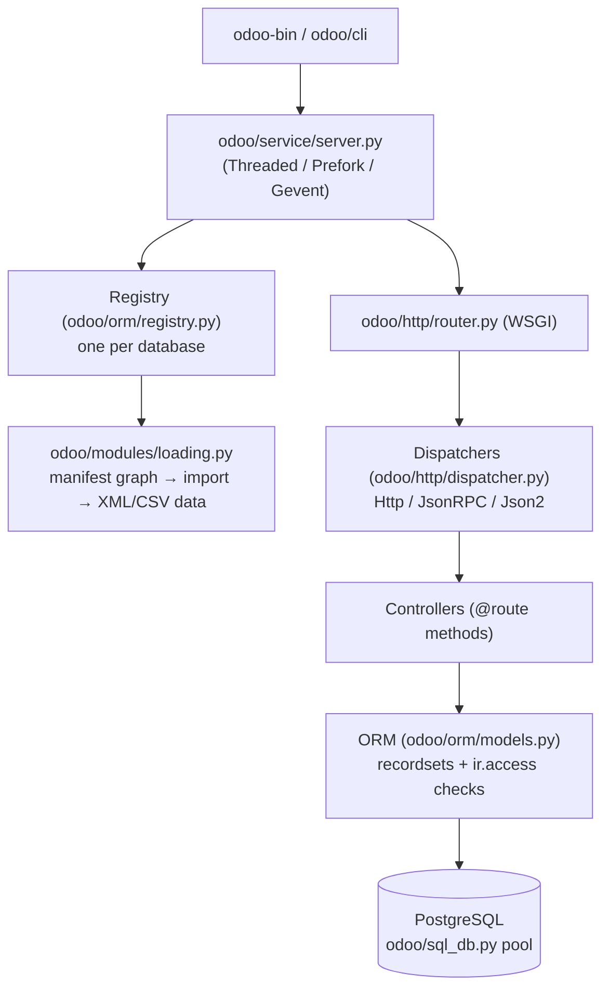
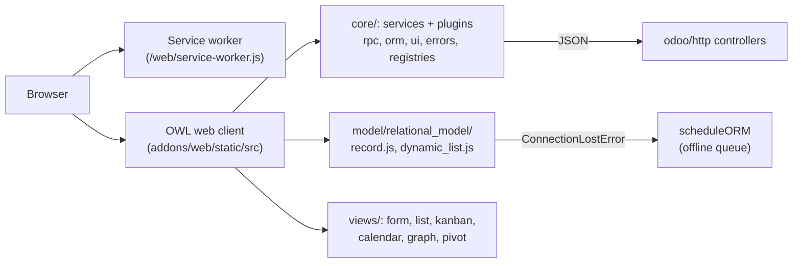

# Architecture

The system has four layers: a PostgreSQL database, a Python application server (the `odoo/` package) that hosts every module and exposes HTTP/RPC, an OWL-based single-page web client (`addons/web`) that talks to the server over JSON, and, specific to this fork, a browser-side offline stack (service worker, encrypted IndexedDB, ORM-call queue) that lets the web client keep working without a connection. Business functionality is delivered as 642 addon modules that plug into the server and extend the client.

By language the codebase is roughly 1.36M lines of Python (server, ORM, module logic), ~1.2M lines of first-party JavaScript (web client, plus vendored libraries such as OWL, Bootstrap 5 and Chart.js in each addon's `static/lib/`), 573k lines of XML (views, data, security), and 80k lines of SCSS.

## Server core



- The server boots via `odoo-bin` → `odoo/cli/server.py` → `odoo/service/server.py`, which picks one of three server models: `ThreadedServer` (dev, one process), `PreforkServer` (production, forked HTTP and cron workers with memory/request/time limits), or `GeventServer` (longpolling and websockets).
- Each database gets a `Registry` that loads the module graph: manifests declare `depends`, data files, and assets; Python model classes are built and set up in `odoo/orm/model_classes.py`.
- Requests enter a WSGI application (`odoo/http/router.py`), which resolves the session and database, matches a route on the per-database routing map, and dispatches through `HttpDispatcher`, `JsonRPCDispatcher`, or `Json2Dispatcher`. Read-only routes run on read-only cursors and retry on a writable cursor if needed.
- The ORM (`odoo/orm/`) is the heart: recordsets, fields, domains (a real AST with optimization passes, `odoo/orm/domains.py`), computed fields, onchange, and access control unified in the `ir.access` model (`odoo/addons/base/models/ir_access.py`).

## Web client



- The client boots `addons/web/static/src/main.js` → `start.js` → `webclient/webclient.js` and registers the shared service worker with scope `/odoo`.
- The vendored framework is OWL 3 (`addons/web/static/lib/owl/owl.js`) behind an Owl-2 compatibility layer (`addons/web/static/src/owl2/owl3_compatibility_layer.js`), imported everywhere as `@odoo/owl`.
- New code uses the plugin API: classes extending OWL `Plugin` registered through `services.add(...)` (`addons/web/static/src/core/services.js`) and consumed with `usePlugin(...)`. Legacy service bridges (`"offline"`, `"ui"`, `"bottom_sheet"`) are temporary, marked for the OWL 3 migration.
- Views are registered in `registry.category("views")`; an XML arch attribute `js_class` binds a view to a custom view object. CRM uses this heavily (see [CRM views](../apps/crm/crm-views.md)).

## The offline stack (this fork)

```mermaid
sequenceDiagram
    participant U as User (offline)
    participant V as View (form/list/kanban)
    participant Q as OfflinePlugin queue
    participant DB as IndexedDB (encrypted)
    participant S as Server

    U->>V: edit a lead, save
    V->>S: web_save RPC
    S--xV: ConnectionLostError
    V->>Q: scheduleORM("crm.lead", "web_save", ...)
    Q->>DB: persist {model, method, args, kwargs, extras}
    Note over Q: entry shown in offline systray
    ... connection returns ...
    Q->>S: orm.silent.call replay, timestamp order
    S-->>Q: success → dequeue / other error → park with extras.error
```

While online, every visited view and successful relational search is cached (encrypted with AES-GCM keyed from `session.browser_cache_secret`). When the connection drops, three detectors agree (`offline_error.js` handlers, `ConnectionLostError` on RPC, browser online/offline events), buttons without the `data-available-offline` attribute are disabled, and any form save, list edit, delete, or archive is queued verbatim. On reconnection, entries replay in timestamp order under a cross-tab Web Lock, last write wins, and failures are parked for the user to handle in the offline systray. The details are in [offline and PWA](../features/offline-and-pwa/index.md).

## How the pieces fit together

| Layer | Code | What it owns |
| --- | --- | --- |
| Server kernel | `odoo/` | ORM, HTTP, module loading, workers, cron, CLI, test framework |
| Base module | `odoo/addons/base` | `ir.*`/`res.*` system models, access control, menus, assets |
| Web client | `addons/web/static/src` | OWL app framework, views, model layer, offline/PWA stack |
| CRM | `addons/crm` | Lead pipeline, custom views, PWA share target, offline consumer |
| Business apps | `addons/*` | Sales, accounting, inventory, HR, website, POS, marketing, 229 localizations |
| Dev environment | `scripts/dev/` | Setup, servers, test runners with anti-false-green guards |

The [module system](../systems/module-system.md) glues these together: addons depend on each other, inherit each other's models and views, and contribute assets to shared bundles. The [testing](../how-to-contribute/testing.md) story wraps the whole stack, from Python unit tests to headless-Chrome JS suites.
