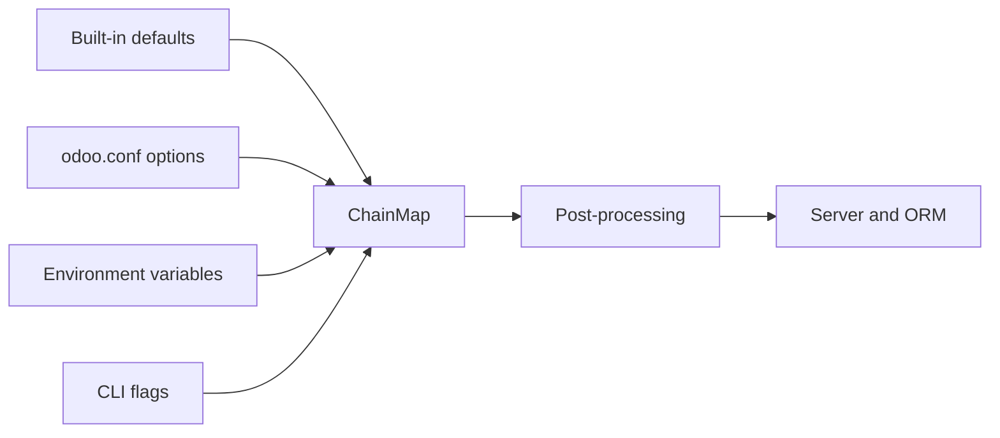

# Configuration
Active contributors: Odoo SA (upstream)

## Purpose

Odoo combines command-line flags, environment variables, an INI-style config
file, and built-in defaults into one process-wide configuration object. The
same option can therefore be set at startup with `--http-port`, in
`[options]` in `odoo.conf`, or through the option's environment mapping.

## Directory layout

```text
odoo/tools/config.py          option declarations, parsing, and precedence
odoo/cli/server.py            server command that consumes the options
scripts/dev/_common.sh        fork development environment defaults
scripts/dev/start.sh          passes the selected database and HTTP port
```

## Key abstractions

| Name | File | Description |
|---|---|---|
| `configmanager` | `odoo/tools/config.py` | Owns defaults, file, environment, CLI, and runtime option maps. |
| `options` | `odoo/tools/config.py` | A `collections.ChainMap` with runtime values taking precedence. |
| `_OdooOption` | `odoo/tools/config.py` | Defines type checking, file loading, export, and environment mapping. |
| `[options]` | `odoo/tools/config.py` | Config-file section for option destinations. |
| `[colors]` | `odoo/tools/config.py` | Optional per-output color settings. |

## How it works



The `configmanager` constructs `ChainMap` in this order:
`_runtime_options`, `_cli_options`, `_env_options`, `_file_options`, then
`_default_options` (`odoo/tools/config.py:179-198`). Runtime values are
derived checks, not a separate user-facing source. `_OdooOption` generates
`ODOO_<DEST>` for file-loadable options unless an explicit `env_name` is
provided. Database options use PostgreSQL names such as `PGHOST`, `PGPORT`,
`PGUSER`, and `PGPASSWORD` (`odoo/tools/config.py:404-425`).

The default config path is selected from the user config directory as
`odoo.conf`, with fallbacks to `~/.odoorc`, `~/.openerp_serverrc`, or a
platform-specific path (`odoo/tools/config.py:540-575`). Odoo reads options
from `[options]`; unknown options are retained as strings with a warning.
`--dev`, `--test-tags`, and several install/test controls are intentionally
CLI-only or non-exportable.

### Common options

| Option | Default or mapping | Meaning |
|---|---|---|
| `config` / `--config` | Selected config path; `ODOO_RC` | Selects the config file. |
| `addons_path` / `--addons-path` | Empty list | Adds comma-separated addon directories. |
| `data_dir` / `--data-dir` | Platform data directory | Stores filestore and runtime data. |
| `server_wide_modules` / `--load` | `base,rpc,web` | Loads modules before a database is selected. |
| `init` / `--init` | Empty | Installs modules, requiring `-d`. |
| `update` / `--update` | Empty | Updates modules, requiring `-d`. |
| `with_demo` / `--with-demo` | `False` | Installs demo data for new databases. |

### HTTP, web, and database options

| Option | Default or mapping | Meaning |
|---|---|---|
| `http_interface` / `--http-interface` | `127.0.0.1` | Address for HTTP services. |
| `http_port` / `--http-port` | `8069` | Main HTTP service port. |
| `gevent_port` / `--gevent-port` | `8072` | Gevent worker port. |
| `http_enable` / `--no-http` | `True` | Enables HTTP and long-polling services. |
| `proxy_mode` / `--proxy-mode` | `False` | Trusts reverse-proxy header rewriting. |
| `dbfilter` / `--db-filter` | Empty | Regex filters databases exposed by the web UI. |
| `db_name` / `-d` | Empty; `PGDATABASE` | Database name(s) for operations. |
| `db_user` / `--db_user` | Empty; `PGUSER` | PostgreSQL user. |
| `db_password` / `--db_password` | Empty; `PGPASSWORD` | PostgreSQL password. |
| `db_host` / `--db_host` | Empty; `PGHOST` | PostgreSQL host or socket directory. |
| `db_port` / `--db_port` | Empty; `PGPORT` | PostgreSQL port. |
| `db_sslmode` / `--db_sslmode` | `prefer`; `PGSSLMODE` | PostgreSQL SSL mode. |
| `db_maxconn` / `--db_maxconn` | `64` | Maximum physical PostgreSQL connections. |

### Runtime, limits, and tests

| Option | Default | Meaning |
|---|---:|---|
| `workers` / `--workers` | `0` | Uses threaded mode at zero, or prefork workers when positive. |
| `gevent_workers` / `--gevent-workers` | `1` | Gevent workers in prefork mode. |
| `limit_memory_soft` | `2048 MiB` | Restarts a worker after a request over the soft virtual-memory limit. |
| `limit_memory_hard` | `2560 MiB` | Rejects allocations over the hard worker limit. |
| `limit_time_cpu` | `60` | CPU seconds allowed per request. |
| `limit_time_real` | `120` | Wall-clock seconds allowed per request. |
| `limit_request` | `65,536` | Requests handled before a worker is recycled. |
| `dev` / `--dev` | Empty; `ODOO_DEV` | Enables `access`, `qweb`, `reload`, `replica`, or `xml` development features. |
| `test_tags` / `--test-tags` | Empty | Selects tests by tag, module, class, or method and implies test mode. |
| `test_enable` / `--test-enable` | `False` | Enables standard test execution; it is CLI-only. |
| `logfile` / `--logfile` | Empty | Writes server logs to a file instead of only the console. |

### Database parameters

`ir.config_parameter` is separate from process startup configuration. Its
defaults are initialized in `odoo/addons/base/models/ir_config_parameter.py`:
`database.secret` (a UUID), `database.uuid`, `database.create_date`,
`web.base.url` using the configured HTTP port,
`base.login_cooldown_after` (10), and `base.login_cooldown_duration` (60).
Other shipped defaults include `base.default_max_email_size` set to 20 in
`odoo/addons/base/data/ir_config_parameter_data.xml` and
`base.template_portal_user_id` in `odoo/addons/base/security/base_groups.xml`.

The web setting `web.web_app_name` is declared by
`addons/web/models/res_config_settings.py:7-10` and read by the manifest
controller for the PWA name. The browser cache secret is not an
`ir.config_parameter` key. `addons/web/controllers/home.py:72-78` derives
`session_info['browser_cache_secret']` with the HMAC scope
`"browser_cache_key"` over the user's session-token values. The HMAC key
falls back to the `database.secret` parameter in
`odoo/tools/misc.py:1792-1806`; password or 2FA changes therefore change the
browser cache key.

### Fork overrides

The development scripts add a second, script-level configuration layer in
`scripts/dev/_common.sh:10-20`: `ODOO_DB` defaults to `crm_offline`,
`ODOO_PORT` to `8069`, `ODOO_HTTPS_BACKEND_PORT` to `8070`, and login/password
to `admin`/`admin`. `PGHOST` defaults to `/var/run/postgresql` and `PGPORT` to
`5432`. `scripts/dev/start.sh:98-105` passes the selected database and backend
port as `-d` and `--http-port`; these `ODOO_PORT` names are not the same as
the auto-generated `ODOO_HTTP_PORT` environment name in `config.py`.

## Integration points

The server command consumes the parsed options, the runtime uses worker and
limit values, and the ORM uses database connection settings. `ir.config_parameter`
is a database model consumed by addons, including web's manifest and bootstrap
controllers. Development wrappers use their own environment variables before
calling `odoo-bin`.

## Entry points for modification

Add a new server option in the appropriate group in
`odoo/tools/config.py`, including its type and file/environment behavior.
For fork-only behavior, prefer a variable or wrapper change in
`scripts/dev/_common.sh` or `scripts/dev/start.sh`; do not alter upstream
configuration semantics from `addons/crm/`.

## Key source files

| File | Purpose |
|---|---|
| `odoo/tools/config.py` | Option declarations, ChainMap precedence, file and environment loading. |
| `odoo/cli/server.py` | Server CLI entry point. |
| `odoo/addons/base/models/ir_config_parameter.py` | Database parameter defaults and typed accessors. |
| `odoo/tools/misc.py` | HMAC helper keyed by `database.secret`. |
| `odoo/addons/base/data/ir_config_parameter_data.xml` | Base email-size default. |
| `odoo/addons/base/security/base_groups.xml` | Portal-user template parameter. |
| `addons/web/models/res_config_settings.py` | `web.web_app_name` setting declaration. |
| `addons/web/controllers/home.py` | Browser cache secret derivation. |
| `addons/web/controllers/webmanifest.py` | Web app name and manifest routes. |
| `scripts/dev/_common.sh` | Fork database, port, credentials, and PostgreSQL defaults. |
| `scripts/dev/start.sh` | Fork server startup and optional TLS proxy. |

## Related pages

- [Reference](index.md)
- [Server runtime](../systems/server-runtime.md)
- [Module system](../systems/module-system.md)
- [Tooling](../how-to-contribute/tooling.md)
- [Offline and PWA](../features/offline-and-pwa/index.md)
