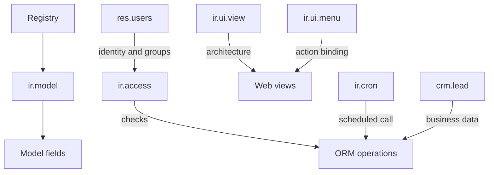

# Data models
Active contributors: Odoo SA (upstream)

## Purpose

Odoo has thousands of models, so this page is a map of the records that
explain most server behavior rather than an exhaustive catalog. The `ir.*`
registry models describe metadata and execution, `res.*` models describe
identity and company context, and `crm.lead` is the business schema most
relevant to this fork.

## Directory layout

```text
odoo/addons/base/models/       ir.* and res.* system models
addons/crm/models/crm_lead.py  crm.lead schema and behavior
odoo/orm/                      model, field, environment, and registry machinery
odoo/cli/shell.py              interactive ORM shell
```

## Key abstractions

| Model | File | Role |
|---|---|---|
| `ir.model` | `odoo/addons/base/models/ir_model.py` | Registry metadata for model names and fields. |
| `ir.access` | `odoo/addons/base/models/ir_access.py` | CRUD permissions and domain restrictions, unified in 20.0. |
| `ir.actions.*` | `odoo/addons/base/models/ir_actions.py` | Actions that open views, URLs, reports, or server code. |
| `ir.ui.view` | `odoo/addons/base/models/ir_ui_view.py` | Stored view architecture and inheritance. |
| `ir.ui.menu` | `odoo/addons/base/models/ir_ui_menu.py` | Navigation tree and action bindings. |
| `ir.cron` | `odoo/addons/base/models/ir_cron.py` | Scheduled server actions and retry state. |
| `ir.attachment` | `odoo/addons/base/models/ir_attachment.py` | Binary or URL attachments linked to records. |
| `ir.config_parameter` | `odoo/addons/base/models/ir_config_parameter.py` | Database-scoped string parameters with typed accessors. |

## How it works



### The `ir.*` registry layer

`ir.model` is metadata for model identity and field introspection. Access
records in `odoo/addons/base/models/ir_access.py:64-124` point to an
`ir.model`, a group, CRUD operations, and an optional domain. In this Odoo
20.0 tree, that model replaces the older split between ACL and record-rule
records.

`ir.actions.actions` is the common action table; window, URL, report, client,
server, and todo actions extend it (`odoo/addons/base/models/ir_actions.py:54-80`).
`ir.ui.view` stores the model, type, architecture, inheritance, groups, and
priority. Its `arch_db`, `inherit_id`, and `mode` fields are the key pieces for
view resolution (`odoo/addons/base/models/ir_ui_view.py:146-205`).
`ir.ui.menu` forms the parent/child navigation tree and points at an action.
`ir.cron` delegates to a server action and stores interval, next execution,
priority, and consecutive failure fields (`odoo/addons/base/models/ir_cron.py:93-131`).
`ir.attachment` links binary data to a model and selects database or filestore
storage through `ir_attachment.location` (`odoo/addons/base/models/ir_attachment.py:68-112`).
`ir.config_parameter` is a unique key/value table; `get_bool`, `get_int`,
`get_float`, and `get_str` convert its stored text
(`odoo/addons/base/models/ir_config_parameter.py:20-117`).

### The `res.*` identity layer

`res.partner` is the contact and company-facing identity record. It holds
names, parent/child relationships, language, timezone, tax ID, addresses,
tags, and communication details (`odoo/addons/base/models/res_partner.py:266-344`).
`res.users` delegates contact data to `res.partner` through `_inherits`, then
adds login, password handling, groups, home action, default company, and
allowed companies (`odoo/addons/base/models/res_users.py:166-230`).
`res.groups` holds users, implied groups, menu/view access, and linked
`ir.access` records (`odoo/addons/base/models/res_groups.py:14-42`).
`res.company` is the legal entity and multi-company boundary, with parent
companies, users, partner, currency, report branding, and address fields
(`odoo/addons/base/models/res_company.py:60-124`). `res.currency` stores ISO
name, symbol, rounding, decimal places, position, and rates
(`odoo/addons/base/models/res_currency.py:51-93`). `res.lang` stores locale,
date/time formats, direction, and separators used by translations and
formatting (`odoo/addons/base/models/res_lang.py:75-119`).

### The `crm.lead` schema

`addons/crm/models/crm_lead.py:85-247` defines `crm.lead` and inherits mail
thread/activity, UTM, address, phone, blacklist, and tracking-duration mixins.
The required `name` is the opportunity label. `type` distinguishes `lead` from
`opportunity`; `active`, `priority`, `team_id`, `user_id`, and `stage_id` drive
pipeline ownership and ordering. `partner_id`, contact/company names, email,
phone, website, language, and address fields represent the prospective
customer, often before a partner is created.

Revenue fields include `expected_revenue`, prorated revenue, `recurring_revenue`,
`recurring_plan`, expected and prorated MRR, and the company currency. Dates
track assignment, stage changes, conversion, closing, automation, and expected
closing. `probability` is editable and constrained from 0 to 100;
`automated_probability` is computed by Predictive Lead Scoring, and
`is_automated_probability` indicates which value is active. `won_status` tracks
won, lost, or pending state, with `lost_reason_id` for losses. Tags, meetings,
duplicate-lead statistics, UTM campaign/medium/source, and partner-sync flags
complete the operational schema.

## Integration points

The registry creates these models and fields, the ORM enforces access and
computed values, and web views consume `ir.ui.view` and action metadata.
CRM extends mail, calendar, sales-team, and partner behavior; its model is
explored further in the [CRM page](../apps/crm/index.md) and its access model
in [the ORM page](../systems/orm.md).

## Entry points for modification

For a schema question, inspect the model's `_name`, `_inherit` or `_inherits`,
and field declarations before searching views and security. For CRM changes,
start at `addons/crm/models/crm_lead.py` and follow the mixin or related model
before adding fields, subject to the fork rules.

To explore interactively, run `./odoo-bin shell -d crm_offline`. The shell
provides `env` when a database is selected (`odoo/cli/shell.py:130-153`):

```python
env['crm.lead']._fields.keys()
env['crm.lead']._fields['probability']
env['ir.model'].search([('model', '=', 'crm.lead')])
env['ir.model.fields'].search([('model', '=', 'crm.lead')])
```

## Key source files

| File | Purpose |
|---|---|
| `odoo/addons/base/models/ir_model.py` | Model and field registry metadata. |
| `odoo/addons/base/models/ir_access.py` | Unified access permissions and domains. |
| `odoo/addons/base/models/ir_actions.py` | Action model family. |
| `odoo/addons/base/models/ir_ui_view.py` | View storage and inheritance. |
| `odoo/addons/base/models/ir_ui_menu.py` | Menu tree and action references. |
| `odoo/addons/base/models/ir_cron.py` | Scheduled action model. |
| `odoo/addons/base/models/ir_attachment.py` | Attachment storage and links. |
| `odoo/addons/base/models/ir_config_parameter.py` | Database parameters. |
| `odoo/addons/base/models/res_partner.py` | Contacts and companies as partners. |
| `odoo/addons/base/models/res_users.py` | Users and partner delegation. |
| `odoo/addons/base/models/res_groups.py` | Groups and implied access. |
| `odoo/addons/base/models/res_company.py` | Companies and multi-company fields. |
| `odoo/addons/base/models/res_currency.py` | Currencies and rates. |
| `odoo/addons/base/models/res_lang.py` | Languages and formatting. |
| `addons/crm/models/crm_lead.py` | CRM lead schema and lifecycle. |
| `odoo/cli/shell.py` | Interactive environment setup. |

## Related pages

- [Reference](index.md)
- [ORM](../systems/orm.md)
- [Base](../apps/base.md)
- [CRM](../apps/crm/index.md)
- [Glossary](../overview/glossary.md)
