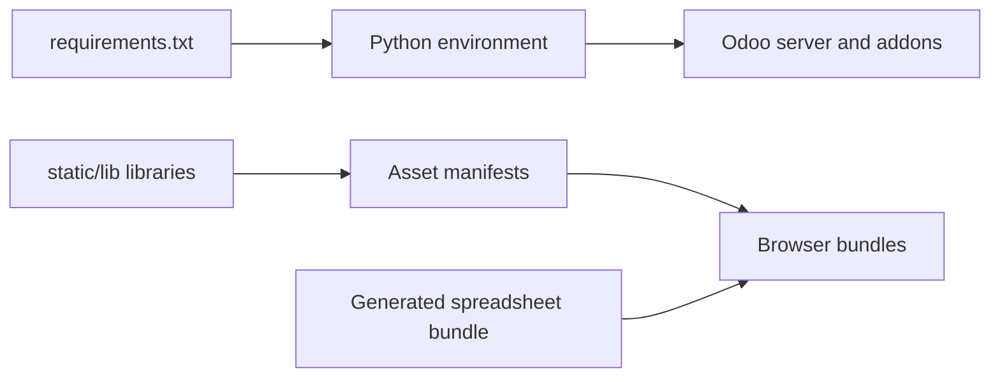

# Dependencies
Active contributors: Odoo SA (upstream)

## Purpose

The Python dependency file pins the server's supported runtime and test
libraries, with version markers for the Python and distro combinations Odoo
supports. Browser dependencies are committed under addon static trees and
loaded through asset manifests; this repository intentionally has no npm or
JavaScript bundler layer.

This is a map of the dependency boundary, not a freshness audit. Offline
review cannot establish whether upstream pins are current, and upstream owns
the main pins.

## Directory layout

```text
requirements.txt                         server and test Python dependencies
addons/populate/requirements.txt         addon-local Faker pins
addons/web/static/lib/                   vendored web libraries
addons/spreadsheet/static/src/o_spreadsheet/
                                          generated spreadsheet distribution
addons/web/__manifest__.py                asset inclusion declarations
```

## Key abstractions

| Dependency or boundary | File | Use |
|---|---|---|
| Python pins | `requirements.txt` | Main server, rendering, database, and test dependencies. |
| Distro-aligned markers | `requirements.txt` | Selects versions for Python 3.11 through 3.14 and Noble/Trixie/Resolute comments. |
| Faker extra | `addons/populate/requirements.txt` | Data population addon dependency, isolated from the main requirements. |
| OWL | `addons/web/static/lib/owl/owl.js` | Vendored OWL 3 runtime imported as `@odoo/owl`. |
| Bootstrap and Popper | `addons/web/static/lib/bootstrap/` and `addons/web/static/lib/popper/` | UI components, styles, and positioning. |
| DOMPurify | `addons/web/static/lib/dompurify/DOMpurify.js` | HTML sanitization in web assets. |
| Chart.js | `addons/web/static/lib/Chart/Chart.js` | Charts, with the Luxon adapter. |
| Spreadsheet bundle | `addons/spreadsheet/static/src/o_spreadsheet/o_spreadsheet.js` | Generated browser spreadsheet engine. |

## How it works



### Python

`requirements.txt` begins by stating that its officially supported versions
are the `python3-*` equivalents distributed in Ubuntu 24.04 and Debian 12.
Version markers select compatible pins across Python versions. Examples are
Werkzeug 3.0.1 for WSGI and HTTP, `psycopg2` 2.9.9 for Python 3.12 and 2.9.10
for Python 3.13+, and lxml 5.2.1, 5.4.0, or 6.0.2 for Python 3.12, 3.13,
or 3.14. `lxml-html-clean` is separate and unpinned because the cleaner was
removed from lxml.

| Package | Pin(s) in `requirements.txt` | Purpose |
|---|---|---|
| Werkzeug | `3.0.1` | WSGI server utilities, routing, and HTTP handling. |
| psycopg2 | `2.9.9` / `2.9.10` | PostgreSQL driver for the ORM and connection pool. |
| lxml | `5.2.1` / `5.4.0` / `6.0.2` | XML, QWeb, view, and document parsing. |
| lxml-html-clean | unpinned | HTML cleaning split from lxml. |
| Pillow | `10.2.0` / `11.1.0` / `12.1.1` | Image decoding, resizing, and report assets. |
| gevent | `24.2.1` / `24.11.1` | Cooperative workers and long-polling support on non-Windows systems. |
| Babel | `2.10.3` / `2.17.0` | Locale-aware dates, numbers, and translations. |
| reportlab | `4.1.0` | PDF report generation. |
| zeep | `4.2.1` / `4.3.1` | SOAP client support for integrations. |
| cryptography | `42.0.8` | Cryptographic primitives and secure integrations. |
| requests | `2.31.0` | Outbound HTTP integrations. |
| freezegun | `1.2.1` / `1.5.1` | Test-time clock freezing. |

The freezegun entries are test support, not a production web dependency.
The only addon with its own requirements file is
`addons/populate/requirements.txt`, which pins Faker to 22.0.0 for Python
3.12, 33.3.1 for Python 3.13, and 39.0.0 for Python 3.14.

### Browser libraries

`addons/web/__manifest__.py:188-219` includes OWL, the OWL 2 compatibility
directory, Popper, and Bootstrap assets. Bootstrap 5 source and JavaScript
live under `addons/web/static/lib/bootstrap/`; Popper is
`addons/web/static/lib/popper/popper.js`. DOMPurify is included at
`addons/web/__manifest__.py:94` from
`addons/web/static/lib/dompurify/DOMpurify.js`. The chart bundle is declared
as `web.chartjs_lib` at `addons/web/__manifest__.py:516-518`, using
`addons/web/static/lib/Chart/Chart.js` and the Luxon adapter.

The OWL runtime is physically in
`addons/web/static/lib/owl/owl.js`, while Odoo imports it as `@odoo/owl`.
This matches the fork's OWL 3 plus compatibility-layer architecture. The
spreadsheet engine is different: `addons/spreadsheet/static/src/o_spreadsheet/o_spreadsheet.js`
is a generated AOT distribution, not a source tree to edit. Its header says
it was generated by spreadsheet build tools and must not be edited.

There is no `package.json`, npm lockfile, webpack/Vite/Rollup configuration,
or `node_modules` workflow in the repository. Odoo builds and serves asset
bundles from addon manifests and database attachments instead of invoking a
JavaScript package manager. Adding an npm dependency would change that
deliberate property and violates the fork's no-new-dependencies rule.

## Integration points

Python imports resolve from the environment prepared by the repository setup
scripts. Web manifests include vendored libraries in backend, frontend, test,
and chart bundles; [assets](../systems/assets.md) explains generation and
cache invalidation. The no-new-dependencies rule is part of the fork's
contribution [patterns](../how-to-contribute/patterns-and-conventions.md).

## Entry points for modification

Check `requirements.txt` and the supported Python marker before changing a
server package. For browser code, inspect the owning addon manifest and
`static/lib/` first; do not add npm tooling or replace a vendored library
without an upstream-compatible plan.

## Key source files

| File | Purpose |
|---|---|
| `requirements.txt` | Main Python dependency pins and version markers. |
| `addons/populate/requirements.txt` | Faker pins for the populate addon. |
| `addons/web/__manifest__.py` | Web asset and library declarations. |
| `addons/web/static/lib/owl/owl.js` | Vendored OWL runtime. |
| `addons/web/static/src/owl2/owl3_compatibility_layer.js` | Compatibility layer around OWL 3. |
| `addons/web/static/lib/bootstrap/` | Vendored Bootstrap 5 sources and JavaScript. |
| `addons/web/static/lib/popper/popper.js` | Vendored Popper positioning library. |
| `addons/web/static/lib/dompurify/DOMpurify.js` | Vendored HTML sanitizer. |
| `addons/web/static/lib/Chart/Chart.js` | Vendored Chart.js library. |
| `addons/web/static/lib/chartjs-adapter-luxon/chartjs-adapter-luxon.js` | Chart.js date adapter. |
| `addons/spreadsheet/static/src/o_spreadsheet/o_spreadsheet.js` | Generated spreadsheet distribution. |

## Related pages

- [Reference](index.md)
- [Assets](../systems/assets.md)
- [Web](../apps/web/index.md)
- [Spreadsheet and dashboards](../apps/spreadsheet-and-dashboards.md)
- [Contribution patterns](../how-to-contribute/patterns-and-conventions.md)
