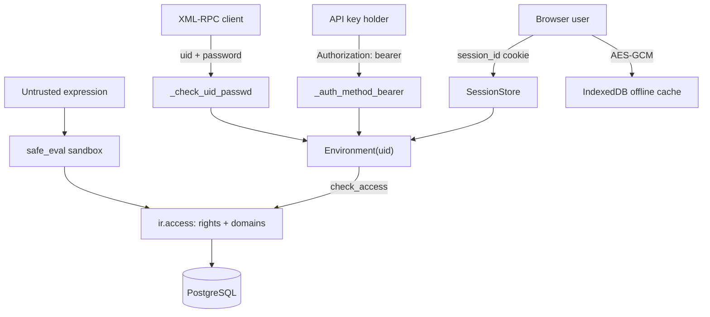

# Security
Active contributors: Odoo SA (upstream)

## Purpose

Odoo's security model has four layers: who the caller is, what the ORM lets that identity touch (`ir.access`), what code may run on the server (`safe_eval`) and in the browser (QWeb escaping, the offline cache), and the request-level protections that stop a third-party site acting as the user. This page describes each layer and points at the files a change would touch.

## Directory layout

```text
odoo/http/
├── session.py             # Session, SessionStore, check(), rotation, expiry
└── requestlib.py          # csrf_token(), validate_csrf()
odoo/addons/base/models/
├── res_users.py           # password hashing, _check_credentials, apikeys, cooldown
├── ir_access.py           # the ir.access model: ACL and record rules in one place
├── ir_config_parameter.py # key/value secrets and feature flags
├── ir_qweb.py             # template rendering, markupsafe escaping
└── ir_http.py             # _authenticate, _auth_method_bearer, _sanitize_cookies
odoo/tools/safe_eval/       # sandboxed evaluation (evaluation, expression, runtime)
odoo/tools/sql.py           # SQL() helper: code and parameters kept together
addons/web/static/src/core/crypto.js      # AES-GCM for the offline cache
addons/web/static/src/core/utils/indexed_db.js  # storage wrapper, registry wipe
addons/web/static/src/service_worker.js   # share-target relay, session-info masking
SECURITY.md                 # upstream disclosure process
```

## Key abstractions

| Name | File | Description |
| --- | --- | --- |
| `Session` / `SessionStore` | `odoo/http/session.py` | File-backed session, rotation, and the session token check. |
| `_check_credentials()` | `odoo/addons/base/models/res_users.py` | Override point for password, API key, TOTP, passkey or external providers. |
| `_check_uid_passwd()` | `odoo/addons/base/models/res_users.py` | Validates the `(uid, password)` pair sent by XML-RPC `execute_kw`. |
| `ir.access` | `odoo/addons/base/models/ir_access.py` | One table for CRUD rights and their record domain. |
| `safe_eval()` | `odoo/tools/safe_eval/evaluation.py` | Evaluates untrusted expressions under an opcode and type whitelist. |
| `SQL()` | `odoo/tools/sql.py` | Parameterized SQL fragment; `SQL.identifier()` validates identifiers. |
| `Crypto` | `addons/web/static/src/core/crypto.js` | AES-GCM with a key derived from `session.browser_cache_secret`. |

## How it works



### Authentication

A browser session is a JSON file in `SessionStore` (`data_dir/sessions`, mode 0700, per `odoo/tools/config.py`) keyed by an 86-character `session_id` cookie generated from `secrets.token_urlsafe(64)`. `session.check()` recomputes `res.users._compute_session_token(sid)` from the user's security fields and compares it with `consteq()`; a mismatch or expiry logs the user out and raises `SessionExpiredException`, which `HttpDispatcher.handle_error` turns into a redirect to `/web/login` with a rotated session id. Sessions rotate every three hours and expire after a week unless `sessions.max_inactivity_seconds` overrides it. Passwords are `pbkdf2_sha512` with at least 600,000 rounds (`MIN_ROUNDS` in `odoo/addons/base/models/res_users.py`); repeated failures trigger a per-worker login cooldown from the `base.login_cooldown_after` and `base.login_cooldown_duration` parameters, held in memory and so not shared across prefork workers. API keys are rows in `res_users_apikeys`, hashed with the same context, and `_check_credentials(scope='rpc', key=...)` is what a bearer header and a non-interactive XML-RPC password both resolve to. Other mechanisms are `_inherit` overrides of `_check_credentials()` in the `auth_oauth`, `auth_ldap`, `auth_signup`, `auth_totp`, `auth_passkey` and `auth_timeout` addons. `_must_check_identity()` in `odoo/addons/base/models/ir_http.py` can force an identity confirmation on unknown devices when `base.session_check_device` is on.

### Authorization

`ir.access` (`odoo/addons/base/models/ir_access.py`) replaced the separate ACL and record rule models: one record carries an `operation` (`crud` subsets) and an optional `domain` restricting it to matching records, and `kind` says whether it grants (`permission`) or restricts (`restriction`). The ORM enforces it in `check_access()` and `_access_domain()`. CRM's rules live in `addons/crm/security/ir.access.csv` (salesmen see their own and unassigned leads, managers see all) and `addons/crm/security/crm_security.xml`. Project rules forbid changing any access rule, and require that the offline cache never widen what a user can see; `ir.access` and `ir.config_parameter` also set `_allow_sudo_commands = False`.

### The offline cache

`addons/web/static/src/core/crypto.js` encrypts every cached value with AES-GCM, a fresh 12-byte IV per value, and a non-extractable key imported from `session.browser_cache_secret`. That secret is an HMAC of the user's session-token fields under the `browser_cache_key` label, computed in `addons/web/controllers/home.py`, so it changes with the password or second factor; it is injected only into the webclient bootstrap page, served with `Cache-Control: no-store` and `X-Frame-Options: DENY`. `addons/web/static/src/core/utils/indexed_db.js` wipes the whole database when `session.registry_hash + CRYPTO_ALGO` changes, and outside a secure context the framework substitutes `FakeIndexedDB` and no `Crypto`, so nothing is cached. The cache holds display names of records the user already searched for and payloads of writes they already made, so it cannot widen access; the secret travels to the browser, so the encryption protects data at rest in the browser profile rather than against the browser itself. See [local store](features/offline-and-pwa/local-store.md).

### Code evaluation and templates

`safe_eval` lives in the `odoo/tools/safe_eval/` package. `evaluation.py` rejects a fixed opcode blacklist (`IMPORT_NAME`, `IMPORT_FROM`, `IMPORT_STAR`, `STORE_ATTR`, `DELETE_ATTR`, `STORE_GLOBAL`, `DELETE_GLOBAL`), rewrites the AST to wrap calls in `safe_call`, and checks every value against a whitelist of qualified names in `runtime.py`; anything else raises an `UnsafeError`. The `--unsafe-policy` option (`disable`, `log`, `raise`, `terminate`, default `log`) decides what happens next. Domains, view `context` and `domain` attributes, server actions and the `domain` column of `ir.access` all go through it. QWeb rendering in `odoo/addons/base/models/ir_qweb.py` produces `markupsafe.Markup`: `t-out` and `t-esc` escape their values, attributes are escaped, and only a value already `Markup` is inserted raw. `Response` is replaced at import time by `SafeResponse` in `odoo/http/_facade.py`, a proxy limiting which response attributes an evaluated expression can reach, and `root.set_csp()` in `odoo/http/router.py` always sets `X-Content-Type-Options: nosniff`, adding `default-src 'none'` on image responses.

### Data access, injection and request-level protections

ORM queries are parameterized: `odoo/orm/query.py` builds statements and passes values separately, and hand-written SQL uses the `SQL()` helper in `odoo/tools/sql.py`, which carries code and parameters in one object, with `SQL.identifier()` asserting that a name is a plain identifier before quoting it. CSRF is enforced by `HttpDispatcher` for unsafe methods on `type='http'` routes that do not pass `csrf=False`, using an HMAC-SHA1 token over the session prefix and a timestamp keyed on `database.secret`. `ir.http._is_allowed_cookie()` zeroes out any cookie not marked `cookie_type='required'` for unauthenticated requests. The share target is the one path where a browser POST never reaches the server: `addons/web/static/src/service_worker.js` intercepts any POST carrying a `share_target` query parameter, redirects to `GET /odoo?share_target=trigger`, and forwards the multipart body to the page with `postMessage`, so the authenticated page decides what to do with it.

### Secrets

`database.secret` in `ir.config_parameter` keys CSRF tokens, mail action-link tokens, the session token computation and `browser_cache_secret`, so a database dump exposes all of them. The same table holds `database.uuid`, `web.web_app_name`, `web.base.url`, `web.json.enabled`, `sessions.max_inactivity_seconds` and `base.enable_programmatic_api_keys`. Reads and writes are granted only to `base.group_system` by `odoo/addons/base/security/ir.access.csv`, and the accessors (`get_str`, `get_int`, ...) call `check_access('read')` first. The database admin password is a server option (`--admin_passwd`), hashed by `config.set_admin_password()`, never stored in the database.

## Integration points

- `_check_credentials()` is the documented extension point for authentication backends; see [Localizations and integrations](apps/localizations-and-integrations.md). Access control is central to the fork's scope rules ([Users, groups and access](primitives/users-groups-and-access.md)), and bearer authentication reuses the same key store as the web UI ([External RPC](api/external-rpc.md), [Web controllers](api/web-controllers.md)).
- Nothing in the repository runs automated security scanning: `.github/` holds only issue and pull request templates, and there is no CI.

## Entry points for modification

Security-sensitive changes belong in `odoo/` or in a `_inherit` override, never in a fork-local copy of a check. The practical starting points here are `addons/crm/security/` for CRM rules, `addons/web/static/src/core/crypto.js` and `.../core/utils/indexed_db.js` for the offline cache, and `AGENTS.md` at the repository root (untracked) for the scope rules.

## Key source files

| File | Purpose |
| --- | --- |
| `odoo/http/session.py` | Session storage, token check, rotation, expiry. |
| `odoo/http/requestlib.py` | CSRF token generation and validation. |
| `odoo/http/dispatcher.py` | CSRF enforcement and error responses. |
| `odoo/addons/base/models/res_users.py` | Password hashing, `_check_credentials`, API keys, login cooldown. |
| `odoo/addons/base/models/ir_access.py` | The unified `ir.access` model. |
| `odoo/addons/base/models/ir_config_parameter.py` | Secret and feature-flag storage. |
| `odoo/addons/base/models/ir_http.py` | Auth methods, identity checks, cookie filtering. |
| `odoo/addons/base/models/ir_qweb.py` | QWeb rendering and markupsafe escaping. |
| `odoo/tools/safe_eval/evaluation.py` | Sandboxed `safe_eval()`. |
| `odoo/tools/safe_eval/runtime.py` | Safe whitelist, checker, unsafe policy. |
| `odoo/tools/sql.py` | `SQL()` and `SQL.identifier()`. |
| `odoo/orm/query.py` | Parameterized query construction. |
| `odoo/http/_facade.py` | `SafeResponse` and the request proxy. |
| `addons/web/static/src/core/crypto.js` | AES-GCM for the offline cache. |
| `addons/web/static/src/core/utils/indexed_db.js` | Storage wrapper and registry-hash wipe. |
| `addons/web/static/src/service_worker.js` | Share-target relay, session-info masking. |
| `addons/web/controllers/home.py` | `browser_cache_secret`, bootstrap headers. |
| `addons/crm/security/ir.access.csv` | CRM rights and record domains. |
| `addons/crm/security/crm_security.xml` | CRM groups. |
| `SECURITY.md` | Upstream disclosure policy and supported versions. |

## Responsible disclosure

`SECURITY.md` at the repository root is the upstream Odoo policy and applies unchanged. It lists supported versions (19.0 down to 16.0 in the checked-in file, which does not mention 20.0), asks for private reports through `https://www.odoo.com/security-report`, prefers text descriptions with a proof of concept over screenshots, and warns that reports without a realistic attack scenario are rejected. There is no fork-specific contact and no private vulnerability reporting configuration in the repository.

## Related pages

- [APIs](api/index.md)
- [Web controllers](api/web-controllers.md)
- [External RPC](api/external-rpc.md)
- [Deployment](deployment.md)
- [Users, groups and access](primitives/users-groups-and-access.md)
- [Local store](features/offline-and-pwa/local-store.md)
- [HTTP server](systems/http-server.md)
- [Localizations and integrations](apps/localizations-and-integrations.md)
- [Architecture](overview/architecture.md)
