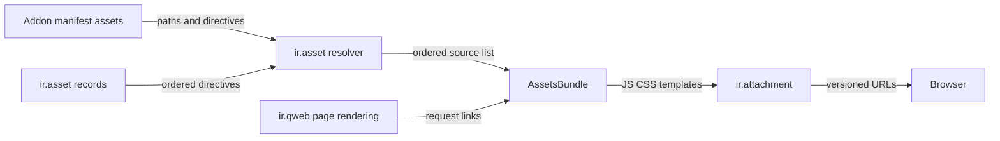

# Assets
Active contributors: Odoo SA (upstream)

## Purpose

Odoo turns JavaScript, stylesheets, and QWeb templates declared by installed addons into named web asset bundles. The bundle resolver and compiler live in `odoo/addons/base/models/ir_asset.py` and `odoo/addons/base/models/assetsbundle.py`; generated output is stored as public `ir.attachment` records rather than committed build files.

## Directory layout

```text
odoo/addons/base/models/
├── ir_asset.py          # manifest and ir.asset directive resolution
├── assetsbundle.py      # bundle compilation, checksums, attachment creation
├── ir_qweb.py           # HTML asset links and bundle pregeneration
└── ir_attachment.py     # deletes generated bundles for regeneration
addons/crm/__manifest__.py
scripts/dev/rebuild-assets.sh
```

## Key abstractions

| Name | File | Description |
| --- | --- | --- |
| `ir.asset` | `odoo/addons/base/models/ir_asset.py` | Model and resolver for manifest declarations and database asset directives. |
| `AssetPaths` | `odoo/addons/base/models/ir_asset.py` | Ordered, de-duplicated list on which asset directives operate. |
| `AssetsBundle` | `odoo/addons/base/models/assetsbundle.py` | Compiles JS, CSS, templates, and binary assets and persists output. |
| `ir.qweb` | `odoo/addons/base/models/ir_qweb.py` | Builds asset links used by rendered pages and pregenerates referenced bundles. |

## How it works

An addon manifest's `assets` mapping contributes paths or directives to a named bundle. `IrAsset._get_asset_paths()` first applies low-sequence `ir.asset` records, then installed addons' manifests in topological order, then remaining records. It supports `append`, `prepend`, `before`, `after`, `remove`, `replace`, and `include`; paths must resolve inside an installed addon's `static/` directory.

`AssetsBundle` separates source files by extension, compiles stylesheets, combines JavaScript and templates, and gives each output a checksum-derived URL such as `/web/assets/<version>/...`. `save_attachment()` creates a public `ir.attachment` linked to `ir.ui.view` with `res_id=0`, then removes obsolete versions. `ir.qweb` requests those bundles while rendering pages, creating them when absent.



The backend bundle is normally `web.assets_backend`; `web.assets_backend_lazy` contains code fetched later. Test tours belong in `web.assets_tests`, and browser unit-test sources in `web.assets_unit_tests`. The CRM manifest, `addons/crm/__manifest__.py`, demonstrates all four. Its backend declaration adds `crm/static/src/**`, then removes feature directories that are declared again in `web.assets_backend_lazy`. Keep that paired `('remove', ...)` plus lazy declaration pattern when moving a directory out of the initial backend load, otherwise it can be shipped twice or not at all.

`addons/web/models/ir_http.py` exposes `registry_hash` in browser session information. It is an HMAC over the registry sequence, so clients can distinguish a changed registry. In this fork, the browser's offline local store uses that value as part of its database version and clears cached data when it changes. See [local store](../features/offline-and-pwa/local-store.md) for that client-side behavior.

## Integration points

- The module loader reads manifest asset declarations as part of installed-addon resolution. See [module system](module-system.md).
- QWeb templates call assets through `odoo/addons/base/models/ir_qweb.py`; `odoo/addons/base/models/ir_attachment.py` can delete all generated asset attachments with `regenerate_assets_bundles()`.
- `scripts/dev/rebuild-assets.sh` stops the development server, deletes generated bundles, pregenerates them, and commits the result. It exists because the server can retain assets in memory.

## Entry points for modification

Add ordinary CRM front-end source below `addons/crm/static/src/`; its existing glob already includes it in `web.assets_backend`. Change `addons/crm/__manifest__.py` only when selecting a bundle, adding test-only assets, or making an intentional lazy split. Do not judge a front-end change with old generated attachments: run `scripts/dev/rebuild-assets.sh` after every JS, CSS, SCSS, or XML change, then run tests. A module upgrade or server restart also regenerates bundles, but stale bundles can otherwise produce false failures.

## Key source files

| File | Purpose |
| --- | --- |
| `addons/crm/__manifest__.py` | CRM bundle declarations and lazy exclusion pairs. |
| `addons/web/models/ir_http.py` | Places `registry_hash` in session information. |
| `odoo/addons/base/models/ir_asset.py` | Resolves bundle directives and static-file paths. |
| `odoo/addons/base/models/assetsbundle.py` | Compiles, versions, saves, and cleans bundle attachments. |
| `odoo/addons/base/models/ir_qweb.py` | Produces asset links and pregenerates required bundles. |
| `odoo/addons/base/models/ir_attachment.py` | Removes generated asset attachments for a rebuild. |
| `scripts/dev/rebuild-assets.sh` | Fork wrapper that regenerates development database assets. |

## Related pages

- [Module system](module-system.md)
- [Server runtime](server-runtime.md)
- [Testing](../how-to-contribute/testing.md)
- [Development tooling](../how-to-contribute/tooling.md)
- [Local store](../features/offline-and-pwa/local-store.md)
