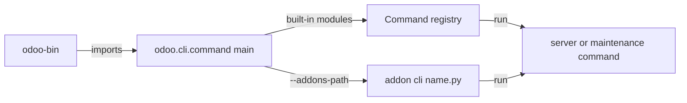

# CLI and maintenance
Active contributors: Odoo SA (upstream)

## Purpose

`odoo-bin` dispatches administrative and development commands from `odoo/cli/`. A `Command` subclass registers itself automatically when its module is imported, while the default command is `server`.

## Directory layout

```text
odoo-bin
odoo/cli/
├── command.py       # dispatch, built-in and addon command discovery
├── server.py        # default server command
├── db.py            # database lifecycle commands
├── module.py        # module lifecycle commands
├── shell.py         # interactive environment
└── upgrade_code.py  # source migration scripts
scripts/dev/
```

## Key abstractions

| Name | File | Description |
| --- | --- | --- |
| `Command` | `odoo/cli/command.py` | Base class that validates and auto-registers a command. |
| `main()` | `odoo/cli/command.py` | Selects the command, defaults to `server`, and invokes it. |
| `Server` | `odoo/cli/server.py` | Parses server configuration and starts the runtime. |
| `Module` | `odoo/cli/module.py` | Installs, upgrades, removes, lists, and loads demo data for modules. |
| `Db` | `odoo/cli/db.py` | Filestore-aware database administration command. |

## How it works

The executable imports `odoo.cli.main`. `Command.__init_subclass__()` derives each command name from its module filename and registers it in a process-local mapping. The dispatcher accepts a leading `--addons-path=...` before the command so it can find extra addon commands, uses `server` when no command is named, and resolves built-ins before searching addon directories.



| Command | Purpose |
| --- | --- |
| `server` | Start the Odoo server; this is the default command. |
| `shell` | Open an interactive Python environment, optionally with `env` for one database. |
| `scaffold` | Generate an addon skeleton from a built-in or supplied template. |
| `db` | Initialize, load, dump, duplicate, rename, or drop a database with filestore handling. |
| `deploy` | Zip and upload an addon to an Odoo instance that supports module import. |
| `start` | Start a project-oriented development server, inferring module paths, database name, and database filter. |
| `module` | Install, upgrade, uninstall, force demo data, or list modules. |
| `i18n` | Import and export translation files and install languages. |
| `cloc` | Count relevant Python, JavaScript, and XML lines by path or database customizations. |
| `neutralize` | Disable production effects such as email in a database intended for testing. |
| `obfuscate` | Encrypt or decrypt selected textual database data; it warns that its output is not safe for third-party transfer. |
| `duplicate` | Populate selected models by duplicating existing data for testing or demos. |
| `help` | List built-in and discovered addon commands. |
| `upgrade_code` | Apply versioned source rewrite scripts under `odoo/upgrade_code`. |

## Integration points

Server options are owned by the configuration parser used from `odoo/cli/server.py`. Common operational flags are `--dev` for development mode, `--test-tags` for filtered test runs, `-i` and `-u` to install or upgrade modules, `--addons-path` to locate addon directories and commands, and `--db-filter` to restrict served databases. Exact option behavior belongs in [Configuration](../reference/configuration.md).

An addon can provide a command at `<module>/cli/<name>.py`. `load_addons_commands()` searches every addons path for that shape and loads it under `odoo.cli.<name>` without importing the addon package. The class still must satisfy the command-name rule: its declared or derived name matches `<name>.py`.

For this fork, use the `scripts/dev/` wrappers for local setup, asset rebuilding, and tests. They encode the CRM database, module update, and test-collection safeguards; see [Development tooling](../how-to-contribute/tooling.md). Server operation and logs are covered by [Server runtime](server-runtime.md) and [Logging](../how-to-monitor/logging.md).

## Entry points for modification

Add a core command as a module in `odoo/cli/` containing one `Command` subclass, or add addon-specific maintenance behavior in that addon's `cli/` directory. Prefer an existing command's parser conventions, and keep database-destructive commands explicit about their target. For CRM development, do not replace the fork wrappers with ad hoc `odoo-bin` commands when a wrapper exists.

## Key source files

| File | Purpose |
| --- | --- |
| `odoo-bin` | Command-line executable that enters Odoo's CLI. |
| `odoo/cli/command.py` | Command registration, dispatch, and addon command discovery. |
| `odoo/cli/server.py` | Default server command and server startup preparation. |
| `odoo/cli/shell.py` | Interactive ORM shell. |
| `odoo/cli/db.py` | Filestore-aware database operations. |
| `odoo/cli/module.py` | Module installation and upgrade operations. |
| `odoo/cli/i18n.py` | Translation import, export, and language setup. |
| `odoo/cli/upgrade_code.py` | Upgrade-code script selection and execution. |
| `scripts/dev/README.md` | Fork development wrapper usage. |

## Related pages

- [Module system](module-system.md)
- [Server runtime](server-runtime.md)
- [Assets](assets.md)
- [Configuration](../reference/configuration.md)
- [Testing](../how-to-contribute/testing.md)
- [Development tooling](../how-to-contribute/tooling.md)
- [Logging](../how-to-monitor/logging.md)
