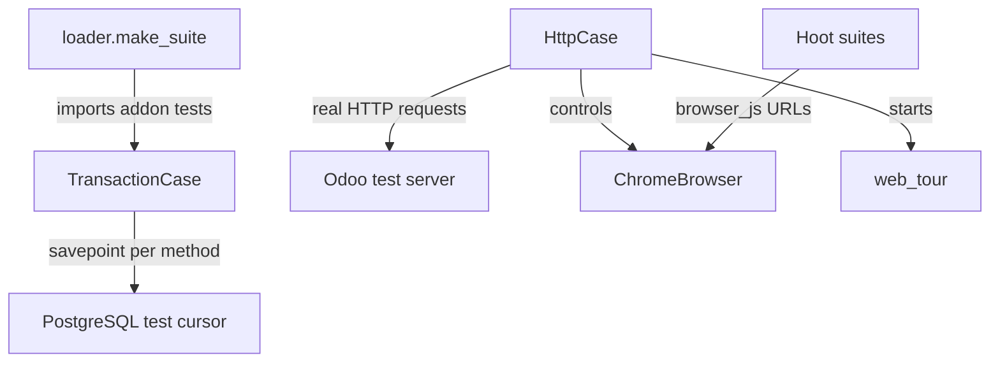

# Test framework
Active contributors: Odoo SA (upstream)

## Purpose

Odoo's Python test layer extends `unittest` with database transactions, registry isolation, HTTP helpers, tags, and browser control. The web client adds Hoot browser suites in `addons/web/tests/test_js.py`; this fork's wrappers close collection and browser-skip gaps described in [Testing](../how-to-contribute/testing.md).

## Directory layout

```text
odoo/tests/
├── case.py           # patched unittest TestCase behavior
├── common.py         # database, HTTP, browser, tags, time helpers
├── loader.py         # addon test discovery and suite construction
└── tag_selector.py   # --test-tags parser and matcher
addons/web/tests/test_js.py
addons/web_tour/
```

## Key abstractions

| Name | File | Description |
| --- | --- | --- |
| `TestCase` | `odoo/tests/case.py` | Odoo's patched `unittest.TestCase` implementation. |
| `TransactionCase` | `odoo/tests/common.py` | Database test case isolated with savepoints. |
| `HttpCase` | `odoo/tests/common.py` | Transactional case with HTTP, headless Chrome, and tour helpers. |
| `TagsSelector` | `odoo/tests/tag_selector.py` | Parses and matches `--test-tags` specifications. |
| `HootSuite` | `addons/web/tests/test_js.py` | Checks test files and runs the Hoot suite. |

## How it works

`TransactionCase` opens a registry cursor for the class, creates a shared savepoint, and rolls that savepoint back after each method. Its cursor is closed without a commit, and direct `commit()`, `rollback()`, and `close()` calls are patched to fail. Common class setup belongs in `setUpClass`; tests that change registry models or fields must arrange registry cleanup.

`HttpCase` extends that transaction fixture with a real local HTTP port and `ChromeBrowser`, a headless Chrome controller. `browser_js()` authenticates a browser, navigates to a route, waits for readiness and a success console signal, and reports browser errors. `start_tour()` is a `browser_js()` wrapper that starts a registered browser tour. Tour assets and runtime support come from `addons/web_tour/`. `freeze_time` in `odoo/tests/common.py` wraps freezegun and works as a class decorator, ordinary decorator, or context manager.



`@tagged()` adds tags and removes tags prefixed by `-`; Odoo common test cases default to `standard` and `post_install`. `--test-tags` is a comma-separated selector language implemented by `TagsSelector`: `tag`, `-tag`, `*`, `/module:Class.method`, optional test-file paths, and parameter filters can be combined. The selector requires an include match and rejects an exclusion match.

`odoo/tests/loader.py` imports only `test_` modules exposed by an addon's `tests` package, then builds suites for module names supplied by the loading run. At `post_install`, the available module set is those modules; tests are therefore not collected merely because their files exist. This is the first false-green mode: running without installing or upgrading the target module can exit successfully after collecting nothing.

On the JavaScript side, `HootSuite.test_check_suite()` scans every `.test.js` in `web.assets_unit_tests` and fails on `only(` or `debug(`. `WebSuite.test_unit_desktop()` opens `/web/tests` with `preset=desktop`; `MobileWebSuite.test_unit_mobile()` uses `preset=mobile`, a `375x667` browser, and touch input. Both route through `HttpCase.browser_js()`, select test modules from the asset bundle, and wait for Hoot's success signal.

## Integration points

- Server flags, including `--test-tags`, are parsed through normal configuration. See [Configuration](../reference/configuration.md).
- Addon manifests select test tours and unit-test assets, as described in [Assets](assets.md).
- CRM Python tests must be imported from their `tests/__init__.py`; CRM JavaScript tests need both browser presets.

## Entry points for modification

Start a Python database test from `TransactionCase`, and use `HttpCase` plus `start_tour()` for rendered UI behavior. Put JS unit tests in the appropriate asset bundle and never leave `only()` or `debug()` in a `.test.js` file. In this fork, run the `scripts/dev/` wrappers rather than raw server invocations; they detect empty selections and skipped browser suites.

## Key source files

| File | Purpose |
| --- | --- |
| `odoo/tests/case.py` | Patched unittest execution and traceback behavior. |
| `odoo/tests/common.py` | Transaction, HTTP, Chrome, tags, and time fixtures. |
| `odoo/tests/loader.py` | Imports addon test modules and constructs filtered suites. |
| `odoo/tests/tag_selector.py` | Parses and evaluates test-tag filters. |
| `addons/web/tests/test_js.py` | Hoot guard, desktop, and mobile test suites. |
| `addons/web_tour/__manifest__.py` | Tour addon assets and module definition. |
| `addons/crm/static/tests/` | CRM browser unit tests and tours. |
| `scripts/dev/test-py.sh` | Fork Python-test wrapper. |
| `scripts/dev/test-js.sh` | Fork desktop and mobile JS-test wrapper. |

## Related pages

- [Assets](assets.md)
- [Server runtime](server-runtime.md)
- [Configuration](../reference/configuration.md)
- [Testing](../how-to-contribute/testing.md)
- [Development tooling](../how-to-contribute/tooling.md)
- [Logging](../how-to-monitor/logging.md)
